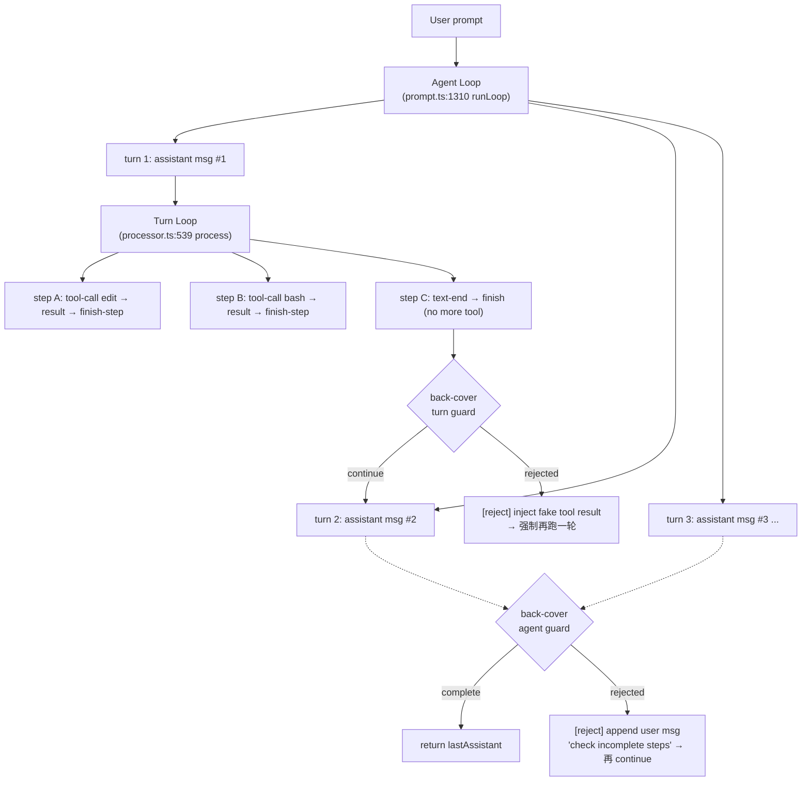

# OpenCode 循环结构 + Back Cover Hook 方案

> 用途：在 turn loop 末 + 写之前插入 "可拉扣的后壳" — 拒绝把 todo 更新 / 总结性文字 / 未验证的执行当成 "任务完成"。
> 适用：OpenCode 内部扩展、外部 plugin、Shadow-Walker 借鉴。

## 1. OpenCode 的两层循环（核心理解）

### 1.1 Agent Loop（外层）— 一次 user message → 多次 turn

`packages/opencode/src/session/prompt.ts:1310 runLoop`：

```
while (true) {                       // 外层 Agent Loop
  status.set(busy)
  msgs = filterCompacted(sessionID)
  pickLastUser / LastAssistant / LastFinished / Tasks

  // [break 判定] 任一为真就退出外层循环
  if (lastAssistant?.finish
      && !["tool-calls"].includes(...)
      && !hasToolCalls
      && lastUser.id < lastAssistant.id) {
    break
  }

  step++
  if (step===1) title agent (fork)
  getModel()

  // [Task 分支] 用户消息包含 subagent/compaction part
  if (task?.type === "subtask")   { handleSubtask(); continue }
  if (task?.type === "compaction") { compaction.process(); if(stop) break; continue }

  // [Overflow 分支] 上次完成时 token 超限
  if (lastFinished && !summary && isOverflow(...)) {
    compaction.create({ auto: true })
    continue
  }

  // [主路径] 调 LLM 处理一次 turn
  assistantMessage = create()
  handle = processor.create({ assistantMessage, ... })
  outcome = yield* Effect.gen(...) {       // 内含 handle.process
    ...
    const result = yield* handle.process({ user, agent, system, messages, tools, model })
    if (result === "stop")   return "break"
    if (result === "compact") { compaction.create({ auto: true }) }
    return "continue"
  }
  if (outcome === "break") break
  continue
}
return lastAssistant(sessionID)
```

关键事实：
- **一次 user 消息 = N 次 turn**（N 由 doom-loop / 上下文 / 模型 stop 决定）
- 每次 turn = 创建一条 assistant message + 一次 `streamText`
- 退出 Agent Loop 的唯一条件是 `lastAssistant.finish` 不是 `tool-calls` 且没有 pending tool calls

### 1.2 Turn Loop（内层）— 一次 stream 内的 AI SDK 步骤

`packages/opencode/src/session/processor.ts:539 process`：

```
process(streamInput) {
  reset(currentText, reasoningMap)
  stream = llm.stream(streamInput)

  stream.pipe(
    tap(event => handleEvent(event)),  // 处理 text-delta / tool-call / finish-step
    takeUntil(() => ctx.needsCompaction),
    runDrain,
  ).pipe(
    onInterrupt(...)
    catchCauseIf(...)
    retry(SessionRetry.policy)         // 自动重试 5xx/429
    catch(halt)                        // 错误归一
    ensuring(cleanup()),               // 写 step-finish / patch part
  )

  if (ctx.needsCompaction) return "compact"
  if (ctx.blocked || ctx.assistantMessage.error) return "stop"
  return "continue"
}
```

`handleEvent` 的关键 switch（`processor.ts:216`）：

| event | 动作 | 是否"实质工作" |
|-------|------|---------------|
| `start` | set busy | — |
| `reasoning-start/delta/end` | reasoningMap 累积 | — |
| `tool-input-start` | 写 tool part (pending) | — |
| `tool-input-delta` | 忽略 | — |
| `tool-input-end` | 忽略 | — |
| `tool-call` | 更新 tool part (running) + **doom-loop 检测** | ⚠️ 取决于 tool |
| `tool-result` | 写 tool part (completed) | — |
| `tool-error` | 写 tool part (error) | — |
| `error` | throw | — |
| `start-step` | 写 step-start + 拍 snapshot | — |
| `finish-step` | 写 step-finish + 算 cost/tokens + 拍 snapshot.patch（→ **PatchPart**） + summary | ✅ **PatchPart 是"真做了事"的硬证据** |
| `text-start/delta/end` | 写 text part | ⚠️ 纯文字可能是"伪完成" |
| `finish` | 忽略 | — |

### 1.3 关系示意



## 2. "伪完成" 信号清单

`assistant message` 真正完成的硬证据 = `PatchPart`（文件改动）+ 测试成功 + 非空 tool output。

**伪完成模式**（按风险从高到低）：

| 模式 | 信号 | 怎么识别 |
|------|------|---------|
| **空话型** | assistant text 含 "任务完成" / "done" / "complete" / "已完成" / "✅" | `text.match(/(任务完成\|已完成\|done\b\|complete\b\|finished\b\|✅)/i)` && `no PatchPart` |
| **Todo 顶包型** | 整轮只调了 `todowrite` / `todo` | `toolCalls.every(t => t.tool === "todowrite")` |
| **只读型** | 整轮只调 `read` / `glob` / `grep` / `list` | 全部 tool 在 `READONLY_TOOLS` 集合 |
| **没验证型** | 有 edit/write 但没跑过 test/lint/typecheck | `patches.length > 0 && !toolCalls.some(t => t.tool in VERIFY_TOOLS)` |
| **自相矛盾型** | 上一步 assistant 说 "fixed X"，但 PatchPart 没改 X | 解析 patch diff 的 path 列表 vs text 中提到的 path 列表 |
| **重复型** | 同一 patch 出现在连续 3 个 turn | hash 出现在最近 N 步 |

## 3. Hook 改造方案（最小侵入）

### 3.1 在 `packages/plugin/src/index.ts:222 Hooks` 新增两个 trigger

```ts
// packages/plugin/src/index.ts:222

export interface Hooks {
  // ... 现有 hook ...

  /**
   * Called at the end of each turn (one LLM stream), AFTER tool calls
   * resolved and step-finish was written, BEFORE the loop decides
   * continue / stop / compact.
   *
   * The hook may "reject" the turn by setting `continue: false` — the
   * processor will then append a synthetic user message to the session
   * and force another turn. This is the "back cover" / 后壳 that
   * prevents the model from declaring success without real work.
   */
  "experimental.turn.complete"?: (
    input: {
      sessionID: string
      agent: string
      model: { providerID: string; modelID: string }
      messageID: string         // the assistant message just produced
      step: number
    },
    output: {
      continue: boolean
      reason?: string           // human-readable, persisted as synthetic user msg
      forceRetry?: boolean      // true = inject nudge; false = let the loop end
    },
  ) => Promise<void>

  /**
   * Called at the end of the agent loop (just before `break`), AFTER
   * the last assistant message has finished. The hook may veto
   * termination by setting `complete: false` — the runner will then
   * append a synthetic user nudge and continue the loop.
   *
   * This is the "outer back cover" — the final mile check that the
   * user's task is actually accomplished before the session goes idle.
   */
  "experimental.session.complete"?: (
    input: {
      sessionID: string
      agent: string
      model: { providerID: string; modelID: string }
      steps: number
      turnSummaries: Array<{
        messageID: string
        toolCalls: string[]
        textSnippets: string[]
        patchHashes: string[]
      }>
    },
    output: {
      complete: boolean
      reason?: string           // appended as synthetic user msg
    },
  ) => Promise<void>
}
```

### 3.2 在 `processor.ts:539 process` 末尾插 trigger

```ts
// packages/opencode/src/session/processor.ts:539 process()

const process = Effect.fn("SessionProcessor.process")(function* (streamInput) {
  slog.info("process")
  ctx.needsCompaction = false
  ctx.shouldBreak = (yield* config.get()).experimental?.continue_loop_on_deny !== true

  return yield* Effect.gen(function* () {
    // ... 现有 stream 消费 + 重试 + cleanup ...

    if (ctx.needsCompaction) return "compact"
    if (ctx.blocked || ctx.assistantMessage.error) return "stop"

    // [NEW] back-cover turn guard
    const turnSummary = {
      toolCalls: MessageV2.parts(ctx.assistantMessage.id)
        .filter(p => p.type === "tool")
        .map(p => (p as MessageV2.ToolPart).tool),
      textSnippets: MessageV2.parts(ctx.assistantMessage.id)
        .filter(p => p.type === "text")
        .map(p => (p as MessageV2.TextPart).text),
      patchHashes: MessageV2.parts(ctx.assistantMessage.id)
        .filter(p => p.type === "patch")
        .map(p => (p as MessageV2.PatchPart).hash),
    }
    const decision = { continue: true, reason: undefined as string | undefined, forceRetry: false }
    yield* plugin.trigger(
      "experimental.turn.complete",
      {
        sessionID: ctx.sessionID,
        agent: ctx.assistantMessage.agent,
        model: {
          providerID: ctx.assistantMessage.providerID,
          modelID: ctx.assistantMessage.modelID,
        },
        messageID: ctx.assistantMessage.id,
        step: ctx.step ?? 0,   // 需要在 ctx 里加一个 step 计数
      },
      decision,
    )
    if (!decision.continue) {
      // 拒绝该 turn 结束 — 注入合成 user 消息，强制再跑
      yield* sessions.updateMessage({
        id: MessageID.ascending(),
        sessionID: ctx.sessionID,
        role: "user",
        time: { created: Date.now() },
        agent: ctx.assistantMessage.agent,
        model: ctx.assistantMessage.modelID
          ? { providerID: ctx.assistantMessage.providerID, modelID: ctx.assistantMessage.modelID }
          : undefined,
        synthetic: true,
      } satisfies MessageV2.User)
      yield* sessions.updatePart({
        id: PartID.ascending(),
        messageID: /* 上面的 id */,
        sessionID: ctx.sessionID,
        type: "text",
        text: decision.reason
          ?? "[back-cover] Previous turn did not produce real work. Please continue with concrete actions.",
        synthetic: true,
      } satisfies MessageV2.TextPart)
      return "continue"
    }

    return "continue"
  })
})
```

### 3.3 在 `prompt.ts:1310 runLoop` 退出 break 之前插 trigger

```ts
// packages/opencode/src/session/prompt.ts:1310 runLoop

if (
  lastAssistant?.finish &&
  !["tool-calls"].includes(lastAssistant.finish) &&
  !hasToolCalls &&
  lastUser.id < lastAssistant.id
) {
  // [NEW] back-cover agent guard
  const decision = { complete: true, reason: undefined as string | undefined }
  yield* plugin.trigger(
    "experimental.session.complete",
    {
      sessionID,
      agent: lastUser.agent,
      model: { providerID: lastUser.model.providerID, modelID: lastUser.model.modelID },
      steps: step,
      turnSummaries: msgs
        .filter(m => m.info.role === "assistant")
        .map(m => ({
          messageID: m.info.id,
          toolCalls: m.parts.filter(p => p.type === "tool").map(p => (p as any).tool),
          textSnippets: m.parts.filter(p => p.type === "text").map(p => (p as any).text),
          patchHashes: m.parts.filter(p => p.type === "patch").map(p => (p as any).hash),
        })),
    },
    decision,
  )
  if (!decision.complete) {
    yield* sessions.updateMessage({
      id: MessageID.ascending(),
      sessionID,
      role: "user",
      time: { created: Date.now() },
      agent: lastUser.agent,
      model: lastUser.model,
      synthetic: true,
    } satisfies MessageV2.User)
    yield* sessions.updatePart({
      id: PartID.ascending(),
      messageID: /* 上面的 id */,
      sessionID,
      type: "text",
      text: decision.reason
        ?? `[back-cover] ${step} turns completed but task may not be done. Please verify completion criteria and continue.`,
      synthetic: true,
    } satisfies MessageV2.TextPart)
    // 不 break — 继续
  } else {
    yield* slog.info("exiting loop")
    break
  }
}
```

### 3.4 在 `ctx` 上加 `step` 计数（processor.ts:108-124）

```ts
// packages/opencode/src/session/processor.ts:108 create

const create = Effect.fn("SessionProcessor.create")(function* (input: Input) {
  // ... existing setup ...
  const ctx: ProcessorContext = {
    assistantMessage: input.assistantMessage,
    sessionID: input.sessionID,
    model: input.model,
    step: input.step ?? 0,    // [NEW]
    toolcalls: {},
    // ...
  }
```

`processor.ts:25` 的 Interface 加一个可选 `step` 参数；`prompt.ts:1426` 调 `processor.create` 时把 `step: step` 传进去。

## 4. 内置 Back-Cover Plugin 草稿

```ts
// packages/plugin/src/back-cover.ts  (新增文件)

import type { Hooks } from "."
import type { MessageV2 } from "@opencode-ai/sdk"

const READONLY_TOOLS = new Set([
  "read", "glob", "grep", "list", "webfetch", "websearch", "codesearch", "skill", "question",
])

const VERIFY_TOOLS = new Set([
  "bash",   // 跑 test/lint/typecheck
  "lsp",    // type check
  "todowrite", // 自我更新 todo
])

const TODO_TOOLS = new Set(["todowrite", "todo"])

const FAKE_SUCCESS_PATTERNS = [
  /任务完成/, /已完成/, /\bdone\b/i, /\bcomplete\b/i, /\bfinished\b/i,
  /all set/i, /that's it/i, /搞定/, /收工/,
]

interface BackCoverConfig {
  /** Minimum patches required in the last turn. Default 0 — most turns are non-mutating. */
  minPatchesPerTurn?: number
  /** Whether the *final* turn (right before agent loop exits) must include at least one verification. */
  requireVerificationOnExit?: boolean
  /** Whether to require at least one tool call beyond read-only at any point. */
  rejectReadOnlyFinalTurn?: boolean
}

export const backCoverPlugin = (cfg: BackCoverConfig = {}): Required<Hooks> => ({
  "experimental.turn.complete": async (input, output) => {
    const { toolCalls, textSnippets } = input  // 注意：input 在 plugin 签名里是 (input, output) — output 在 input 字段
    // ... 见下文 ...
  },
  "experimental.session.complete": async (input, output) => {
    // ...
  },
})
```

**注**：上面只是签名示意；`Hooks` 在 plugin API 里 input/output 是分开的，所以 plugin 里实际拿到的是 `output` 参数（要被 plugin 改写），而 `turnSummaries` 在 `input` 里。

正确的 plugin 写法（参考 `packages/plugin/src/example.ts`）：

```ts
// 真实签名：output 是会被 plugin 改写的对象
async (input, output) => {
  // 读 input 的 turnSummaries
  const summaries = input.turnSummaries
  const last = summaries[summaries.length - 1]

  // 1) 整轮只调 todowrite → 拒绝
  if (last && last.toolCalls.length > 0
      && last.toolCalls.every(t => TODO_TOOLS.has(t))) {
    output.complete = false
    output.reason = "[back-cover] Last turn only updated todos. Please execute the actual changes."
    return
  }

  // 2) 整轮没调任何 tool，且 text 含"完成"字样 → 拒绝
  if (last && last.toolCalls.length === 0
      && last.textSnippets.some(t => FAKE_SUCCESS_PATTERNS.some(p => p.test(t)))) {
    output.complete = false
    output.reason = "[back-cover] You declared completion without any tool calls. Please do the actual work."
    return
  }

  // 3) 整轮只调只读工具 → 拒绝
  if (last && last.toolCalls.length > 0
      && last.toolCalls.every(t => READONLY_TOOLS.has(t))) {
    output.complete = false
    output.reason = "[back-cover] Last turn only used read-only tools. Please write/run something."
    return
  }

  // 4) 验证门 — 最后一步应当有 bash/lsp 验证
  if (cfg.requireVerificationOnExit
      && last
      && !last.toolCalls.some(t => VERIFY_TOOLS.has(t))
      && last.patchHashes.length > 0) {
    output.complete = false
    output.reason = "[back-cover] You made changes but did not verify (run tests/lint). Please verify before declaring done."
    return
  }

  // 默认放行
  output.complete = true
}
```

## 5. 决策矩阵（Back Cover 的判定表）

| 输入信号 | back-cover.turn.complete | back-cover.session.complete |
|---------|--------------------------|-----------------------------|
| 整轮无 tool call + text 含"完成" | reject | reject |
| 整轮只 todowrite | reject | reject |
| 整轮只 read/glob/grep | reject | reject |
| 整轮有 edit/write + 没验证 | — | reject（仅 session 级） |
| 整轮有 patch + 跑过 bash test | accept | accept |
| 整轮只 text 解释但没声明"完成" | accept | accept |
| 多 turn 都声明"完成"但 patch 没变 | — | reject |
| 用户在最后一轮发了"stop" / "算了" | accept | accept（short-circuit 优先级最高） |

## 6. 与 Shadow Walker 的对照

| OpenCode | Shadow Walker | 借鉴方式 |
|----------|---------------|---------|
| `experimental.turn.complete` | `pipeline.status.md` 的 L5 step 验证 | 在 L5 harness plan 加 "step.completion.guard" 步骤 |
| `experimental.session.complete` | L5 → L6 跳转门 | 在 L5 末尾加 "fake-completion check" |
| PatchPart 硬证据 | L5 batch 的 test pass / lint pass | 已经存在，但需要把 `*_test.go` / `pytest` 通过率作为硬约束 |
| doom-loop 3 次拒绝 | Walker 的 L6 3 轮修复上限 | 已存在；可参考把"循环执行"做成可观察指标 |
| `forceRetry` 注入合成 user msg | Walker 让 LLM 写 "fix-incomplete" 步骤 | 已经在 L5 harness 里手工做；可考虑自动化 |

**最大借鉴点**：把"back cover"做成 Shadow 标准 L5 出口门（不是 plugin 级别，是 framework 级别）。在 L5 batch 结束前，必须经过：
1. **Patch 硬证据** — diff stat > 0 OR test 文件被创建
2. **验证** — 至少一个 `bun test` / `go test` 跑过
3. **反空话** — LLM 写的"完成说明"必须 cite 具体的 file:line 改动
4. **不达三条** 自动回 L5，不进 L6

## 7. 关键文件 / 行号速查

| 文件:行 | 作用 |
|---------|------|
| `packages/opencode/src/session/prompt.ts:1310` | Agent Loop（外层 `runLoop`） |
| `packages/opencode/src/session/prompt.ts:1540` | `loop` 把 sessionID 绑到 `state.ensureRunning` |
| `packages/opencode/src/session/processor.ts:539` | Turn Loop（内层 `process`） |
| `packages/opencode/src/session/processor.ts:584` | Turn 退出判定（compact/stop/continue） |
| `packages/opencode/src/session/processor.ts:216` | `handleEvent` 事件分发 |
| `packages/opencode/src/session/processor.ts:357` | `finish-step` 处理（写 PatchPart） |
| `packages/opencode/src/session/processor.ts:287` | `tool-call` 事件（doom-loop 检测） |
| `packages/opencode/src/session/llm.ts:72` | `LLM.run`（streamText 包装） |
| `packages/opencode/src/session/compaction.ts:1` | Compaction（独立子任务，不在主循环） |
| `packages/opencode/src/plugin/index.ts:40` | `Plugin.Service.trigger` 内部实现 |
| `packages/plugin/src/index.ts:222` | `Hooks` 接口（plugin 作者看的 API 表面） |
| `packages/opencode/src/snapshot/index.ts:36` | `Patch` schema + `snapshot.patch()` |
| `packages/opencode/src/session/message-v2.ts:94` | `PatchPart` 类型 |
| `packages/opencode/src/session/retry.ts:1` | `SessionRetry.policy`（重试策略） |

---

> 文档生成时间：2026-06-04
> 触发原因：用户要求调研 OpenCode Agent Loop + Turn Loop，加 back cover hook 防伪完成
> 关联文档：`overview.md`
