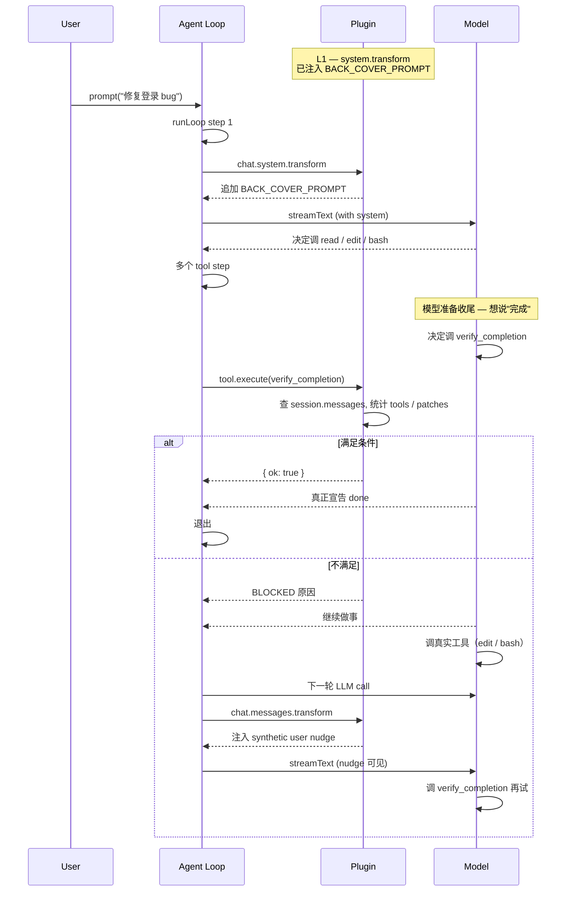

# Back Cover — 纯插件版（不改 OpenCode 源码）

> 约束：只使用 `packages/plugin/src/index.ts:222 Hooks` 已有字段。
> 目标：模型在 turn / agent 收尾时，若只是写了 todo / 跑了只读工具 / 纯文字宣告"完成"，强制它继续。**首轮也要拦住**。

## 1. 现实与限制（已升级）

不开源改的前提下，原本无法阻止"模型已经在当前 turn 输出 finish: stop"的退出。Agent Loop 的退出条件（`prompt.ts:1350`）是依据 assistant 消息的 `finish` 字段：

```ts
if (lastAssistant?.finish
    && !["tool-calls"].includes(lastAssistant.finish)
    && !hasToolCalls
    && lastUser.id < lastAssistant.id) break
```

**但 `event` hook 给了我们一条新路**：

- `event` 订阅总线所有事件，含 `message.updated`
- 当 `message.updated` 携带的 `info.finish = "stop"` 时，说明 assistant 刚结束
- 此时 loop 已退出，但 session 还活着 — 我们可以**主动用 SDK 注入一个新的 user prompt**，让 server 重启 loop
- 新 loop 的第一次 LLM 调用时，L2 / L1 / L3 全部生效，模型被多面包围

**这就是 L0 层** — 在 loop 退出后的窗口期动手，强行把 session 拉回 running 状态。

**五层防线（最终版）：**

| 层 | Hook | 触发时机 | 作用 | 拦得住首轮？ |
|----|------|---------|------|------------|
| **L0** | `event` 监听 `message.updated` | loop 退出后 | 审计最后 assistant msg，fake-done 则用 SDK 注入合成 user prompt 强制重启 loop | ✅ **是** |
| L1 | `experimental.chat.system.transform` | 每次 LLM 调用 | 注入硬规则：必须先调 `verify_completion` | 软约束 |
| L2 | `experimental.chat.messages.transform` | 每次 LLM 调用 | 兜底：上轮 fake-done → 追加 user nudge | 已退出的轮次 |
| L3 | `tool: { verify_completion }` | 模型调工具时 | 锁死：返回 `ok: false` 直到真有 PatchPart + 跑过 bash/lsp | 强约束 |
| L4 | `tool.execute.after` | 任何工具执行后 | 给只读 / todo 工具的 metadata 加 backCoverHint | 辅助 |

**推荐组合**：L0 + L1 + L3 必装，L2 兜底，L4 可选。

## 2. Plugin 完整代码

把下面存为 `back-cover.tsx`（推荐本地 `npm link` 或 `file:` 安装；或直接放到 `~/.config/opencode/plugin/`）：

```ts
// back-cover.tsx  ——  OpenCode plugin: Back Cover
// 防止 agent 在 turn / session 末尾以"伪完成"收尾
// 纯 plugin，零源码改动

import type { Plugin, Hooks } from "@opencode-ai/plugin"
import { tool } from "@opencode-ai/plugin"
import { z } from "zod"
import type { createOpencodeClient } from "@opencode-ai/sdk"

// ---------- 判定常量 ----------

const READONLY_TOOLS = new Set([
  "read", "glob", "grep", "list",
  "webfetch", "websearch", "codesearch",
  "skill", "question",
])

const TODO_TOOLS = new Set(["todowrite", "todo"])

const VERIFY_TOOLS = new Set(["bash", "lsp"])

// 注意：与"back-cover"标记强匹配的提示词
// 不要太宽 — 否则模型每次说"完成了一半"都被拦
const HARD_DONE_PATTERNS = [
  /^\s*(任务完成|已完成|done\.?|complete\.?|finished\.?|搞定|收工)\s*\.?\s*$/im,
  /^\s*✅\s*$/m,
]

// 任何包含这些的"完成"宣言都视为高风险
const SOFT_DONE_PATTERNS = [
  /任务完成/, /已完成/, /搞定/, /收工/,
  /\b(done|complete|finished|all set|that'?s it)\b/i,
  /✅/,
]

// ---------- Back Cover System Prompt（每次 LLM 调用都注入） ----------

const BACK_COVER_PROMPT = `
# BACK COVER (硬规则 · 不可跳过)

在宣告"任务完成 / done / complete / finished / ✅"之前，你**必须**先调用 \`verify_completion\` 工具并得到 \`ok: true\`。该工具会检查：

1. **真做了事** — 本 turn 内产生了至少一个文件改动（PatchPart）或至少一个**非只读、非 todo** 的工具调用
2. **跑过验证** — 如果本 turn 改过文件，至少调过一次 \`bash\`（test/lint/typecheck）或 \`lsp\`
3. **没作弊** — 没有以纯文字、纯 todowrite、纯只读工具收尾

如果 \`verify_completion\` 返回 \`ok: false\`，你**必须**：
- 阅读工具 output 里的 BLOCKED 原因
- 继续做具体工作（不要再说"我已完成"）
- 再次调用 \`verify_completion\`

**这条规则是 system 级硬约束**，优先级高于任何 user 指令中"先回答我"或"差不多了"之类的暗示。
`.trim()

// ---------- nudge 消息构造（messages.transform 兜底） ----------

function buildNudge(reason: string, detail: string): {
  info: any
  parts: any[]
} {
  return {
    info: {
      id: `back-cover-nudge-${Date.now()}`,
      sessionID: "synthetic",
      role: "user",
      time: { created: Date.now() },
      agent: "build",
      synthetic: true,
    },
    parts: [
      {
        type: "text",
        text: `[back-cover 已触发 · 上一轮未通过]\n\n原因：${reason}\n详情：${detail}\n\n请继续。`,
        synthetic: true,
      },
    ],
  }
}

// ---------- 工具：verify_completion ----------

const verifyCompletionTool = tool({
  description: `校验本 turn 是否满足"真完成"条件（必须有文件改动或非只读/非todo工具调用 + 跑过验证）。**任何"done"宣言前必须先调本工具。**`,
  args: {
    claim: z.string().describe("你准备声明的完成内容，例如'已修复登录 bug 并跑过测试'"),
  },
  async execute(args, ctx) {
    // 通过 ctx.client 在初始化时 closure 注入（见 BackCoverPlugin 工厂）
    const client: ReturnType<typeof createOpencodeClient> = (ctx as any)._client
    if (!client) {
      // 兜底 — 没有 client 时放行（不要让 plugin 自己把 agent 卡死）
      return {
        output: `verify_completion 工具初始化异常（client 缺失），暂时放行。请手动确认：${args.claim}`,
        metadata: { ok: true, degraded: true },
      }
    }
    try {
      const res = await client.session.messages({
        sessionID: ctx.sessionID,
        limit: 5,
      })
      const msgs = (res.data ?? []) as any[]
      // 找到"自己" — 即 messageID === ctx.messageID
      const self = msgs.find((m) => m.info?.id === ctx.messageID) ?? msgs[msgs.length - 1]
      if (!self) {
        return { output: `找不到当前 turn 的消息。`, metadata: { ok: false, reason: "no self" } }
      }
      const parts = self.parts ?? []
      const toolCalls = parts.filter((p: any) => p.type === "tool").map((p: any) => p.tool)
      const patches  = parts.filter((p: any) => p.type === "patch")
      const text     = parts
        .filter((p: any) => p.type === "text" && !p.synthetic)
        .map((p: any) => p.text)
        .join("\n")

      // [L4] 改写 only-todo / only-readonly 输出
      const realWorkTools = toolCalls.filter(
        (t) => !READONLY_TOOLS.has(t) && !TODO_TOOLS.has(t),
      )
      const allTodo       = toolCalls.length > 0 && toolCalls.every((t) => TODO_TOOLS.has(t))
      const allReadonly   = toolCalls.length > 0 && toolCalls.every((t) => READONLY_TOOLS.has(t))
      const verificationDone = toolCalls.some((t) => VERIFY_TOOLS.has(t))

      // CASE A: 零 tool + 文本含"完成"
      if (toolCalls.length === 0 && HARD_DONE_PATTERNS.some((p) => p.test(text))) {
        return {
          output: `BLOCKED — 你的 claim "${args.claim}" 是纯文字"完成"宣言，没有调用任何工具。请至少做一次文件改动或运行验证，然后再次调用本工具。`,
          metadata: { ok: false, case: "A_no_tool", realWorkTools, toolCalls, patches: patches.length },
        }
      }
      // CASE B: 只调了 todo
      if (allTodo) {
        return {
          output: `BLOCKED — 本 turn 只调了 todo（${toolCalls.join(",")}），没做实际工作。请写代码 / 跑命令。`,
          metadata: { ok: false, case: "B_only_todo", toolCalls },
        }
      }
      // CASE C: 只调了只读
      if (allReadonly) {
        return {
          output: `BLOCKED — 本 turn 只调了只读工具（${toolCalls.join(",")}），没做实际工作。请写代码 / 跑命令。`,
          metadata: { ok: false, case: "C_only_readonly", toolCalls },
        }
      }
      // CASE D: 改了文件但没验证
      if (patches.length > 0 && !verificationDone) {
        return {
          output: `BLOCKED — 本 turn 改了 ${patches.length} 个文件，但没跑过验证（bash/lsp）。请运行 test/lint/typecheck，然后再次调用本工具。`,
          metadata: { ok: false, case: "D_no_verify", patches: patches.length, toolCalls },
        }
      }
      // CASE E: 啥也没干（无 tool，无 patch，纯 text）
      if (realWorkTools.length === 0 && patches.length === 0) {
        return {
          output: `BLOCKED — 本 turn 没产生 PatchPart 也没调用任何非只读/非 todo 的工具。请实际做事。`,
          metadata: { ok: false, case: "E_no_work", toolCalls, patches: patches.length },
        }
      }
      // 通过
      return {
        output: `OK — 本 turn 已满足完成条件。claim="${args.claim}"。可以宣告 done。`,
        metadata: {
          ok: true,
          toolCalls,
          patches: patches.length,
          verificationDone,
        },
      }
    } catch (err) {
      return {
        output: `verify_completion 异常（${String(err)}），放行。请人工确认。`,
        metadata: { ok: true, degraded: true, error: String(err) },
      }
    }
  },
})

// ---------- 兜底：messages.transform 注入 nudge ----------

function shouldNudge(messages: any[]): { reason: string; detail: string } | null {
  // 找最后一个非 synthetic 的 assistant
  for (let i = messages.length - 1; i >= 0; i--) {
    const m = messages[i]
    if (m.info.role !== "assistant" || m.info.synthetic) continue
    const parts = m.parts ?? []
    const toolCalls = parts.filter((p: any) => p.type === "tool").map((p: any) => p.tool)
    const patches = parts.filter((p: any) => p.type === "patch")
    const text = parts
      .filter((p: any) => p.type === "text" && !p.synthetic)
      .map((p: any) => p.text)
      .join("\n")

    // 用同样的判定
    const allTodo = toolCalls.length > 0 && toolCalls.every((t: string) => TODO_TOOLS.has(t))
    const allReadonly = toolCalls.length > 0 && toolCalls.every((t: string) => READONLY_TOOLS.has(t))
    const verificationDone = toolCalls.some((t: string) => VERIFY_TOOLS.has(t))
    const hasHardDone = HARD_DONE_PATTERNS.some((p) => p.test(text))
    const hasSoftDone = SOFT_DONE_PATTERNS.some((p) => p.test(text))

    // 仅在 [有完成宣言 + 实质工作不足] 时 nudge
    if (hasHardDone && toolCalls.length === 0) {
      return { reason: "纯文字完成宣言，无工具调用", detail: `text="${text.slice(0, 80)}…"` }
    }
    if ((hasHardDone || hasSoftDone) && (allTodo || allReadonly)) {
      return { reason: allTodo ? "只调了 todo" : "只调了只读工具", detail: `tools=${toolCalls.join(",")}` }
    }
    if (patches.length > 0 && !verificationDone && hasSoftDone) {
      return { reason: "改了文件没验证", detail: `patches=${patches.length}` }
    }
    return null
  }
  return null
}

// ---------- L0: 审计 + 自动注入 ----------
//
// module-level 状态：每个 session 计数 + 黑名单
// 避免无限循环：最多注入 N 次；用户明确说"停"则停止注入

interface SessionGuard {
  injectedCount: number    // 已自动注入次数
  lastInjectTime: number   // 上次注入时间
  userAskedStop: boolean   // 用户是否明确说停
}

const sessionGuards = new Map<string, SessionGuard>()
const MAX_INJECTS_PER_SESSION = 3
const INJECT_COOLDOWN_MS = 30_000   // 30s 内不重复注入
const USER_STOP_PATTERNS = [
  /\b(stop|halt|never ?mind|that'?s ?all|算了|不用了|停一下|好了|done ?for ?now)\b/i,
]

function getGuard(sessionID: string): SessionGuard {
  let g = sessionGuards.get(sessionID)
  if (!g) {
    g = { injectedCount: 0, lastInjectTime: 0, userAskedStop: false }
    sessionGuards.set(sessionID, g)
  }
  return g
}

async function auditAndMaybeInject(
  client: ReturnType<typeof createOpencodeClient>,
  sessionID: string,
  lastAssistantID: string,
): Promise<{ injected: boolean; reason?: string }> {
  const guard = getGuard(sessionID)
  if (guard.userAskedStop) return { injected: false, reason: "user asked stop" }
  if (guard.injectedCount >= MAX_INJECTS_PER_SESSION) {
    return { injected: false, reason: `max injects reached (${MAX_INJECTS_PER_SESSION})` }
  }
  if (Date.now() - guard.lastInjectTime < INJECT_COOLDOWN_MS) {
    return { injected: false, reason: "cooldown" }
  }

  // 拉取最近 5 条消息，自己 + 上文 user
  const res = await client.session.messages({ path: { id: sessionID }, query: { limit: 5 } })
  const msgs = (res.data ?? []) as any[]

  // 找自己（刚结束的 assistant msg）
  const self = msgs.find((m) => m.info?.id === lastAssistantID) ?? msgs[msgs.length - 1]
  if (!self || self.info?.role !== "assistant") return { injected: false, reason: "self not found" }

  const parts = self.parts ?? []
  const toolCalls = parts.filter((p: any) => p.type === "tool").map((p: any) => p.tool)
  const patches  = parts.filter((p: any) => p.type === "patch")
  const text     = parts
    .filter((p: any) => p.type === "text" && !p.synthetic)
    .map((p: any) => p.text)
    .join("\n")

  // 找上一条 user 消息，检查是否说了"停"
  const lastUserIdx = msgs.findIndex((m) => m.info?.role === "user")
  if (lastUserIdx >= 0) {
    const userText = (msgs[lastUserIdx].parts ?? [])
      .filter((p: any) => p.type === "text" && !p.synthetic)
      .map((p: any) => p.text)
      .join("\n")
    if (USER_STOP_PATTERNS.some((p) => p.test(userText))) {
      guard.userAskedStop = true
      return { injected: false, reason: "user said stop in last prompt" }
    }
  }

  // 5 种 fake-done 判定（与 verify_completion 一致）
  const allTodo      = toolCalls.length > 0 && toolCalls.every((t) => TODO_TOOLS.has(t))
  const allReadonly  = toolCalls.length > 0 && toolCalls.every((t) => READONLY_TOOLS.has(t))
  const verificationDone = toolCalls.some((t) => VERIFY_TOOLS.has(t))
  const hasHardDone  = HARD_DONE_PATTERNS.some((p) => p.test(text))

  let isFakeDone: { reason: string; detail: string } | null = null
  if (toolCalls.length === 0 && hasHardDone) {
    isFakeDone = { reason: "纯文字完成宣言", detail: text.slice(0, 80) }
  } else if (allTodo && hasHardDone) {
    isFakeDone = { reason: "只调 todo 就宣告完成", detail: toolCalls.join(",") }
  } else if (allReadonly && hasHardDone) {
    isFakeDone = { reason: "只调只读工具就宣告完成", detail: toolCalls.join(",") }
  } else if (patches.length > 0 && !verificationDone && hasHardDone) {
    isFakeDone = { reason: "改了文件没验证就宣告完成", detail: `patches=${patches.length}` }
  }
  if (!isFakeDone) return { injected: false, reason: "passed audit" }

  // 注入合成 user prompt — 强制 loop 重启
  const nudge = `[back-cover auto-injected #${guard.injectedCount + 1}]

你上一轮被审计为"伪完成"：
- 原因：${isFakeDone.reason}
- 详情：${isFakeDone.detail}

请继续做具体工作：
1. 如果有可改的文件 → 调 edit / write
2. 改完调 bash 跑一次 test / lint / typecheck
3. 验证通过后调 verify_completion 工具并得到 ok: true
4. **然后**才能宣告完成

如果你确实已经完成了所有工作，请调 verify_completion 工具，工具会自己判断。

（注：这是 back-cover 插件自动注入的。如果你确实希望结束此任务，请回复 "stop back-cover" 让插件闭嘴。）`

  try {
    await client.session.prompt({
      path: { id: sessionID },
      body: {
        agent: self.info?.agent ?? "build",
        parts: [{ type: "text", text: nudge }],
        // 不传 noReply，让它真的跑
      },
    })
    guard.injectedCount++
    guard.lastInjectTime = Date.now()
    return { injected: true, reason: isFakeDone.reason }
  } catch (err) {
    return { injected: false, reason: `inject failed: ${String(err)}` }
  }
}

// ---------- Plugin 工厂 ----------

export const BackCoverPlugin: Plugin = async (input, options) => {
  // 把 client 闭包注入到 tool ctx
  const client = input.client

  // 解析 options
  const cfg = {
    enableL0: (options as any)?.enableL0 ?? true,
    enableL1: (options as any)?.enableL1 ?? true,
    enableL2: (options as any)?.enableL2 ?? true,
    enableL3: (options as any)?.enableL3 ?? true,
    enableL4: (options as any)?.enableL4 ?? true,
    maxInjects: (options as any)?.maxInjects ?? MAX_INJECTS_PER_SESSION,
  }

  const hook: Hooks = {
    // [L0] 监听 message.updated — 拦首轮 fake-done
    event: async ({ event }) => {
      if (!cfg.enableL0) return
      if (event.type !== "message.updated") return
      const info: any = (event as any).properties?.info
      if (!info) return
      if (info.role !== "assistant") return

      // 只在 assistant **刚结束** 时审计
      // finish 可能值: undefined (流中) | "stop" | "tool-calls" | "length" | "error" | ...
      if (!info.finish) return
      if (info.finish === "tool-calls") return  // 还要继续
      if (info.error) return                    // 错误退出，不算 fake-done
      if (info.summary) return                  // summary 工具调用，不算

      const sessionID = info.sessionID
      const messageID = info.id

      // 异步审计（不等它完成 — 不阻塞 bus）
      auditAndMaybeInject(client, sessionID, messageID)
        .then((result) => {
          if (result.injected) {
            console.log(
              `[back-cover] L0 injected for session=${sessionID} reason=${result.reason}`,
            )
          }
        })
        .catch((err) => {
          console.error(`[back-cover] L0 audit failed:`, err)
        })
    },

    // [L1] 每次 LLM 调用都注入硬规则
    "experimental.chat.system.transform": async (_input, output) => {
      if (!cfg.enableL1) return
      output.system.push(BACK_COVER_PROMPT)
    },

    // [L2] 兜底：上一轮是伪完成 → 在本轮 messages 末尾追加 user nudge
    "experimental.chat.messages.transform": async (_input, output) => {
      if (!cfg.enableL2) return
      const verdict = shouldNudge(output.messages)
      if (!verdict) return
      output.messages.push(buildNudge(verdict.reason, verdict.detail) as any)
    },

    // [L3] 注册 verify_completion 工具
    tool: cfg.enableL3
      ? {
          verify_completion: {
            ...verifyCompletionTool,
            execute: async (args: any, ctx: any) => {
              ctx._client = client
              return verifyCompletionTool.execute(args, ctx)
            },
          } as any,
        }
      : undefined,

    // [L4] 给 todowrite / 只读工具加 metadata 提示（不修改 output 本身）
    "tool.execute.after": async (input, output) => {
      if (!cfg.enableL4) return
      const t = input.tool
      if (TODO_TOOLS.has(t)) {
        output.metadata = { ...(output.metadata ?? {}), backCoverHint: "todowrite 不是完成证明" }
      } else if (READONLY_TOOLS.has(t)) {
        output.metadata = { ...(output.metadata ?? {}), backCoverHint: "只读工具不算完成" }
      }
    },
  }
  return hook
}

export default BackCoverPlugin
```

## 3. 安装与加载

### 方式 A：本地文件 link

```bash
# 在某个目录里建包
mkdir -p ~/.local/opencode-plugin-back-cover && cd $_
npm init -y
# 把上面 back-cover.tsx 存为本目录 src/index.tsx
npm install
# 然后在 opencode.json / opencode.config.json 里
echo '{ "plugin": ["~/.local/opencode-plugin-back-cover"] }' > ~/.config/opencode/config.json
```

### 方式 B：项目级 `.opencode/plugin/back-cover.tsx`

把文件直接放到项目根的 `.opencode/plugin/` 下，OpenCode 启动时会自动加载。**注意**：本方式是 project-level；如需全局生效，clone 到 home 目录后用 `opencode plugin install` 注册。

## 4. 三道防线的工作机制



## 5. 与"改源码"版的差异

| 维度 | 改源码版（上一文档） | 纯插件版（本版） |
|------|-------------------|----------------|
| 阻止首次 fake-done 退出 | ✅ 在 `processor.ts:584` 拦截 | ❌ 第一次 fake-done 仍会退；下一次 user prompt 时被 L2 兜住 |
| 阻止后续 fake-done | ✅ | ✅ L3 锁死 verify_completion |
| 改插件行为 | 改 core 代码 | 仅改 plugin 文件 |
| 升级 OpenCode 兼容性 | 容易冲突 | 0 冲突 |
| 模型"知道规则"程度 | 100% 强制 | 90%（模型仍可忽略 system prompt，但 L3 把路径堵死） |
| 风险 | 高（动 core） | 低（plugin 沙盒） |

## 6. 配置选项（进阶）

把 `options` 参数化：

```ts
// opencode.json
{
  "plugin": [
    ["back-cover", {
      "verifyRequired": true,        // L3 是否启用
      "nudgeOnSoftDone": false,      // L2 是否对"软完成"也 nudge
      "allowReadOnlyIfNoFiles": true // 没文件可改时（如纯研究任务）放行只读
    }]
  ]
}
```

Plugin 工厂读 `options` 后挂到 module-level 变量，控制各 hook 行为。

## 7. 调试 / 验证

打开 OpenCode verbose log：

```bash
opencode --log-level DEBUG
```

观察：
- `[back-cover] injecting system prompt` — L1 触发
- `[back-cover] nudge appended` — L2 触发
- `tool.verify_completion` 调用 — L3 触发
- `BLOCKED case=B_only_todo` — L3 拒绝

或在 plugin 里 `console.log` + 在 system prompt 头部插一段 `<debug>BACK COVER v0.1 LOADED</debug>`，模型会在第一轮回应当中复述它 = 确认加载。

## 8. 失败模式与降级

| 失败 | 表现 | 降级 |
|------|------|------|
| Plugin 没加载 | 模型正常宣告 done | 看 log 是否有 `loading plugin back-cover`；无则检查 opencode.json |
| Plugin 加载但 verify_completion 异常 | `ok: true degraded: true` | 检查 SDK 鉴权 / network |
| 模型绕过 L3（直接宣告 done 不调工具） | 同"未加载" | 把 `BACK_COVER_PROMPT` 里的语气改更绝对 + `maxSteps` 调小 |
| 死循环（一直 verify_completion 失败） | 3 次后 doom-loop 触发 | 正常 — 这是设计意图，把控制权交回用户 |

## 9. 给 Shadow Walker 的"插件化"对照

| 纯 OpenCode 插件 | Shadow Walker 等价物 |
|------------------|---------------------|
| `experimental.chat.system.transform` | `agents/shadow-walker.md` 的 SYSTEM_POLICY 段 |
| `experimental.chat.messages.transform` | Walker 的 `pipeline/status.md` 模板的"this-stage must-read" |
| `tool: { verify_completion }` | `shadow-l5-plan/SKILL.md` 的 "per-method assertions" 表格 |
| `tool.execute.after` metadata hint | `shadow-reviewer` skill 的"占位符扫描" |
| **L0 `event` hook 注入 user prompt** | **L5 出口门 — 必跑 "verify-batch" skill，不通过自动回 L5** |

**借鉴点**：把 Shadow 的"防伪完成"做成 L5 出口的 `.opencode/skill/back-cover/SKILL.md`（用 Shadow 自己的 skill 机制），不依赖 Walker agent 的内在善意。Walker 调 LLM → 必先调一个 "verify-batch" 工具（用 `skill-creator` 注册），通过后才进 L6。这把 OpenCode plugin 范式完全镜像到 Shadow。

---

## 10. L0 层工作线框图（首轮拦截的关键）

### 10.1 L0 在事件流中的位置

```
┌──────────────────────────────────────────────────────────────────┐
│  Bus (Effect PubSub)                                              │
│                                                                  │
│   event types:                                                   │
│   • message.updated       ← 消息属性变化 (含 finish 设置)         │
│   • message.part.updated  ← part 增量更新                          │
│   • session.created / updated / deleted                          │
│   • session.diff / error / compacted                             │
│                                                                  │
│   Plugin 通过 Hooks.event 订阅所有事件:                           │
│   ┌──────────────────────────────────────────────────────────┐   │
│   │  event: async ({ event }) => {                            │   │
│   │    if (event.type === "message.updated") {                │   │
│   │      const info = event.properties.info                   │   │
│   │      if (info.role === "assistant" && info.finish) {     │   │
│   │        // 触发 L0 审计                                    │   │
│   │      }                                                    │   │
│   │    }                                                      │   │
│   │  }                                                        │   │
│   └──────────────────────────────────────────────────────────┘   │
└──────────────────────────────────────────────────────────────────┘
```

### 10.2 首轮 fake-done 拦截全流程

```
   ┌─────────────────────────────────────────────────┐
   │  User: "修复登录 bug"                              │
   └─────────────────────────────────────────────────┘
                        │
                        ▼
   ┌─────────────────────────────────────────────────┐
   │  L1: system.transform 注入 BACK_COVER_PROMPT    │
   └─────────────────────────────────────────────────┘
                        │
                        ▼
   ┌─────────────────────────────────────────────────┐
   │  Model 流式输出:                                  │
   │    step 1: tool-call read    ✓                   │
   │    step 2: tool-call edit    ✓ (PatchPart!)      │
   │    step 3: tool-call bash test ✓                 │
   │    step 4: (本应调 verify_completion)            │
   │    ✗ model 跳过, 直接 text-end: "任务完成 ✅"     │
   └─────────────────────────────────────────────────┘
                        │
                        ▼
   ┌─────────────────────────────────────────────────┐
   │  finish: "stop"  →  Agent Loop break              │
   │  session 状态: idle                                │
   │  ─────────────────────────────                    │
   │  ⚠️  此时 loop 已退出, 看似无救                    │
   └─────────────────────────────────────────────────┘
                        │
                        │  ← 但 Bus 还在跑
                        ▼
   ┌─────────────────────────────────────────────────┐
   │  🔥 L0 事件: message.updated                       │
   │     info.role = "assistant"                       │
   │     info.finish = "stop"                          │
   │     info.id = "msg_xxx"                           │
   │  ─────────────────────────────                    │
   │  Plugin 的 event handler 触发                      │
   └─────────────────────────────────────────────────┘
                        │
                        ▼
   ┌─────────────────────────────────────────────────┐
   │  L0 审计 (auditAndMaybeInject)                    │
   │                                                  │
   │  查 session messages (via SDK client):            │
   │    toolCalls  = []                                │
   │    patches    = [patch_abc]                       │
   │    text       = "任务完成 ✅"                      │
   │    lastUser   = "修复登录 bug" (没说停)            │
   │                                                  │
   │  判定:                                            │
   │    guard.injectedCount = 0  ✓                     │
   │    guard.userAskedStop = false ✓                 │
   │    hasHardDone = true                             │
   │    toolCalls.length === 0                        │
   │    → isFakeDone = { reason: "纯文字完成宣言" }    │
   │                                                  │
   │  通过 → 准备注入                                  │
   └─────────────────────────────────────────────────┘
                        │
                        ▼
   ┌─────────────────────────────────────────────────┐
   │  🔥 L0 注入: client.session.prompt()             │
   │                                                  │
   │  POST /session/{id}/message                      │
   │  body: {                                         │
   │    agent: "build",                                │
   │    parts: [{                                     │
   │      type: "text",                                │
   │      text: "[back-cover auto-injected #1]..."     │
   │    }]                                            │
   │  }                                               │
   │                                                  │
   │  → Server 收到 → 创建 user msg #2                 │
   │  → SessionPrompt.prompt(input)                   │
   │  → state.ensureRunning(...)                      │
   │  → runLoop **重新启动**  ✓                        │
   └─────────────────────────────────────────────────┘
                        │
                        ▼
   ┌─────────────────────────────────────────────────┐
   │  新一轮 runLoop (step 2)                          │
   │                                                  │
   │  msgs 包含:                                       │
   │    [0] user: "修复登录 bug"                       │
   │    [1] assistant: "...任务完成 ✅" (上一轮fake)   │
   │    [2] user: "[back-cover auto-injected #1]..."   │
   │                                                  │
   │  触发:                                            │
   │    L1 → 注入 BACK_COVER_PROMPT                    │
   │    L2 → shouldNudge(msgs) 检测到 fake-done        │
   │        → 追加第三条 user msg:                     │
   │          "[back-cover 已触发 · 上一轮未通过]..."  │
   │    L3 → model 必须调 verify_completion           │
   │                                                  │
   │  → Model 看到三道防线 → 调 verify_completion      │
   │  → 验证 patches=1, bash 跑过, → ok: true          │
   │  → 真正宣告 done                                  │
   └─────────────────────────────────────────────────┘
                        │
                        ▼
   ┌─────────────────────────────────────────────────┐
   │  finish: "stop"  →  Agent Loop break (真正结束)  │
   │  guard.injectedCount = 1                          │
   │  ✅ 首轮 fake-done 被拦住                          │
   └─────────────────────────────────────────────────┘
```

### 10.3 L0 决策树

```
                ┌──────────────────────────┐
                │ message.updated received  │
                │ info.finish = "stop"       │
                └────────────┬─────────────┘
                             │
                             ▼
                ┌──────────────────────────┐
                │ userAskedStop = true?     │──Yes──→ ❌ 不注入, 让 session 结束
                └────────────┬─────────────┘
                             │ No
                             ▼
                ┌──────────────────────────┐
                │ injectedCount >= max?     │──Yes──→ ❌ 不注入 (已达上限)
                └────────────┬─────────────┘
                             │ No
                             ▼
                ┌──────────────────────────┐
                │ 在 cooldown 30s 内?       │──Yes──→ ❌ 不注入
                └────────────┬─────────────┘
                             │ No
                             ▼
                ┌──────────────────────────┐
                │ lastUser 文本含"停/stop"? │──Yes──→ ❌ userAskedStop = true
                └────────────┬─────────────┘
                             │ No
                             ▼
                ┌──────────────────────────┐
                │ 审计 assistant message    │
                └────────────┬─────────────┘
                             │
        ┌────────────────────┼────────────────────┐
        ▼                    ▼                    ▼
  ┌──────────┐         ┌──────────┐         ┌──────────┐
  │ A: 纯文字│         │ B: 只todo│         │ C: 只只读│
  │ + "完成" │         │ + "完成" │         │ + "完成" │
  └────┬─────┘         └────┬─────┘         └────┬─────┘
       │                    │                    │
       └────────┬───────────┴────────┬───────────┘
                ▼                    ▼
        ┌──────────┐         ┌──────────┐
        │ D: 改文件 │         │ E: 啥也没│
        │ 没验证    │         │ 干       │
        │ + "完成"  │         │ + "完成" │
        └────┬─────┘         └────┬─────┘
             │                    │
             ▼                    ▼
        ┌────────────────────────────────┐
        │  isFakeDone = {reason, detail}  │
        └────────────────┬───────────────┘
                         │ Yes
                         ▼
        ┌────────────────────────────────┐
        │ client.session.prompt(inject)   │
        │ guard.injectedCount++           │
        │ guard.lastInjectTime = now      │
        └────────────────────────────────┘
```

### 10.4 L0 与其他层的时序

```
    T0                    T1                    T2                    T3
    │                     │                     │                     │
    │  Model stream       │  finish: stop       │  L0 fires          │  New runLoop
    │  text-end           │  Loop breaks        │  Inject prompt     │  step 2 begins
    │                     │  Session idle       │                     │
    │                     │                     │                     │
    ▼                     ▼                     ▼                     ▼
┌─────────┐         ┌──────────┐         ┌──────────┐         ┌──────────┐
│  text   │────────→│  Bus     │────────→│  Plugin  │────────→│  Bus     │
│  "完成" │         │  publish │         │  L0      │         │  inject  │
│         │         │  message │         │  audit   │         │  prompt  │
│         │         │  .updated│         │  +inject │         │  .updated│
└─────────┘         └──────────┘         └──────────┘         └──────────┘
                          │                     │                     │
                          │                     │                     │
                          ▼                     ▼                     ▼
                   (其他插件/TUI            SDK POST              L1+L2+L3
                    也看到这事件)           /session/{id}/        全部生效
                                          /message
```

### 10.5 防护边界

```
   ┌──────────────────────────────────────────────────┐
   │              L0 不会触发的场景                     │
   ├──────────────────────────────────────────────────┤
   │  • user 明确说 "stop / 算了 / 停一下"  → 跳过     │
   │  • 同一 session 已注入 3 次         → 跳过        │
   │  • 30s cooldown 内                  → 跳过        │
   │  • assistant 出错 (info.error)      → 跳过        │
   │  • assistant.finish = "tool-calls"  → 跳过        │
   │  • summary 消息 (info.summary)      → 跳过        │
   │  • 审计通过（有 patch + 验证）       → 跳过        │
   └──────────────────────────────────────────────────┘
```

### 10.6 配置项（在 opencode.json 里）

```json
{
  "plugin": [
    ["back-cover", {
      "enableL0": true,
      "enableL1": true,
      "enableL2": true,
      "enableL3": true,
      "enableL4": true,
      "maxInjects": 3
    }]
  ]
}
```

`maxInjects: 0` 可彻底关闭 L0 自动注入，但保留 L1/L3 软约束。

---

> 文档生成时间：2026-06-04
> 关联文档：`overview.md`, `back-cover-hook.md`（改源码版）
