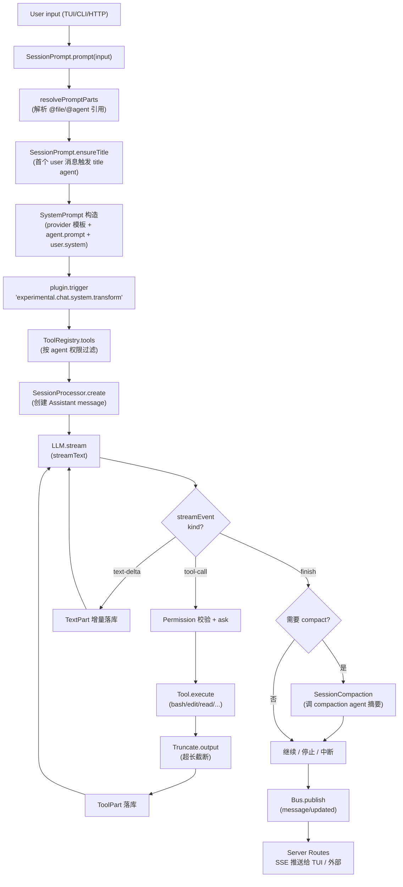

# OpenCode 架构总览学习文档

> 仓库根：`~/ws/opencode`
> 核心包：`packages/opencode/`（`opencode@1.14.25`，私有包）
> 默认分支：`dev`
> 入口 bin：`./bin/opencode` → `src/index.ts`

## 概述

OpenCode 是一个 **AI 编码 Agent 运行时**：CLI 启动 → 加载配置/插件 → 引导每个打开的项目为一个 Instance（`project/instance.ts`）→ 接收用户 prompt → 在 Session 中通过 LLM 流式调用 → 模型返回 tool call → Agent 执行 tool（bash/read/edit/write/grep/glob/skill/task/…）→ 结果回填 → 继续循环直至 `stop` / `compact` / 中断。

整体架构关键词：

- **多实例（Per-Project Instance）** — 一个 CLI 进程同时服务多个 project，每个 project 拥有独立的 `InstanceState`、`Bus`、`Storage`。
- **Effect-TS 服务化（Context/Layer）** — 所有子系统以 `Context.Service<...>("@opencode/Xxx")` 形式声明，`Layer.provide` 组合，`InstanceState` 做 per-instance 缓存与清理。
- **双总线（Bus + GlobalBus）** — Bus 在本进程内做 typed PubSub；GlobalBus 跨进程/跨窗口转发（用于 TUI ↔ Server 通信）。
- **AI SDK Provider 抽象** — 通过 `ai`（Vercel AI SDK）适配 20+ 家 LLM 厂商（Anthropic / OpenAI / Bedrock / Vertex / Groq / OpenRouter / GitHub Copilot / GitLab / Venice / …）。
- **插件钩子链** — `Plugin.Service.trigger("chat.params" | "experimental.chat.system.transform" | "tool.definition" | "event" | "config" | …)` 在 prompt 构造、流式请求、工具定义、事件分发等节点横向注入行为。
- **分层流水线** — L1/L1.5/L2/L5/L6 的 Shadow 语义在这里落不到代码层级，但 L0 风格的"研究→流程→规范→架构→计划→实现"被压缩进 `session/prompt.ts`（主循环）+ `session/processor.ts`（带 doom-loop 检测的步骤机）。

## 目录速览

| 目录 | 行数级别 | 职责 |
|------|---------|------|
| `packages/opencode/src/index.ts` | 248 | yargs CLI 入口，注册 22 个子命令（run/serve/agent/web/acp/mcp/…） |
| `packages/opencode/src/cli/cmd/*.ts` | 中 | 各 CLI 子命令，serve/tui/run/web/export/import/pr/session/… |
| `packages/opencode/src/server/` | 中 | Hono HTTP 服务、middleware、routes（`routes/instance/*` & `routes/global.ts`） |
| `packages/opencode/src/session/` | 极大 | Session 生命周期、MessageV2、Prompt 循环、Compaction、Revert、Retry、Status、RunState、Projector |
| `packages/opencode/src/agent/` | 中 | Agent 注册表（build/plan/general/explore/compaction/title/summary）+ `generate`（自动生成新 agent） |
| `packages/opencode/src/provider/` | 大 | LLM provider 适配（20+）、模型元数据（models.dev）、价格/限额、Transform |
| `packages/opencode/src/tool/` | 大 | Tool 实现（bash/edit/write/read/grep/glob/lsp/webfetch/websearch/skill/task/todo/plan/question/apply_patch/truncate/…）+ Registry |
| `packages/opencode/src/bus/` | 小 | PubSub 总线（typed + wildcard），跨实例事件分发 |
| `packages/opencode/src/plugin/` | 中 | 插件加载（内部/外部 npm）、钩子触发、Codex/Copilot/GitLab/Poe/Cloudflare 内置鉴权 |
| `packages/opencode/src/storage/` | 小 | Drizzle/SQLite 客户端、迁移加载、事务封装 |
| `packages/opencode/src/project/` | 中 | Project 模型、Instance 引导（ALS）、VCS/git 集成 |
| `packages/opencode/src/effect/` | 中 | `makeRuntime`、`InstanceState`、`EffectBridge`（Effect ↔ Promise）|
| `packages/opencode/src/skill/` | 小 | 加载 `.opencode/skills/` 与全局 skills（与 Shadow 体系同源） |
| `packages/opencode/src/permission/` | 中 | 三态权限规则（allow/deny/ask）+ evaluate 引擎 |
| `packages/opencode/src/snapshot/` | 中 | 文件级快照（用于 revert） |
| `packages/opencode/src/lsp/` | 中 | LSP 客户端（按需启动语言服务） |
| `packages/opencode/src/mcp/` | 中 | MCP 服务器/客户端（stdio/SSE） |
| `packages/opencode/src/auth/` | 中 | 鉴权（OAuth/Token），与 Provider 解耦 |
| `packages/opencode/src/config/` | 中 | 配置加载（JSONC + 多源合并） |
| `packages/opencode/src/sync/` | 小 | SyncEvent（持久化事件，类似事件溯源） |
| `packages/opencode/src/v2/` | 小 | v2 数据迁移相关 |
| `packages/opencode/src/control-plane/` | 中 | 多 workspace 实验性协调（OPENCODE_WORKSPACE_ID） |
| `packages/opencode/migration/` | — | Drizzle 生成的 SQL 迁移 |
| `packages/opencode/specs/` | — | Effect 迁移规范、`json-schema` 等 |

其他 workspace 顶层包：

- `packages/sdk/` — TS SDK（客户端到 server 的 fetch 封装），与 `opencode serve` 对应
- `packages/plugin/` — 插件类型/工具定义（`PluginDefinition`、`Hooks`、`WorkspaceAdaptor`）
- `packages/core/` — 跨包共享工具（global path、installation、util、Flag、filesystem）
- `packages/console/`, `packages/enterprise/`, `packages/desktop/`, `packages/desktop-electron/`, `packages/app/`, `packages/web/`, `packages/slack/`, `packages/function/`, `packages/containers/`, `packages/identity/`, `packages/extensions/`, `packages/storybook/`, `packages/ui/`, `packages/docs/`, `packages/containers/` — UI 与企业集成层
- `sdks/vscode/` — VS Code 扩展

## 核心文件

### 入口与命令注册

| 文件 | 职责 | 关键点 |
|------|------|--------|
| `packages/opencode/src/index.ts:1` | yargs CLI 入口 | 中间件：初始化 Log/Heap/env，**首次启动做 JSON 迁移**（带进度条），注册 22 个子命令（`serve`/`run`/`generate`/`agent`/`web`/`acp`/`mcp`/`tui`/`attach`/`session`/…） |
| `packages/opencode/src/cli/cmd/serve.ts:6` | `opencode serve` | 调用 `Server.listen(opts)`；可选 Basic Auth（`OPENCODE_SERVER_PASSWORD`） |
| `packages/opencode/src/cli/cmd/tui/thread.ts` | TUI 主循环 | Solid + OpenTUI（`@opentui/core` + `@opentui/solid`） |
| `packages/opencode/src/cli/cmd/tui/attach.ts` | 连接到运行中的 server | 通过 `Server.url` 复用已有实例 |
| `packages/opencode/src/cli/cmd/run.ts` | 单次 prompt 跑完即退出 | 调用 `SessionPrompt.prompt` 后退出 |

### 服务端

| 文件 | 职责 | 关键点 |
|------|------|--------|
| `packages/opencode/src/server/server.ts:39` | Hono 应用工厂 | 注册 middleware（Auth/Logger/Compression/Cors/Error/Fence/Instance/WorkspaceRouter），挂载 `/global`、`/experimental/workspace`、`/instance`、UI 路由；可选 mDNS（`bonjour-service`） |
| `packages/opencode/src/server/routes/instance/session.ts:33` | Session HTTP API | `GET /session`、`/status`、流式 `POST /session/:id/prompt` 等；带 OpenAPI 描述（`hono-openapi`） |
| `packages/opencode/src/server/middleware.ts:1` | 通用中间件 | `AuthMiddleware`（Basic Auth）、`CompressionMiddleware`、`CorsMiddleware`、`ErrorMiddleware`、`LoggerMiddleware` |
| `packages/opencode/src/server/workspace.ts:1` | 多 workspace 路由 | `WorkspaceRouterMiddleware` 把请求按 `workspaceID` 分流到对应 Instance |
| `packages/opencode/src/server/proxy.ts:1` | Provider 请求代理 | 用于 OAuth token 透传等 |

### Session 主循环

| 文件 | 职责 | 关键点 |
|------|------|--------|
| `packages/opencode/src/session/session.ts:370` | Session Service（Context.Service） | 22 个方法：`create/fork/get/touch/setTitle/setArchived/setPermission/setRevert/diff/messages/children/remove/updateMessage/updatePart/...` |
| `packages/opencode/src/session/prompt.ts:72` | SessionPrompt Service | 真正驱动一个 prompt 的 5 步循环（解析模板 → 调 LLM → 处理 tool call → 落库 → 决定 continue/compact/stop） |
| `packages/opencode/src/session/processor.ts:55` | SessionProcessor Service | 单条 assistant message 的流式消费：维护 `toolcalls`、`shouldBreak`、`needsCompaction`、`currentText`、`reasoningMap`，含 **doom-loop 检测**（`DOOM_LOOP_THRESHOLD = 3`） |
| `packages/opencode/src/session/llm.ts:53` | LLM Service | 封装 `streamText`（Vercel AI SDK），合并 `system`/`variant`/`options`/`headers`/`tools`，触发 `chat.params` / `chat.headers` / `experimental.chat.system.transform` 钩子 |
| `packages/opencode/src/session/message-v2.ts:1` | MessageV2 模式 | discriminated union：`User` / `Assistant` / `Tool`；Part：`Text` / `Reasoning` / `Tool` / `File` / `Snapshot` / `Patch` / `Subtask` / `Agent` / `Compaction` |
| `packages/opencode/src/session/compaction.ts:1` | Compaction Service | 上下文溢出时按 turn 切窗，调用 compaction agent 生成摘要；保留 `tail turns`（最近 2 轮） + `MIN_PRESERVE_RECENT_TOKENS = 2_000` |
| `packages/opencode/src/session/retry.ts:1` | SessionRetry | 退避重试（5xx、429 等） |
| `packages/opencode/src/session/revert.ts:1` | SessionRevert | 回到某个 messageID/partID，配套 Snapshot |
| `packages/opencode/src/session/summary.ts:1` | SessionSummary | diff 统计（additions/deletions/files） |
| `packages/opencode/src/session/status.ts:1` | SessionStatus | busy / retry / idle 状态机 |
| `packages/opencode/src/session/run-state.ts:1` | SessionRunState | 取消信号（AbortController） |
| `packages/opencode/src/session/instruction.ts:1` | Instruction | 加载 `AGENTS.md` / `CLAUDE.md` / 自定义 instruction 文件 |
| `packages/opencode/src/session/system.ts:1` | SystemPrompt | 静态 system prompt 模板（按 provider 适配） |
| `packages/opencode/src/session/todo.ts:1` | Todo | 会话内 todo 列表（与 TodoWrite 工具配套） |
| `packages/opencode/src/session/session.sql.ts:15` | Drizzle 表 | `session` / `message` / `part` / `todo` / `session_entry` / `permission`，字段 snake_case（AGENTS.md 强制） |

### Agent

| 文件 | 职责 | 关键点 |
|------|------|--------|
| `packages/opencode/src/agent/agent.ts:71` | Agent.Service | 6 个内置 agent（`build` / `plan` / `general` / `explore` / `compaction` / `title` / `summary`）+ `generate()` 动态生成 |
| `packages/opencode/src/agent/agent.ts:86` | 默认 Permission 规则 | `* = allow`、`doom_loop = ask`、`external_directory = ask`（除 skill 目录外）、`question = deny`、`*.env = ask` |
| `packages/opencode/src/agent/agent.ts:107` | build/plan 差异 | build 允许 question/plan_enter；plan 反向默认 deny edit（除 `.opencode/plans/*.md`） |
| `packages/opencode/src/agent/prompt/*.txt` | 静态 prompt 资源 | `compaction.txt` / `explore.txt` / `summary.txt` / `title.txt` |

### Provider

| 文件 | 职责 | 关键点 |
|------|------|--------|
| `packages/opencode/src/provider/provider.ts:92` | 20+ Provider 注册表 | `BUNDLED_PROVIDERS` 是动态 `import()` 映射表（懒加载 AI SDK） |
| `packages/opencode/src/provider/provider.ts:137` | `custom()` | Anthropic 默认 beta header（`interleaved-thinking-2025-05-14`）等定制化 |
| `packages/opencode/src/provider/transform.ts:1` | ProviderTransform | `temperature` / `topP` / `topK` / `maxOutputTokens` / `options` / `smallOptions` / `providerOptions` 适配；解决不同 provider 的 prompt caching、reasoning、tool calling 差异 |
| `packages/opencode/src/provider/models.ts:1` | models.dev 拉取 | 从 `https://models.dev` 拉取模型元数据（capabilities、cost、limit、variants） |
| `packages/opencode/src/provider/auth.ts:1` | Auth | 多 provider 鉴权（API key、OAuth） |
| `packages/opencode/src/provider/error.ts:1` | ProviderError | 错误归一化（`APIError` / `AuthError` / `ContextOverflowError`） |
| `packages/opencode/src/provider/sdk/copilot.ts` | GitHub Copilot SDK | 自实现的 openai-compatible 封装（带 token 刷新） |
| `packages/opencode/src/provider/schema.ts:1` | 品牌类型 | `ModelID` / `ProviderID` 强类型 |

### Tool

| 文件 | 职责 | 关键点 |
|------|------|--------|
| `packages/opencode/src/tool/registry.ts:72` | ToolRegistry Service | 合并内置 + 用户 `tool/*.ts` + 插件 tool，按 model 过滤（如 GPT 系列自动切 `apply_patch` 替代 edit/write） |
| `packages/opencode/src/tool/tool.ts:1` | Tool 抽象 | `Tool.Def` / `Tool.init()` / `InferDef<>` |
| `packages/opencode/src/tool/bash.ts:1` | BashTool | shell 命令执行（描述里点明 "DO NOT use for find/grep/cat/head/tail"） |
| `packages/opencode/src/tool/edit.ts:1` | EditTool | 精确字符串替换（含 fuzzy match fallback） |
| `packages/opencode/src/tool/apply_patch.ts:1` | ApplyPatchTool | 仅在 `gpt-*`（非 oss/4）模型下启用 |
| `packages/opencode/src/tool/truncate.ts:1` | Truncate | 工具输出超过阈值时落盘到 `<worktree>/.opencode/truncation/`，元数据返回 `outputPath` |
| `packages/opencode/src/tool/lsp.ts:1` | LspTool | 通过 `@vscode/jsonrpc` 调用 LSP（gopls/tsserver/…） |
| `packages/opencode/src/tool/task.ts:1` | TaskTool | subagent 调用（`general` / `explore` / 自定义） |
| `packages/opencode/src/tool/skill.ts:1` | SkillTool | 加载 skill（与 Shadow 体系对齐） |
| `packages/opencode/src/tool/plan.ts:1` | PlanEnter / PlanExit | 进出 plan mode 标记 |
| `packages/opencode/src/tool/question.ts:1` | QuestionTool | 客户端 `ask` 钩子，UI 弹窗 |

### Plugin / Bus / Storage

| 文件 | 职责 | 关键点 |
|------|------|--------|
| `packages/opencode/src/plugin/index.ts:105` | Plugin.Service | 注册 6 个内置鉴权插件（Codex/Copilot/GitLab/Poe/Cloudflare），加载 `cfg.plugin_origins` 外部 npm 插件，**纯模式**由 `OPENCODE_PURE` 跳过外部插件 |
| `packages/opencode/src/plugin/loader.ts:1` | PluginLoader | 解析 spec（`name@version`）、从 npm 安装、加载 entry、兼容性检查 |
| `packages/opencode/src/plugin/codex.ts:1` | Codex OAuth 插件 | Codex 鉴权 |
| `packages/opencode/src/plugin/github-copilot/copilot.ts` | Copilot OAuth 插件 | 设备码流 |
| `packages/opencode/src/bus/index.ts:43` | Bus.Service | typed + wildcard PubSub；订阅/发布通过 `EffectBridge` 桥接同步回调 |
| `packages/opencode/src/bus/bus-event.ts:12` | `BusEvent.define(type, schema)` | 强类型事件定义，保留 zod 派生 |
| `packages/opencode/src/bus/global.ts:1` | GlobalBus | 跨进程事件桥（Node EventEmitter） |
| `packages/opencode/src/storage/db.ts:84` | `Client` 懒加载 | 首次访问打开 SQLite、设 PRAGMA（WAL/NORMAL/busy_timeout/foreign_keys）、应用迁移 |
| `packages/opencode/src/storage/db.ts:129` | `use()` 事务封装 | 复用 `LocalContext` 中的 tx，否则开新事务；`effect()` 绑定到当前 Instance ALS |
| `packages/opencode/src/storage/json-migration.ts:1` | JSON→SQLite 迁移 | 老版本 opencode 用 JSON 文件，首次升级会跑这个（CLI 启动时的进度条就是这个） |
| `packages/opencode/src/storage/schema.sql.ts` | Drizzle 公共字段 | `Timestamps`（`time_created` / `time_updated`） |

### Project / Instance / Effect 基础设施

| 文件 | 职责 | 关键点 |
|------|------|--------|
| `packages/opencode/src/project/instance.ts:57` | `Instance` 全局 | `provide({ directory, init, fn })` — 在 ALS 中执行；`Instance.directory` / `worktree` / `project` getter；`bind()` / `restore()` 给原生回调用 |
| `packages/opencode/src/project/bootstrap.ts:17` | InstanceBootstrap | 启动时：Config → Plugin.init → fork-detach LSP/Share/Format/File/FileWatcher/VCS/Snapshot；订阅 `Command.Executed` 标记项目已初始化 |
| `packages/opencode/src/project/project.ts:1` | Project.Service | 从 directory 解析 project（Git root、worktree） |
| `packages/opencode/src/project/vcs.ts:1` | VCS 适配 | Git/非 Git 项目 |
| `packages/opencode/src/effect/instance-state.ts:1` | InstanceState | per-directory 的 `ScopedCache`，open/close 时自动清理 Effect fiber |
| `packages/opencode/src/effect/run-service.ts:1` | `makeRuntime` | 返回 `{ runPromise, runFork, runCallback }`，共享 `memoMap` 去重 layer |
| `packages/opencode/src/effect/bridge.ts:1` | `EffectBridge` | Effect ↔ Promise 互转（fork 到 scope） |
| `packages/opencode/src/effect/instance-registry.ts:1` | disposeInstance | 关闭项目时清理所有资源 |
| `packages/opencode/src/effect/instance-ref.ts:1` | InstanceRef | 在 Effect 中携带 ALS context（`Instance.directory`） |

## 关键数据流：一次 Prompt 的完整路径



## 关键设计模式

### 1. Per-Instance Scope（项目即沙箱）

- `Instance.provide({ directory })` 包装一个上下文，**整个项目的所有 Effect service 都通过 `InstanceState` 缓存**到该 directory 下。
- 关闭项目时调用 `disposeInstance(directory)` → 中断所有 fiber、shutdown PubSub、关闭数据库。
- 这就是为什么多个项目可以共存于一个 `opencode serve` 进程而互不污染。

### 2. `Context.Service` + `Layer.provide` 依赖注入

```ts
// 声明（agent.ts:69）
export class Service extends Context.Service<Service, Interface>()("@opencode/Agent") {}

// 依赖（tool/registry.ts:72）
export const layer: Layer.Layer<Service, never, Config.Service | Plugin.Service | ...> = ...

// 提供默认值（agent.ts:402）
export const defaultLayer = layer.pipe(
  Layer.provide(Plugin.defaultLayer),
  Layer.provide(Provider.defaultLayer),
  ...
)
```

AGENTS.md（`packages/opencode/AGENTS.md:1`）专门规定：

- **不要用 `export namespace`** — 用 `export * as Foo from "./foo"` 平铺重导出
- **多文件目录不要 barrel `index.ts`** — 破坏 tree-shaking
- **Schema.Class** for multi-field data；**Schema.brand** for 单值类型；**Schema.TaggedErrorClass** for typed errors
- **`InstanceState`** 用于 per-directory state；**`makeRuntime`** 用于服务运行时

### 3. `Effect.fn` 命名 + OpenTelemetry

所有 service 方法都用 `Effect.fn("Domain.method")` 包裹，自动带 span 名称和追踪 ID。Provider 启用 `experimental.openTelemetry` 时整条调用链可观测。

### 4. AI SDK v6 适配

`packages/opencode/package.json:82` 拉了 22 个 `@ai-sdk/*` 子包。`streamText` 在 `llm.ts:200` 附近调用：

- 合并 `system`（agent prompt + provider system + user system）
- 合并 `options`（base + model + agent + variant）
- 触发 `chat.params` / `chat.headers` 插件钩子
- 处理 OpenAI OAuth（`isOpenaiOauth`）的特殊 instructions 路径
- 处理 LiteLLM / Anthropic 代理需要 dummy tool 的边界
- 包含缓存 token 修正（`session.ts:299 getUsage`）

### 5. 双总线

- **Bus**（`src/bus/index.ts`）— Effect PubSub，typed channel + wildcard，per-Instance。
- **GlobalBus**（`src/bus/global.ts`）— Node EventEmitter 桥，把 Instance 事件扇出到控制平面（多 TUI、IDE、远程客户端订阅）。

### 6. Doom Loop 检测

`processor.ts:24 DOOM_LOOP_THRESHOLD = 3`：连续 3 次相同 tool call（含相同 args）触发中断 — 这是 `Permission` 规则里 `doom_loop: "ask"` 的实现基础。

### 7. 工具注册

`tool/registry.ts:279 tools()`：

- 按 model 切换 `apply_patch` vs `edit`/`write`（GPT-* 且非 oss 且非 4 → patch）
- `websearch`/`codesearch` 仅在 `opencode` provider 或 `OPENCODE_ENABLE_EXA` 时启用
- `lsp` 仅在 `OPENCODE_EXPERIMENTAL_LSP_TOOL`
- `plan` 仅在 `OPENCODE_EXPERIMENTAL_PLAN_MODE` 且 CLI
- `question` 仅在 app/cli/desktop 客户端

## 关键实现片段

### Prompt 循环入口（`session/prompt.ts:72`）

```ts
// SessionPrompt.Service（5 个方法）
export interface Interface {
  readonly cancel: (sessionID: SessionID) => Effect.Effect<void>
  readonly prompt: (input: PromptInput) => Effect.Effect<MessageV2.WithParts>
  readonly loop: (input: LoopInput) => Effect.Effect<MessageV2.WithParts>
  readonly shell: (input: ShellInput) => Effect.Effect<MessageV2.WithParts>
  readonly command: (input: CommandInput) => Effect.Effect<MessageV2.WithParts>
  readonly resolvePromptParts: (template: string) => Effect.Effect<PromptInput["parts"]>
}
```

### LLM 流式调用（`session/llm.ts:72`）

`LLM.run` 是 AI SDK `streamText` 的 Effect 包装：

```ts
const system: string[] = []
system.push(
  [
    ...(input.agent.prompt ? [input.agent.prompt] : SystemPrompt.provider(input.model)),
    ...input.system,
    ...(input.user.system ? [input.user.system] : []),
  ].filter((x) => x).join("\n"),
)
yield* plugin.trigger("experimental.chat.system.transform", { sessionID, model }, { system })
```

### Tool 注册按 model 过滤（`tool/registry.ts:285`）

```ts
const usePatch =
  input.modelID.includes("gpt-") && !input.modelID.includes("oss") && !input.modelID.includes("gpt-4")
if (tool.id === ApplyPatchTool.id) return usePatch
if (tool.id === EditTool.id || tool.id === WriteTool.id) return !usePatch
```

### Plugin 内置鉴权（`plugin/index.ts:57`）

```ts
const INTERNAL_PLUGINS: PluginInstance[] = [
  CodexAuthPlugin,
  CopilotAuthPlugin,
  GitlabAuthPlugin,
  PoeAuthPlugin,
  CloudflareWorkersAuthPlugin,
  CloudflareAIGatewayAuthPlugin,
]
```

### Bus typed + wildcard（`bus/index.ts:69`）

```ts
function getOrCreate<D extends BusEvent.Definition>(state: State, def: D) {
  return Effect.gen(function* () {
    let ps = state.typed.get(def.type)
    if (!ps) {
      ps = yield* PubSub.unbounded<Payload>()
      state.typed.set(def.type, ps)
    }
    return ps as unknown as PubSub.PubSub<Payload<D>>
  })
}
```

### Doom Loop 守卫（`session/processor.ts:24`）

```ts
const DOOM_LOOP_THRESHOLD = 3
```

## 多实例（Per-Directory）机制

OpenCode 进程可以同时为多个项目工作。`src/project/instance.ts:57` 暴露 `Instance.provide({ directory, init, fn })`：

- 用 `LocalContext`（`util/` 下）做 ALS，绑定 `directory` / `worktree` / `project`。
- `Instance.bind(fn)` 把当前 ALS 快照包装成同步回调 — 给 `node-pty` / `@parcel/watcher` 这类原生 addon 用。
- `InstanceState`（`effect/instance-state.ts`）做 per-directory 的 Effect `ScopedCache`：每个 directory 第一次访问时构造所有 service 的 fiber，关闭时 `Effect.addFinalizer` 一并清理。

这意味着：

- `opencode serve` 在 4096 端口接受 HTTP，每个请求带 `directory` header → InstanceMiddleware 解析 → 进入对应项目沙箱。
- TUI 多开：每个 TUI tab 关联不同 directory，server 端按 directory 路由。

## Effect 偏好（`packages/opencode/AGENTS.md:69`）

- 用 `Effect.gen(function* () { ... })` 组合。
- 用 `Effect.fn("Domain.method")` 命名/追踪；`Effect.fnUntraced` 内部 helper。
- 用 `Effect.callback` 包回调式 API。
- `DateTime.nowAsDate` 优于 `new Date(yield* Clock.currentTimeMillis)`。
- `Schema.Class` / `Schema.brand` / `Schema.TaggedErrorClass`。
- `FileSystem.FileSystem` 而非 `fs/promises`。
- `ChildProcessSpawner.ChildProcessSpawner` + `ChildProcess.make(...)` 而非手写 spawn。
- `HttpClient.HttpClient` 而非裸 `fetch`。
- `Effect.cached` 做并发去重，不要手写 `Promise | undefined`。
- `Instance.bind` 专给原生 addon 回调用。

## 与 Shadow 体系的对照

| Shadow 概念 | OpenCode 对应物 |
|------------|---------------|
| `agents/shadow-walker.md` (Agent 定义) | `src/agent/agent.ts` (Agent.Service) + `src/agent/agent.ts:107` 内置 6 个 agent |
| `shadow-l1-research / l1-flow / l1-spec / l1-wire` (业务建模) | （无对应物）— OpenCode 不做项目级建模，只做 agent 通用能力 |
| `shadow-l1p5-architecture` (API/Event 契约) | `provider/error.ts` + `server/routes/instance/*` 的 OpenAPI 描述 + `bus/bus-event.ts` 强类型事件 |
| `shadow-scaffold` (项目脚手架) | （无）— OpenCode 用 `scaffold` skill 由 plugin 提供 |
| `shadow-l2-e2e` (BDD 验收) | `tool/bash.ts` 的描述里写 "Do not use this tool... use Grep/Read/Glob instead" — 引导而非约束 |
| `shadow-l5-plan` (Harness 计划) | （无）— OpenCode 内部没有按 batch 计划；用户自己写 AGENTS.md |
| `shadow-l6-deploy` (部署验证) | （无）— OpenCode 是开发者工具，不部署用户项目 |
| **可借鉴的工程实践** | `tool/truncate.ts` 输出截断 + 元数据 `outputPath` 落盘；`permission/` 的三态规则 + `evaluate` 引擎；`compaction.ts` 的 turn-based 摘要策略；`processor.ts` 的 doom-loop 检测；`bus/index.ts` 的 typed + wildcard 双 PubSub；`InstanceState` per-directory 自动清理；`plugin/index.ts` 区分内部/外部/Pure 模式 |

**最大借鉴点**：把 OpenCode 的 `Effect.fn` + `Context.Service` + `Layer.provide` 范式引入 Shadow — Walker 内部可以用同样的 Effect 化分层（Config/Provider/Storage/PromptLoop/ToolRegistry/Plugin）实现一个更可测试、可静态校验的单进程运行时，而不是当前的"扁平的 Bash 脚本 + 文件系统状态"。

## 速查命令

```bash
# 入口
cd ~/ws/opencode/packages/opencode
bun run dev          # 跑 src/index.ts（dev 模式）
bun run typecheck    # 跑 tsgo
bun test             # 跑测试（必须在包目录，不能在 repo 根）

# 数据库
bun run db generate --name <slug>   # 生成 drizzle 迁移

# 看架构图
cat ~/ws/opencode/docs/architecture.mmd
npx -p @mermaid-js/mermaid-cli mmdc -i ~/ws/opencode/docs/architecture.mmd -o /tmp/oc.svg

# Style
# - 单一 function 优先（除非可组合）
# - 少用 try/catch
# - 不用 any
# - 用 Bun API（Bun.file()）
# - 解构仅在有命名冲突时使用
# - 优先 const + 三元/早返
```

## 参考资料

- AGENTS.md（项目根） — 顶层规约（`AGENTS.md:1`）
- AGENTS.md（`packages/opencode/`） — Effect 规则、Schema 规则、Module shape（`packages/opencode/AGENTS.md:1`）
- `docs/architecture.mmd` — 统一架构图
- `CONTRIBUTING.md` — 贡献流程
- https://opencode.ai/docs/zh-cn/tools/ — 用户文档
- Vercel AI SDK 文档 — Provider 适配层参考
- Effect-TS 文档 — `Effect.fn` / `Context.Service` / `InstanceState` 模式来源

---

> 文档生成时间：2026-06-04
> 版本：opencode@1.14.25
> 触发原因：用户请求"学习 OpenCode"，按 `opencode-learning` 技能执行首次学习流程
