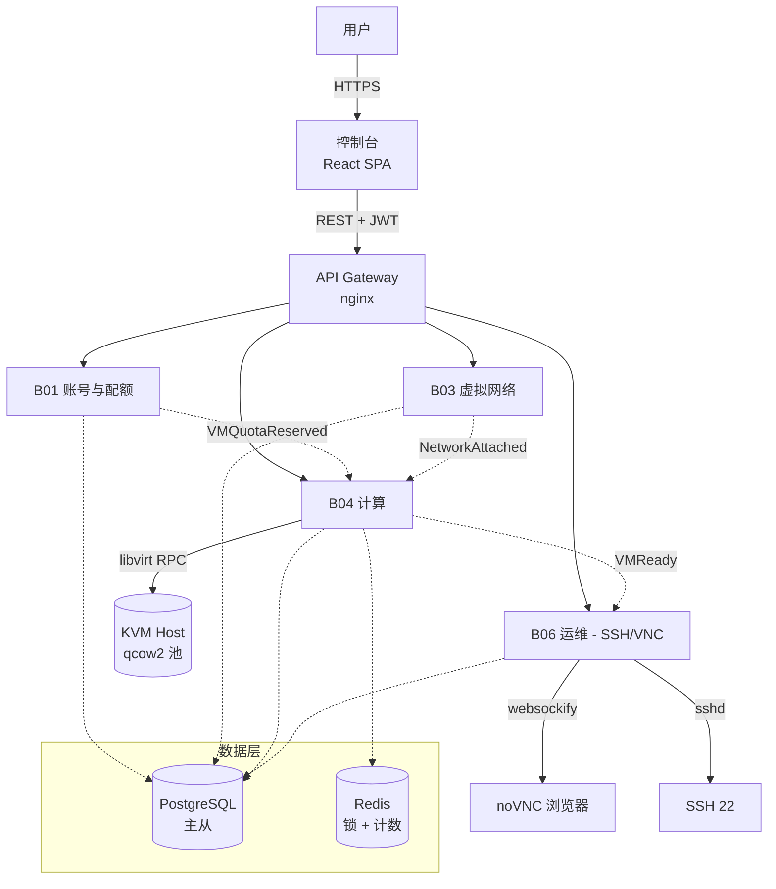

# VM 调度平台 — 极简架构草稿

> 头脑风暴产出，非正式 L1.5 architecture.md。
> MVP 聚焦 4 条业务线（B01 账号 / B03 网络 / B04 计算 / B06 运维），其他先不做。

## 1. 全景图



## 2. 聚合全景

| BXX | 聚合 | 一致性边界 | 关键发布事件 |
|-----|------|----------|-------------|
| **B01** | Account | 单事务 | `AccountCreated` `AccountAuthenticated` |
| **B01** | Quota | 单事务 + Redis 计数 | `QuotaReserved` `QuotaReleased` |
| **B03** | VPC | 单事务 | `VPCCreated` `VPCDeleted` |
| **B03** | Subnet | 单事务 | `SubnetCreated` |
| **B03** | SecurityGroup | 单事务 | `SGRuleAdded` `SGRuleRemoved` |
| **B03** | EIP | 单事务 | `EIPBound` `EIPUnbound` |
| **B04** | **VMInstance** | **强一致状态机** | `VMRequested` `VMScheduled` `VMLaunched` `VMStarted` `VMStopped` `VMDestroyed` |
| **B04** | Host | 强一致 | `HostCapacityChanged` |
| **B06** | KeyPair | 单事务（公钥+指纹） | `KeyPairCreated` `KeyPairAttached` |
| **B06** | ConsoleSession | 短时单事务 | `VNCProxyStarted` `ConsoleSessionOpened` |

**强一致 vs 最终一致分界**：
- 单聚合内 → 强一致（PG 事务）
- 跨聚合 → 事件驱动最终一致（VM 启动要等 Network 配好 + Quota 扣减 + KeyPair 注入，3 步串行但每步独立事务）

## 3. 规则 → 文件 → 端点（MVP 切片）

> 完整 26 条规则覆盖 4 BXX 核心路径。其他 3 条业务线（B02 镜像 / B05 存储 / B07 计费）未列入。

| RXX | 后端文件 | 前端文件 | API | 节点 |
|-----|---------|---------|-----|------|
| `account-R01` 注册 | `b01/account/aggregate.py` | `pages/RegisterPage.tsx` | `POST /api/auth/register` | B01-N01 |
| `account-R02` 登录 | `b01/account/aggregate.py` | `pages/LoginPage.tsx` | `POST /api/auth/login` | B01-N02 |
| `quota-R01` 查配额 | `b01/quota/aggregate.py` | `hooks/useQuota.ts` | `GET /api/quota` | B01-N03 |
| `vpc-R01` 建 VPC | `b03/vpc/aggregate.py` | `pages/VpcCreatePage.tsx` | `POST /api/vpcs` | B03-N01 |
| `subnet-R01` 建子网 | `b03/subnet/aggregate.py` | `pages/SubnetCreatePage.tsx` | `POST /api/vpcs/:id/subnets` | B03-N02 |
| `sg-R01` 加安全组规则 | `b03/security_group/aggregate.py` | `pages/SgRulePage.tsx` | `POST /api/security-groups/:id/rules` | B03-N03 |
| **`vm-R01` 申请 VM** | `b04/vm/aggregate.py` | `pages/VmLaunchPage.tsx` | `POST /api/vms` | **B04-N01** |
| `vm-R02` 调度 | `b04/vm/scheduler.py` | (后台 worker) | (内部事件) | B04-N02 |
| `vm-R03` 启动 | `b04/vm/provisioner.py` | (后台 worker) | (内部事件) | B04-N03 |
| `vm-R04` 列表 | `b04/vm/aggregate.py` | `pages/VmListPage.tsx` | `GET /api/vms` | B04-N04 |
| `vm-R05` 详情 | `b04/vm/aggregate.py` | `pages/VmDetailPage.tsx` | `GET /api/vms/:id` | B04-N05 |
| `vm-R06` 关机 | `b04/vm/aggregate.py` | `pages/VmDetailPage.tsx` | `POST /api/vms/:id/stop` | B04-N06 |
| `vm-R07` 开机 | `b04/vm/aggregate.py` | `pages/VmDetailPage.tsx` | `POST /api/vms/:id/start` | B04-N07 |
| `vm-R08` 销毁 | `b04/vm/aggregate.py` | `pages/VmDetailPage.tsx` | `DELETE /api/vms/:id` | B04-N08 |
| `kp-R01` 建密钥对 | `b06/keypair/aggregate.py` | `pages/KeyPairPage.tsx` | `POST /api/keypairs` | B06-N01 |
| `kp-R02` 注入到 VM | (vm-R03 内部步骤) | (内嵌) | (内嵌) | B06-N02 |
| `console-R01` 取 VNC token | `b06/console/vnc.py` | `pages/VmConsolePage.tsx` | `GET /api/vms/:id/vnc-token` | B06-N03 |
| `console-R02` VNC WebSocket | (websockify) | `pages/VmConsolePage.tsx` | `WS /vnc/:token` | B06-N04 |
| `console-R03` 取控制台日志 | `b06/console/log.py` | `pages/VmConsolePage.tsx` | `GET /api/vms/:id/console-log` | B06-N05 |

**vm-R01 申请 VM 走通全链路**（4 步异步）：

```
POST /api/vms
  ├─ 1. 校验 Quota (B01)
  ├─ 2. 扣 Quota (B01) → 事件 QuotaReserved
  ├─ 3. 调度选 Host (B04) → 事件 VMScheduled
  └─ 4. libvirt 启动 + cloud-init 注 KeyPair (B04) → 事件 VMReady
                                            ↓
                                  6. B06 生成 VNC token (B06)
```

每步独立事务；任一步失败 → 补偿事件回滚（QuotaReleased / VMDestroyed）。

## 4. 技术栈

| 层 | 选型 | @intent |
|----|------|---------|
| 后端 | **Go 1.22** + Gin + GORM | 云平台主流（K8s/Docker/Prometheus 都 Go）；goroutine 适合调度并发；单文件二进制部署简单 |
| 前端 | React 18 + TypeScript + Vite + Ant Design | 控制台类后台；Ant Design 现成组件多 |
| 元数据库 | **PostgreSQL 16** | 强一致 + JSONB（VM 元数据灵活）+ 触发器（事件 outbox） |
| 缓存 / 锁 | **Redis 7** | scheduler leader election（`SET NX`）+ quota 计数 + 短 token 缓存 |
| 事件总线 | **Redis Streams** | MVP 阶段够用（生产换 NATS 或 Kafka） |
| VM Hypervisor | **KVM via libvirt**（生产）/ Docker container 模拟（笔记本演示） | KVM 是 Linux 主流；MVP 演示用 Docker 跑得动 |
| VNC 网关 | **noVNC + websockify** | 浏览器内嵌，免装客户端 |
| SSH | 原生 sshd + 密钥对 | 公钥 cloud-init 注入；私钥一次性返回给用户 |
| 镜像存储 | 本地 qcow2 目录（MVP）/ MinIO（生产） | MVP 不上分布式存储 |
| 部署 | Docker Compose | 全链路 Docker，方便 harness 测试 |

**没选 Python / Node 的原因**：云平台领域 Go 的库生态更熟（libvirt-go、kubernetes client-go）；Node 单线程模型对长连接 VNC/SSH 网关不友好。

## 5. 硬指标

| 维度 | 指标 | 怎么达成 |
|------|------|----------|
| API 响应 | P99 < 500ms（不含 VM launch） | Go 异步 + DB 索引（VM 按 tenant_id+status 复合索引）+ Redis 缓存 quota |
| **VM 启动** | **P95 < 30s**（请求 → SSH 可达） | 镜像预热（Keep 5 个 hot 镜像）+ cloud-init 注入密钥（不挂 ISO）+ 并行预启动 |
| VNC 接入 | 首帧 < 3s | websockify 预连接 + 短时 token 一次性 |
| 调度并发 | 单 scheduler **500 并发 launch** | goroutine pool + Redis 分布式锁（不让 2 个 scheduler 选同一 host） |
| 可用性 | 99.9%（单可用区） | API 无状态横向扩 + DB 主从 + scheduler 主备（Redis 选主） |
| 安全 | 私钥不落盘 | DB 只存公钥 + sha256 指纹；私钥**仅在创建时一次性**返回 |
| 租户隔离 | 严格 | 每次 query 强制 `WHERE tenant_id = ?`（走 GORM scope）；libvirt 用 network namespace 隔离 |
| SSH/VNC 鉴权 | 短时 token | VNC 走 JWT（5min 过期）；SSH 走公钥指纹校验（不靠密码） |

## 6. 部署拓扑

```
┌──────────────────┐      ┌──────────────────────────────────────┐
│  用户浏览器       │─────→│  nginx (TLS 终止 + 静态资源)          │
│  (Chrome/Safari) │      │  ├─ React SPA (gzip/brotli)          │
└──────────────────┘      │  └─ /api/* /ws/* 反代                 │
                         └──────────────┬────────────────────────┘
                                        ↓
                         ┌──────────────────────────────────────┐
                         │  api (Go, stateless, N 副本)          │
                         │  ├─ B01 账号/Quota                    │
                         │  ├─ B03 VPC/Subnet/SG/EIP             │
                         │  ├─ B04 VM aggregate + scheduler + prov│
                         │  └─ B06 KeyPair/Console               │
                         └──────┬─────────┬──────────┬──────────┘
                                ↓         ↓          ↓
                          ┌──────────┐ ┌──────┐ ┌──────────────┐
                          │PostgreSQL│ │Redis │ │ Scheduler    │
                          │  主 + 从  │ │主 + 从│ │ (active=1)   │
                          └──────────┘ └──────┘ └──────┬───────┘
                                                       │ 选主后 libvirt RPC
                                                       ↓
                                            ┌────────────────────┐
                                            │  KVM Host           │
                                            │  - libvirtd          │
                                            │  - qcow2 镜像池      │
                                            │  - VM 们             │
                                            └────────────────────┘
```

**关键部署决策**：

- **API 无状态** → 横向扩 N 副本（Nginx upstream）
- **Scheduler 走 Redis lock 选主** → 避免双调度；standby 持续 watch
- **KVM Host 暂 1 台**（笔记本/物理机）；扩多机时 libvirt 集群调度（lifecycle 复杂，先不做）
- **DB 读写分离在 MVP 之后**（先单主）
- **VNC token 走 Redis 短时存储**（5min TTL），不持久化

## 不在 MVP 范围内（明确剔除）

- B02 镜像市场（自定义镜像/共享镜像）→ 用 Ubuntu/CentOS 公共镜像起步
- B05 云盘/快照 → 直接绑定 qcow2 单盘
- B07 计费/订单 → Quota 计数代替，**不做实际扣费**
- 多可用区 / 跨 region → 单 KVM Host
- 抢占式实例 → 普通按需
- 监控大盘 → 只用 docker logs 临时看

## 估算

- 业务线 = 4（MVP）/ 7（最终）
- 规则数 ≈ 26（MVP）/ 80+（最终）→ MVP 落 **M 规模**
- 页面数 ≈ 12（MVP）/ 25（最终）→ MVP 落 **M 规模**
- 外部依赖 = 6（Postgres/Redis/KVM/websockify/sshd/Docker） → **L 规模**

→ MVP 取**最高** = L，但因 BXX 数只有 4，配置 `persona_max=10` 收敛画像、`wire_passes=2`（M/L 都 3 实际够用 2）。

## 下一步如果要真做

1. **L0 发散**：7 个笔记文件，竞品对标重点写阿里云 ECS 控制台 + AWS EC2 + OpenStack Horizon
2. **L1 业务**：intent.md + business-landscape.md + 4 份 BXX research.md（**B04 事件风暴最重**，VM 状态机有 7+ 事件）
3. **L1 Flow**：项目级总图 1 张，约 25-30 个 BXX-NYY 节点
4. **L1 Spec**：26 条 RXX 规则 + API 预映射 + ERROR_CODE
5. **L1 Wire**：12 个页面 SVG（最关键：VmLaunchPage / VmDetailPage / VmConsolePage 这 3 个）
6. **L1.5 架构**：按本文件 6 节结构产出，API 端点清单 ~20 个
7. **L2 e2e**：14 维覆盖矩阵 × 12 页面 = 168 个测试用例
8. **L5 plan/impl**：约 8 个 batch
9. **L6 deploy**：本地 Docker Compose 真跑，Playwright 跑 VNC + SSH 接入

预估总工时（MVP）：3-4 周（1 人全职） / 2 周（用 Walker 加速）。
