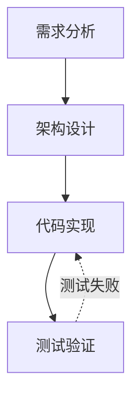

# Plan Workflow + MindMaster/Visio 集成

## 设计理念

```text
MindMaster / Visio / 其他流程设计工具
        ↓
    Mermaid 或 JSON plan
        ↓
    plan_workflow.py
        ↓
   按步骤推进开发
```

## 推荐流程

### Phase 1: 设计流程

你可以用两种格式进入统一工作流：

1. `Mermaid`
2. `JSON plan`

如果外部工具导出的是 Mermaid，先解析或直接创建执行态。

### Phase 2: 导入执行

#### 方式 1: 从 Mermaid 创建执行态

```bash
python skills/plan-workflow/scripts/plan_workflow.py create \
  --plan-id login-feature \
  --name "登录功能开发" \
  --from-mermaid flow.mermaid
```

#### 方式 2: 先把 Mermaid 回填成 JSON

```bash
python skills/plan-workflow/scripts/plan_workflow.py parse \
  --file flow.mermaid \
  --json
```

然后把 JSON plan 落盘，再启动：

```bash
python skills/plan-workflow/scripts/plan_workflow.py start \
  --plan-id login-feature \
  --name "登录功能开发" \
  --from-json login-feature.json
```

### Phase 3: 按步骤推进

```bash
python skills/plan-workflow/scripts/plan_workflow.py status \
  --plan-id login-feature \
  --json
```

```bash
python skills/plan-workflow/scripts/plan_workflow.py complete-task \
  --plan-id login-feature \
  --note "完成当前步骤"
```

```bash
python skills/plan-workflow/scripts/plan_workflow.py verify-task \
  --plan-id login-feature \
  --result passed \
  --note "验证通过"
```

## Mermaid 约定

推荐 MindMaster/Visio 导出的 Mermaid 满足：



要求：

- 节点 id 唯一
- 节点文本简洁
- 回退边用虚线表达

## 双向同步建议

如果设计工具里改了流程：

1. 重新导出 Mermaid
2. 重新生成 JSON plan 或重新 `create`
3. 不要直接把运行时状态文件当作设计源文件

如果执行中只是状态变化：

1. 继续使用 `complete-task` / `verify-task`
2. 不要重新导入设计文件

## VSCode 集成

```json
{
  "version": "2.0.0",
  "tasks": [
    {
      "label": "Plan Workflow: Status",
      "type": "shell",
      "command": "python skills/plan-workflow/scripts/plan_workflow.py status --plan-id ${input:planId} --json"
    },
    {
      "label": "Plan Workflow: Complete",
      "type": "shell",
      "command": "python skills/plan-workflow/scripts/plan_workflow.py complete-task --plan-id ${input:planId} --note '${input:note}'"
    }
  ]
}
```

## Git Hook 示例

```bash
STATUS=$(python skills/plan-workflow/scripts/plan_workflow.py status --plan-id current --json 2>/dev/null)
```

如果你需要更复杂的高级执行能力，比如显式 `fallback-task` 或 `reject-task`，再回到底层兼容执行器：

```bash
python skills/plan-engine/scripts/plan_engine.py --json reject-task \
  --plan-id login-feature \
  --note "验证失败"
```
