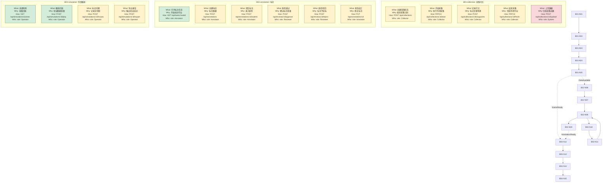

# Shadow·MDD — 模型驱动流程设计

## 角色

把业务调研的认知画成**一张项目级总图**。这张图是**你的思考载体**，不是按业务线拆散的交付物。

MDD 的思维链：
```
project.flow.mermaid (项目级业务模型总图，BXX-NYY 节点编号)
    → spec.md (细化，规则引用节点编号)
    → architecture.md §5 (API 端点清单，端点映射节点编号)
    → harness-plan.md (精密执行计划，引用 API 端点)
    → 代码
```

**流程节点编号（BXX-NYY）是整个传导链的核心追溯键**——spec 规则、API 端点、后端方法、前端页面都引用它。

## 编号系统（轻量版）

只需要 **BXX-NYY** 两级编号：

```
BXX — 总图泳道/领域编号（B01, B02, ...），用于分组和全局寻址，不对应独立 flow 文件
NYY — 泳道内流程节点编号（N01, N02, ...）
```

**原则**：编号是用来让下游引用的，不是用来炫耀的。Shadow Flow 只维护一张总图，不再为每条业务线创建独立 flow。

## 怎么做

### 1. 读 research.md

从统一语言和事件风暴提取节点。

### 2. 画项目级总流程

每个节点 = 一个不可再拆的业务动作。project.flow.mermaid 必须是开发者理解全项目业务的第一入口，而不是只画 happy path 的示意图。

**必答（缺了 = 契约不完整）：**
- 这个动作能不能再拆？（能就拆）
- 这个节点读写了什么数据？（标注 read/write/external）
- 这个节点失败时怎么处理？（校验失败、权限拒绝、外部超时、重试、降级）

**选答（画图时自然覆盖）：**
- 谁发起的？（入口标注触发来源）
- 正常走完是什么样？（主路径）
- 哪里会分支？（决策节点）
- 用户最终得到什么？（交付物节点）
- 这个节点会触发什么 API 操作？（在节点或边上轻量标注 HTTP 方法）
- 这个动作属于哪个泳道/领域？（放入对应 BXX subgraph）
- 跨泳道协作是同步调用、异步事件，还是共享状态读取？

project.flow.mermaid 必须覆盖这些业务信息：
- 操作点：用户点击、提交、审批、上传、下载、确认、取消。
- 业务点：创建、校验、分配、审核、结算、导出、通知等领域动作。
- 流程点：入口、主路径、分支、循环、等待、终态。
- 数据流转：DB 写入、缓存读取、状态迁移、文件生成、Token/凭证变化。
- 接口请求流：前端/客户端到后端的 HTTP/RPC/query 调用。
- 外部依赖：短信、邮件、OAuth、支付、对象存储、消息队列等。
- 错误处理：400/401/403/404/409/429/5xx、超时、重试、回滚、用户提示。

### 3. 标注泳道、聚合边界和领域事件

总图用 subgraph 表示业务域/泳道；泳道内部可以再用轻量注释标出聚合。聚合名来自 research.md 的事件风暴。

跨泳道/跨聚合通信优先通过领域事件（虚线标注）。如果是同步 API 调用，边标签必须标明 `HTTP` / `RPC` / `query` 等调用性质。

### 4. 流程节点 → API 端点预映射

在画流程时，问自己：
- **这个节点是否需要 API 端点？**（用户交互节点通常需要）
- **是读取数据还是写入数据？**（GET vs POST/PUT/DELETE）
- **谁有权限触发？**（Admin/Annotator/Reviewer）

**示例映射**：
```
B01-N01: 采集员创建采集任务 → POST /api/collections (Collector 角色)
B02-N08: 标注员提交标注 → POST /api/annotations/:id/submit (Annotator 角色)
B02-N06: 标注员打开任务 → GET /api/tasks/:taskId (Annotator 角色)
B02-N09: 质检员通过质检 → POST /api/reviews/:id/approve (Reviewer 角色)
```

这些映射需要在 project.flow.mermaid 中轻量标注，正式请求/响应契约再由 L1.5 API 端点清单细化。

**体系全局视角**：想了解 L1 Flow 在整个 Shadow 体系（L0→L1→L1.5→Scaffold→L2→L5→L6）中的位置和上下游协作关系，参考 `references/system-architecture.mmd`（一张 mermaid 融合 Walker 架构 + 行为流 + 业务线）。画项目级流程图前看一眼，能更好把握 L1 Flow 的"上游从 L1 Research 来、下游到 L1 Spec/Wire 和 L1.5 去"的传导定位。

### 5. 检查完整性

- 异常路径画了吗？
- 权限拒绝处理了吗？
- 需要通知/审计/外部调用的节点标了吗？
- 每个节点下游（spec/wire/L2/L5 Plan）能消费吗？
- **每个用户交互节点是否都能对应到 API 端点？**

传导完整性和下游消费清单见 `references/l1-conduction-map.md` 和 `references/forward-chain-contract.md`。

### 思维框架：Who / What / Why / How

所有架构设计的底层思维。每设计一个元素（节点/边/泳道/入口），必须能回答：

| 维度 | 问题 | AI 翻译 |
|------|------|---------|
| **Who** | 谁触发？谁有权？ | 鉴权中间件、角色守卫 |
| **What** | 做什么事？ | 函数名、事件名 |
| **Why** | 为什么做？ | 校验规则、错误文案、测试断言 |
| **How** | 怎么做？ | HTTP 方法、SQL、SDK 调用 |

**Why 最容易被忽略又最关键**：没有 Why → AI 写了代码但不知道为什么，遇到边界就出错。

### 节点即契约约定

加载 `references/node-contract-convention.md`。核心规则：

每个节点是 AI 的执行契约，按 W3H 组织：

```
BXX-NYY["What: 动词+宾语(Why: 业务目的)<br/>How: HTTP方法 路径 / 数据操作<br/>Who: role: 角色"]
```

- 第1行：**What + Why**（业务语义 + 为什么需要这一步）
- 第2行：**How**（接口契约 / 状态迁移）
- 第3行：**How**（数据契约 read/write/external）
- 第4行：**Who**（角色约束 role）

完整性检查：AI 看到每个节点 → 能写出函数签名、if 条件、错误处理、鉴权逻辑。不能 = 标注不够。

### 多入口触发

真实系统不止一个入口。每个独立触发源都要有自己的 ENTRY 节点：

```
ENTRY_ORDER["👤 用户下单<br/>trigger: user<br/>entry: POST /api/orders"]
ENTRY_TIMEOUT["⏰ 超时扫描<br/>trigger: cron<br/>entry: cron '*/5 * * * *'"]
ENTRY_CALLBACK["🔗 支付回调<br/>trigger: webhook<br/>entry: POST /api/payments/callback"]
```

六种触发类型：USER / CRON / WEBHOOK / EVENT / ADMIN / SYSTEM。

检查：每个节点都能追溯到某个 ENTRY 节点，没有悬空节点。

### 模板库

画图前先从 `templates/` 选择最匹配的模板，在模板基础上适配：

| 模板 | 适用场景 |
|------|---------|
| `flow-template.md` | 通用业务流程 |
| `T01-crud-resource.md` | 后台管理、资源 CRUD |
| `T02-content-publish.md` | CMS 内容发布、审核 |
| `T03-multi-step-form.md` | 多步骤表单、注册向导 |
| `T04-ecommerce-order.md` | 电商下单、支付、库存 |
| `T05-payment-integration.md` | 支付、退款、对账 |
| `T06-saas-billing.md` | SaaS 订阅、计费、升降级 |
| `T07-approval-workflow.md` | 审批流、多级审批 |
| `T08-task-tracking.md` | 任务分配、工单、质检 |
| `T09-state-machine.md` | 状态机驱动、生命周期 |
| `T10-data-pipeline-etl.md` | 数据管道、ETL、数仓 |
| `T11-file-upload.md` | 文件上传、转码、CDN |
| `T12-user-auth.md` | 注册登录、OAuth、密码管理 |
| `T13-rbac-permission.md` | RBAC 权限、数据权限 |
| `T14-api-aggregation.md` | API 聚合、BFF |
| `T15-event-driven.md` | 事件驱动、消息队列、CQRS |
| `T16-av-data-annotation.md` | 自动驾驶数据标注平台 |
| `T17-av-simulation-testing.md` | 自动驾驶仿真测试平台 |
| `T18-av-model-training.md` | 自动驾驶模型训练平台 |
| `T19-av-fleet-management.md` | 自动驾驶车队管理平台 |

### 品味引导：有结构的流程图

**泳道划分体现领域边界。** 泳道其实就是你对业务边界的理解宣言：

```
无品味：一条大泳道塞进所有节点
  subgraph 数据平台
    B01-N01 创建采集任务 → B02-N07 标注 → B02-N09 质检 → B03-N12 仿真
  end
  （读者：所以采集、标注、仿真是一个东西？）

有品味：泳道即限界上下文
  subgraph B01[采集打点]
    B01-N01[创建采集任务] → B01-N02[开始采集] → B01-N03[记录打点]
  end
  subgraph B02[标注]
    B02-N07[创建标注] → B02-N08[提交质检]
    B02-N08 -.->|AnnotationSubmitted| B02-N09[质检通过]
    B02-N10[质检驳回] -->|返工| B02-N11[修改返工]
  end
  subgraph B03[仿真播放]
    B01-N05 -.->|DataAvailable| B03-N12[选择场景]
  end
```

判断标准：解释"这个节点为什么放这个泳道"时如果需要想 3 秒以上 → 边界划模糊了。

**节点粒度均匀。** 全图所有节点的抽象层级应该一致。如果大部分是"保存草稿"这种细粒度，突然出现一个"管理项目"——读者会困惑：

```
粒度不一致（坏）:
  B01-N01 外场采集 ← 太粗，等于 5 个节点
  B01-N03 点击打点按钮 ← 太细，等于 1 次点击

粒度均匀（好）:
  B01-N01 创建采集任务
  B01-N02 开始采集
  B01-N03 记录打点
```

判断标准：用一行话概括每个节点。需要两行才能说清 → 拆。

**视觉节奏感。** 流程图读起来应该像读文章一样流畅：

- **主线从左到右**，不要回头线（回头线说明泳道切错了，应该用领域事件解耦）
- **决策节点精炼**（一张图 2-3 个决策点合适，超过 5 个说明该分层了）
- **跨泳道连线越少越好**（连线多说明领域间耦合高，审视是否该移动节点）

## 产出

`.shadow/L1-business/project.flow.mermaid`

**生命周期角色**（`design_baseline` 设计基线）：BXX-NYY 节点是全传导链的追溯键,被 L1 Spec / Wire / L1.5 / L2 / L5 / L6 全部下游引用,改节点必然触发整链重审。详见 `shadow-schema.json:lifecycle_artifacts` → `project-flow-mermaid`。

这是项目级唯一流程总图。不要输出 `.shadow/L1-business/BXX-{slug}/project.flow.mermaid`，也不要为每条业务线创建独立 flow 文件。

## 约束

- 开始节点标注触发来源
- 末尾节点标注交付物
- 聚合边界必须与 research.md 一致
- 领域事件必须与 research.md 事件清单一致
- **每个节点有唯一编号（BXX-NYY），供下游追溯**
- **所有 BXX-NYY 节点必须出现在同一张总图中**
- **禁止按业务线拆独立 flow；复杂细节写在节点说明/spec 中，不新建业务线 flow 文件**
- **用户交互节点预留 API 端点映射思考**
- **关键用户交互节点必须在节点或边上标注 API 请求或数据读写**
- **关键外部依赖必须有失败/超时/重试/降级路径**
- 如果 mmdc 安装了，可以验证渲染；没装也不拦你

## 品味约束

引用 `references/taste-criteria.md`。交付前通过致命三检：

- [ ] 减法：删 30% 内容后核心传导不断裂
- [ ] 人话：新人 5 分钟理解核心
- [ ] 一致：术语跨层一致，无同义词混用

Flow 特化：每个决策节点有否定分支。单个泳道决策节点 ≤ 3（超过说明该泳道职责过多）。泳道 ≤ 10 节点。节点标注 read/write/external。

## 简单项目示例：自动驾驶数据平台



**节点说明**：

**B01-collection（采集打点）**：
- B01-N01: 创建采集任务（路线/区域/时段）
- B01-N02: 开始采集，发布 CollectionStarted
- B01-N03: 采集过程中记录打点（GPS+场景类型），发布 WaypointRecorded
- B01-N04: 结束采集，发布 CollectionFinished
- B01-N05: 系统自动上传数据到对象存储，发布 DataAvailable（跨上下文事件）

**B02-annotation（标注）**：
- B02-N06: 标注员打开分配给自己的任务
- B02-N07: 创建标注（2D 框/3D 框/语义标签），发布 AnnotationCreated
- B02-N08: 提交质检，发布 AnnotationSubmitted + ReviewRequested
- B02-N09: 质检通过，发布 ReviewPassed
- B02-N10: 质检驳回（需填原因），发布 ReviewRejected
- B02-N11: 标注员修改返工，回到 B02-N08 重新提交

**B03-simulation（仿真播放）**：
- B03-N12: 选择已标注场景（依赖 B01 采集 + B02 标注）
- B03-N13: 播放回放（视频+点云+标注叠加），发布 SimulationStarted
- B03-N14: 标记问题帧（时间戳+问题描述），发布 IssueMarked
- B03-N15: 导出仿真报告，发布 ReportExported

**跨线依赖**：
- B01→B02：采集数据上传完成后（DataAvailable）触发标注任务创建
- B01→B03：采集数据可用于仿真回放
- B02→B03：标注结果叠加到仿真回放画面

## L1 门禁检查

### 层内自检（本 agent 完成后）

执行下方的 L1 门禁检查（只检查本 agent 产出物相关的检查项）。全部 L1 agent 完成后执行完整 L1 gate 检查。

### 门禁检查项

1. intent.md 存在（项目意图定义，含用户画像发散清单 ≥5 个画像）
2. business-landscape.md 存在（业务全景）
3. research.md 存在（每条业务线，含用户旅程穷举章节，总旅程数 ≥ 画像数 × 5）
4. project.flow.mermaid 存在（可选验证渲染）
5. spec.md 存在
6. 统一语言术语在 spec 中一致使用
7. BXX-NYY 编号在 flow 和 spec 间一致
8. wire.svg 存在（仅当项目有前端时检查；纯后端项目跳过）
9. wire.svg 页面覆盖 research.md 旅程穷举中的业务场景（仅当前端项目）：
   - `metadata#wire-coverage` 存在且 `coverage` 为 100%
   - `wire-coverage` 中的 `total_journeys` ≥ research.md 中的总旅程数
   - `uncovered_journeys` 为空

### 门禁脚本

快速检查：`bash skills/shadow-l1-flow/scripts/gate-check-l1.sh <slug>`
语义检查：`bash skills/shadow-l1-flow/scripts/check-semantic-gate-l1.sh <slug>`

门禁详细语义说明见 `references/gate-l1.md` 和 `references/gate-semantics.md`。Mermaid 渲染验证见 `references/mermaid-check.md`，语法规范见 `references/mermaid-spec.md`。

通过后创建 `{迭代门禁目录}/l1.{slug}.passed`（门禁目录为 `.shadow/iterations/{当前迭代}/gate/`）。
失败时输出到对话：列出具体失败项、文件路径和缺失说明。
