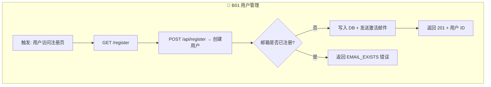
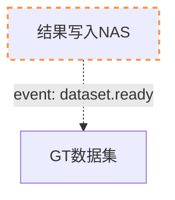
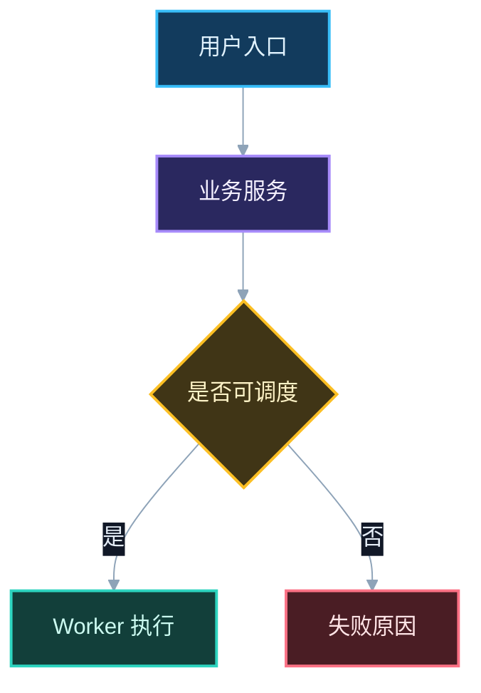
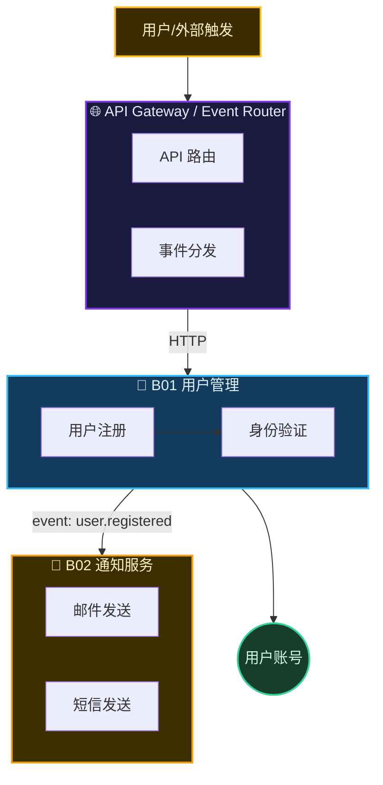

# Mermaid 配色和语法约束

## 节点编号规范（项目级总图 + BXX-NYY 路由体系）

> **每个节点必须有编号。** 编号决定代码可追溯精度。
> **项目只维护一张流程总图。** BXX 是总图中的泳道/领域编号，不再对应独立业务线 flow 文件。

### 编号格式

```
BXX-NYY-CZZ-DDD
│   │   │   │
│   │   │   └── 子子节点（第4层，可选）
│   │   └────── 子节点（第3层，可选）
│   └────────── 流程节点（第2层）
└────────────── 总图泳道/领域（第1层）
```

### 节点编号示例



### 编号规则

| 规则 | 说明 |
|------|------|
| 节点 ID 用 `BXX-NYY` 格式 | `B01-N01`, `B01-N02`...`B99-N99`，泳道内从 01 递增 |
| 子节点用 `BXX-NYY-CZZ` | `B04-N07-C01` 表示 B04-N07 下的第1个子节点 |
| 子子节点用 `BXX-NYY-CZZ-DDD` | `B04-N07-C01-D02` 表示再下一层 |
| 触发源节点必须是 `N01` | 标注整个流程的入口和触发者 |
| 交付物节点标注 `resultNode` class | 用户可感知的交付物 |
| 节点内部有子步骤必须拆分 | 一个节点 = 一个不可再拆的业务动作 |
| 使用具体动作描述 | `B01-N03[POST /api/register → 创建用户记录]` 而非 `B01-N03[处理注册]` |
| 单一总图 | 所有正式节点都在 `.shadow/L1-business/project.flow.mermaid` 中维护 |

### 复杂节点表达

复杂节点不再拆成独立业务线 flow 文件。总图只画业务可见动作和关键分支，节点内部细节进入 `spec.md` 的规则、异常路径和状态迁移；如确实需要子节点，仍然写在同一个 `project.flow.mermaid` 中。

### 跨泳道连接



### 从节点到代码的追溯链

```
project.flow.mermaid: B01-N03[POST /api/register → 创建用户]
    ↓
spec.md: user-management-R01（对应 B01-N03 的规则）
    ↓
    L5 harness-plan.md: @implements: user-management-R01
    ↓
L5 代码: # @implements: user-management-R01 (B01-N03)
    ↓
trace.sh: forward B01-N03 → 查看该节点所有实现 + 测试
```

## 泳道配色表

| 泳道类型 | 背景色 | 边框色 | 文字色 | 场景 |
|-----------|--------|--------|--------|------|
| 👤 用户/身份 | `#123B5D` | `#38BDF8` | `#E0F2FE` | 注册、登录、权限 |
| 💳 支付/财务 | `#2A1850` | `#A78BFA` | `#F4F0FF` | 支付、退款、账单 |
| 📦 订单/物流 | `#1B3A2D` | `#34D399` | `#D1FAE5` | 订单、发货、库存 |
| 🔔 通知/消息 | `#3B2F00` | `#F59E0B` | `#FEF3C7` | 邮件、短信、推送 |
| 🔍 搜索/推荐 | `#3B1028` | `#F472B6` | `#FCE7F3` | 搜索、推荐、排行 |
| ⚙️ 管理/配置 | `#1F2937` | `#6B7280` | `#F3F4F6` | 后台管理、设置 |
| 📊 数据/分析 | `#1A2744` | `#60A5FA` | `#DBEAFE` | 报表、统计、埋点 |
| 🌐 网关/路由 | `#1A1A3E` | `#7C3AED` | `#EDE9FE` | API Gateway、事件路由 |
| ⚠️ 告警/异常 | `#4A1D24` | `#FB7185` | `#FFE4E6` | 错误处理、熔断 |
| 📥 数据采集 | `#2D4A3E` | `#34D399` | `#D1FAE5` | API 拉取、CDC、日志采集 |
| 🔄 数据转换 | `#4A3D16` | `#FBBF24` | `#FEF3C7` | ETL、清洗、字段映射、聚合 |
| 💾 数据存储 | `#1A3A5C` | `#60A5FA` | `#DBEAFE` | 数仓分层、表结构、分区 |
| 📊 数据服务 | `#2D1A3E` | `#E879F9` | `#FAE8FF` | API 查询、报表、Dashboard |
| 🎯 管道编排 | `#2D1A4E` | `#A78BFA` | `#F4F0FF` | DAG、调度、任务依赖、重试 |
| ✅ 数据质量 | `#1A4A3A` | `#2DD4BF` | `#CCFBF1` | Schema 校验、完整性、对账 |
| 📡 数据分发 | `#4A2030` | `#FB7185` | `#FFE4E6` | 消息队列、跨系统同步 |
| 🔗 跨线出口 | `#4A2A16` | `#FB923C` | `#FFEDD5` | 流向他线的节点 |

**新增配色规则：** 色相环间隔 ≥ 60°、饱和度 40-70%、明度 15-35%、边框比背景亮 2-3 级。

## 基础节点配色



classDef crossLine stroke-dasharray: 5 5,stroke:#FB923C,stroke-width:2px

## 单图维护规范

```
.shadow/L1-business/
  └── project.flow.mermaid     ← 唯一项目级流程总图
```

- B01/B02/B03 等只作为总图 subgraph 泳道存在
- 不创建 `B01-user/project.flow.mermaid`、`B02-payment/project.flow.mermaid`
- 不创建 `flow-xxx.project.flow.mermaid` 作为业务线或公共流程子图
- 公共流程通过同一总图内的共享节点表达，多个入口可以指向同一节点

语法约束：
- `subgraph` 标题不要使用节点形状标记
- 路径参数写成 `:job_id` 而非 `{job_id}`
- 函数调用写成 `调用 cancel_job` 而非 `cancel_job()`
- 每个 `classDef` 显式写 `color`

## 项目级总图 Mermaid 规范

### 文件结构

```
.shadow/L1-business/project.flow.mermaid   ← 唯一总图，包含所有 BXX 泳道和跨域边
```

### 总图示例



### Gate 检查扩展项

| # | 检查项 | 说明 |
|---|--------|------|
| M1 | 总图包含所有 BXX 泳道 subgraph | 不按业务线拆文件 |
| M2 | 不存在业务线独立 flow 文件 | 只允许 `.shadow/L1-business/project.flow.mermaid` |
| M3 | 跨泳道连接有语义 | 同步调用标注 HTTP/RPC/query，异步调用标注 event |
| M4 | 连接标签完整 | 每条跨泳道边都有标签 |
| M5 | 事件命名规范 | 使用 `domain.action` 格式 |
| M6 | 无循环依赖 | 泳道间无 A→B→A 调用链 |
| M7 | 配色唯一性 | 每个泳道使用独立的 classDef 配色 |
| M8 | spec.md 有跨域依赖表 | 当存在跨泳道连接时必须有此表 |
