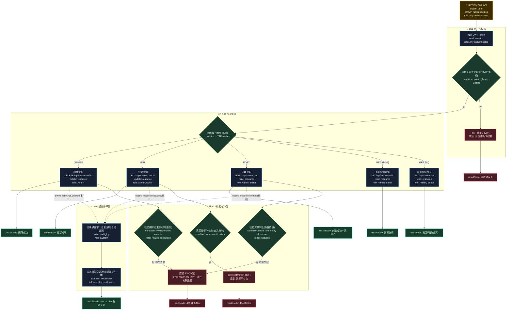

# T01: CRUD 资源管理模板

## 适用场景

- 后台管理系统（用户管理、商品管理、配置管理）
- 标准 CRUD：列表 / 详情 / 新建 / 编辑 / 删除
- 分页、搜索、排序
- 操作审计

## 泳道设计（W3H）

| 泳道 | Who | What | Why | How |
|------|-----|------|-----|-----|
| B01 用户与权限 | Any authenticated | 身份校验、角色鉴权 | 确保只有合法用户操作合法资源 | JWT 鉴权 + RBAC |
| B02 资源管理 | Admin, Editor | CRUD 核心操作 | 资源是业务的核心数据，必须正确持久化 | HTTP API + DB |
| B03 校验与冲突 | System | 字段校验、存在性检查、约束检查 | 写入操作必须校验，防止脏数据和级联丢失 | 校验规则 + DB 约束 |
| B04 通知与审计 | System | 操作日志、变更通知 | 所有变更必须可追溯 | 异步写入 + WebSocket |

## 入口分析（W3H）

| 入口 | Who | What | Why | How |
|------|-----|------|-----|-----|
| 用户操作 | Any authenticated | 资源增删改查 | 用户需要管理业务数据 | `* /api/resources` |

CRUD 场景通常只有一个入口（API Gateway 分发），不同操作通过 HTTP Method 区分。

## Mermaid 图

## 异常路径清单

| 触发点 | 错误码 | Why | 恢复方式 |
|--------|--------|-----|---------|
| B01-N02 | 403 | 角色无权操作该资源 | 联系管理员 |
| B03-N01 | 409 | 名称重复导致数据冲突 | 修改名称 |
| B03-N01 | 400 | 字段为空导致脏数据 | 填写名称 |
| B03-N02 | 404 | 操作不存在的资源是幽灵操作 | 返回列表页 |
| B03-N03 | 409 | 级联删除会导致关联数据丢失 | 先清理关联 |

## 常见变异

| 变异点 | 默认方案 | 替代方案 | Why |
|--------|---------|---------|-----|
| 删除策略 | 硬删除 | 软删除（deleted_at） | 需要数据恢复能力 |
| 分页方式 | offset 分页 | 游标分页 | 数据量大时 offset 性能差 |
| 权限粒度 | 角色级 | 行级（只看自己的） | 多租户隔离需求 |
| 并发控制 | 无 | 乐观锁 | 防止并发覆盖 |
| 排序 | 默认排序 | 多字段排序 | 用户自定义视图 |
| 搜索 | 精确匹配 | 全文搜索 | 需要模糊查询能力 |
