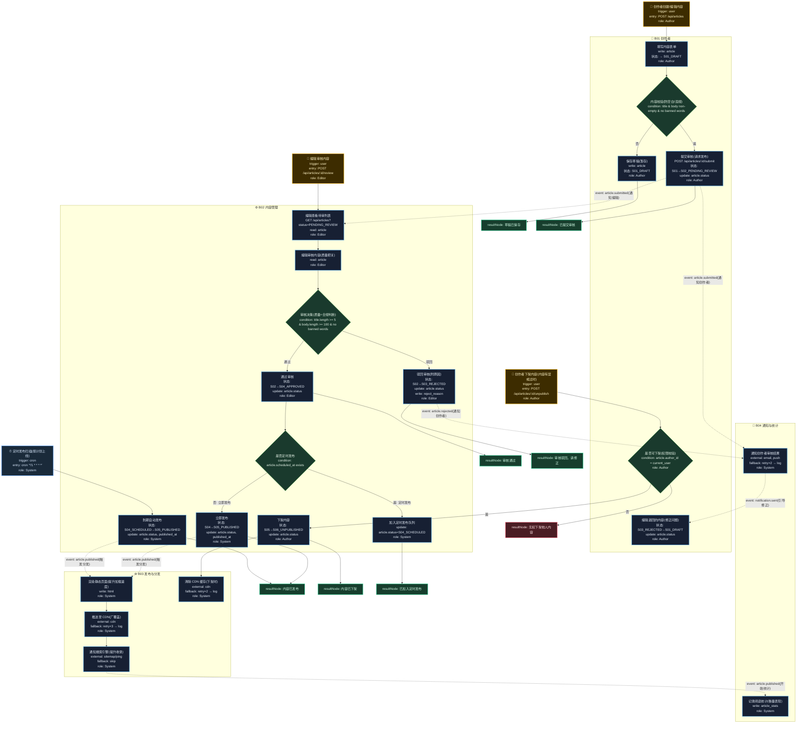

# T02: 内容发布流程模板

## 适用场景

- CMS 内容管理：博客、文章、新闻、文档
- 内容创建 → 审核 → 发布 → 下架全生命周期
- 多角色协作：创作者、编辑、审核员

## 泳道设计（W3H）

| 泳道 | Who | What | Why | How |
|------|-----|------|-----|-----|
| B01 创作者 | Author | 创建/编辑/提交内容 | 创作者需要表达内容意图 | HTTP API + 富文本编辑器 |
| B02 内容管理 | Editor, System | 审核、状态流转、定时发布 | 内容必须经过审核才能对外展示 | 状态机 + 定时调度 |
| B03 发布与分发 | System | 渲染、CDN 分发、SEO | 内容需要高性能、广覆盖地触达读者 | CDN + SSG/SSR |
| B04 通知与统计 | System | 状态通知、阅读统计 | 创作者需要了解内容表现 | 异步通知 + 埋点 |

## 入口分析（W3H）

| 入口 | Who | What | Why | How |
|------|-----|------|-----|-----|
| 创作者提交 | Author | 创建/编辑内容 | 创作者表达意图 | `POST /api/articles` |
| 编辑审核 | Editor | 通过/驳回内容 | 确保内容质量 | `POST /api/articles/:id/review` |
| 定时发布 | Cron | 到期内容自动发布 | 内容按计划时间上线 | `cron '*/1 * * * *'` |
| 创作者下架 | Author | 撤回已发布内容 | 内容过时或有误需撤回 | `POST /api/articles/:id/unpublish` |

## Mermaid 图



## 状态机

```
S01_DRAFT → S02_PENDING_REVIEW → S04_APPROVED → S05_PUBLISHED
                ↓                      ↓                ↓
          S03_REJECTED          S04_SCHEDULED     S06_UNPUBLISHED
                ↓                      ↓
          S01_DRAFT(修正)       S05_PUBLISHED(到期)
```

## 异常路径清单

| 触发点 | 错误码 | Why | 恢复方式 |
|--------|--------|-----|---------|
| B01-N02 | 400 | 内容为空或含违禁词 | 返回编辑页提示 |
| B01-N06 | 403 | 无权下架他人内容 | 返回 403 |
| B02-N03 | 400 | 内容不符合质量标准 | 驳回附原因 |
| B03-N02 | 502 | CDN 推送失败 | retry×3 → log |
| B03-N03 | 502 | 搜索引擎通知失败 | skip |
| B04-N01 | 502 | 邮件/推送发送失败 | retry×2 → log |

## 常见变异

| 变异点 | 默认方案 | 替代方案 |
|--------|---------|---------|
| 审核层级 | 单级审核 | 多级审核（编辑→主编） |
| 发布方式 | 定时+立即 | 仅立即发布 |
| 渲染方式 | SSG 静态渲染 | SSR 服务端渲染 / ISR 增量渲染 |
| 内容类型 | 文章 | 视频/音频/图集（增加转码流程） |
| 协作模式 | 单人编辑 | 多人协同（加锁/OT） |
| 版本管理 | 覆盖更新 | 版本历史（可回滚） |
