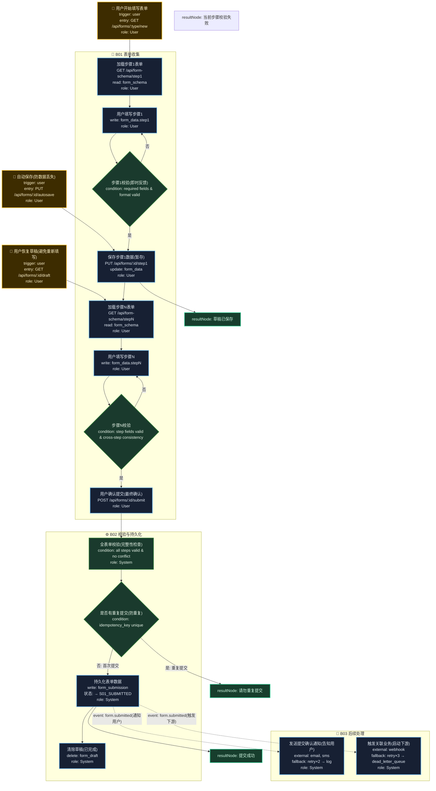

# T03: 多步骤表单模板

## 适用场景

- 注册向导、问卷填写、申请流程
- 多步骤表单：信息收集 → 校验 → 提交
- 步骤间数据暂存、前进/后退、草稿恢复

## 泳道设计（W3H）

| 泳道 | Who | What | Why | How |
|------|-----|------|-----|-----|
| B01 表单收集 | User | 多步骤数据录入 | 用户需要分步提供信息降低认知负担 | HTTP API + 前端向导 |
| B02 校验与持久化 | System | 数据校验、去重、保存 | 确保数据完整正确后持久化 | 服务端校验 + DB |
| B03 后续处理 | System | 通知、关联业务触发 | 提交后需要触发后续流程 | 异步事件 |

## 入口分析（W3H）

| 入口 | Who | What | Why | How |
|------|-----|------|-----|-----|
| 用户填写 | User | 进入表单向导 | 用户需要提交信息 | `GET /api/form/:type` |
| 草稿恢复 | User | 恢复上次未完成的填写 | 用户可能中断后回来 | `GET /api/form/:id/draft` |
| 自动保存 | User(前端定时) | 定期保存用户进度 | 防止用户丢失已填数据 | `PUT /api/forms/:id/autosave` |

## Mermaid 图

## 异常路径清单

| 触发点 | 错误码 | Why | 恢复方式 |
|--------|--------|-----|---------|
| B01-N03 | 400 | 步骤1校验失败 | 前端即时反馈 |
| B01-N07 | 400 | 步骤N校验失败 | 前端即时反馈 |
| B02-N02 | 409 | 重复提交 | 返回提示 |
| B03-N01 | 502 | 邮件/短信发送失败 | retry×2 → log |
| B03-N02 | 502 | Webhook 触发失败 | retry×3 → dead_letter_queue |
| B01-N04 | 500 | 自动保存失败 | 前端本地暂存 |

## 常见变异

| 变异点 | 默认方案 | 替代方案 |
|--------|---------|---------|
| 步骤间暂存 | 服务端 session | 前端 localStorage |
| 校验时机 | 每步即时校验 | 最终统一校验 |
| 草稿存储 | DB 持久化 | Redis（TTL 自动过期） |
| 步骤跳转 | 严格顺序 | 允许跳步（自由导航） |
| 并发填写 | 无 | 多人协作（WebSocket 同步） |
| 表单模式 | 固定步骤 | 动态步骤（条件分支决定下一步） |
