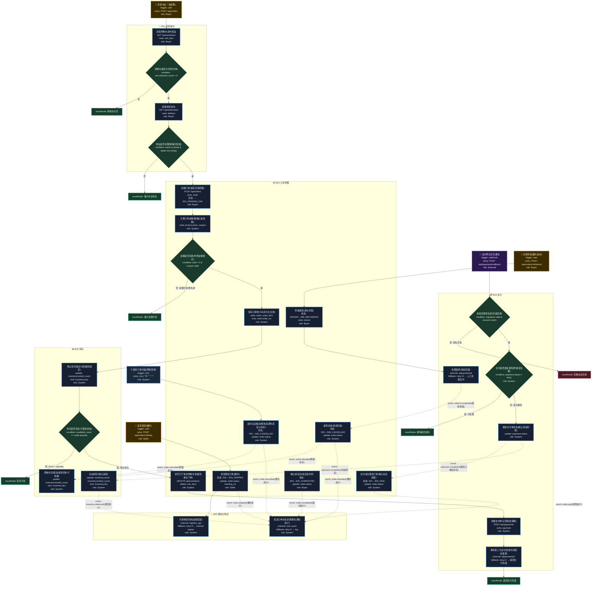

# T04: 电商下单流程模板

## 适用场景

- B2C 电商下单：购物车 → 下单 → 支付 → 发货 → 确认收货
- 库存扣减、支付集成、订单状态机
- 支付回调、超时取消、退款

## 泳道设计（W3H）

| 泳道 | Who | What | Why | How |
|------|-----|------|-----|-----|
| B01 买家操作 | Buyer | 购物车管理、地址填写 | 买家需要选择商品并确认收货信息 | HTTP API + 前端表单 |
| B02 订单管理 | Buyer, Seller, System | 订单全生命周期管理 | 订单是交易的核心载体，状态必须准确 | 状态机 + 事件驱动 |
| B03 支付 | System, External | 支付创建、回调、退款 | 资金流转必须可靠、幂等、可追溯 | 第三方支付 SDK + Webhook |
| B04 库存 | System | 库存预占/扣减/释放 | 防超卖是电商的生命线 | 分布式锁 + 预占机制 |
| B05 通知与物流 | System | 状态通知、物流对接 | 用户需要实时了解订单状态 | 异步通知 + 物流 API |

## 入口分析（W3H）

| 入口 | Who | What | Why | How |
|------|-----|------|-----|-----|
| 用户下单 | Buyer | 发起购买流程 | 用户决定购买商品 | `POST /api/orders` |
| 支付回调 | 支付网关 | 确认支付结果 | 资金状态变更必须通知下游 | `POST /api/payments/callback` |
| 超时取消 | Cron | 清理超时未支付订单 | 防止恶意占库存 | `cron '*/5 * * * *'` |
| 卖家发货 | Seller | 履约发货 | 买家付款后卖家需履约 | `POST /api/orders/:id/ship` |
| 买家退款 | Buyer | 发起逆向流程 | 商品问题需要退款机制 | `POST /api/orders/:id/refund` |

## Mermaid 图



## 状态机

```
S01_PENDING_PAY → S02_PAID → S03_SHIPPED → S04_COMPLETED
       ↓               ↓
S06_CANCELLED    S05_REFUNDING → S06_CANCELLED

S01 → S06: 超时 30 分钟未支付（cron 扫描）
Why: 释放资源，防止恶意占库存
```

## W3H 逐节点速查

| 节点 | Who | What | Why | How |
|------|-----|------|-----|-----|
| B01-N02 | Buyer | 检查购物车 | 防空单提交 | condition: count > 0 |
| B01-N04 | Buyer | 检查地址 | 确保可配送 | condition: 必填字段 |
| B02-N03 | System | 校验金额 | 防零金额欺诈 | condition: total > 0 |
| B04-N01 | System | 预占库存 | 防超卖 | lock + update locked_count |
| B04-N02 | System | 检查库存 | 可售性校验 | condition: available >= qty |
| B03-N03 | External | 校验签名 | 防伪造回调 | signature + amount match |
| B03-N05 | System | 去重检查 | 防重复处理 | payment.status ≠ PAID |
| B02-N06 | System(Cron) | 超时取消 | 释放资源 | update status + 释放库存 |
| B04-N04 | System | 释放库存 | 回补可用量 | update locked_count |
| B03-N06 | System | 退款 | 资金回退 | external SDK + retry |

## 入口与触发矩阵

| 入口节点 | 触发类型 | 进入节点 | 幂等策略 | Why |
|---------|---------|---------|---------|-----|
| ENTRY_ORDER | USER | B01-N01 | 防重复提交 | 用户购买意图 |
| ENTRY_PAYCALLBACK | WEBHOOK | B03-N03 | paymentId 去重 | 资金确认 |
| ENTRY_TIMEOUT | CRON | B02-N06 | orderId + 状态 | 释放资源 |
| ENTRY_SHIP | USER | B02-N08 | orderId 幂等 | 卖家履约 |
| ENTRY_REFUND | USER | B02-N10 | orderId + 退款单 | 逆向流程 |

## 异常路径清单

| 触发点 | 错误码 | Why | 恢复方式 |
|--------|--------|-----|---------|
| B01-N02 | 400 | 购物车为空 | 返回购物车页 |
| B01-N04 | 400 | 地址不完整无法配送 | 提示补全 |
| B02-N03 | 400 | 金额异常可能为欺诈 | 提示重新选择 |
| B04-N02 | 409 | 库存不足超卖风险 | 提示库存不足 |
| B03-N02 | 502 | 支付网关不可用 | 重试 2 次 |
| B03-N03 | 400 | 签名无效可能是伪造 | 忽略 + 日志 |
| B03-N05 | 200 | 重复通知 | 幂等返回 |
| B03-N06 | 502 | 退款接口超时 | 重试 3 次 → 人工队列 |

## 关键设计决策

| 决策点 | 方案 | Why |
|--------|------|-----|
| 库存扣减时机 | 下单预占 + 支付扣减 | 平衡防超卖与用户体验 |
| 超时取消 | cron 扫表 | 简单可靠 |
| 幂等 | paymentId 去重 | 防重复支付 |
| 分布式锁 | SKU 维度锁 | 粒度合适，防超卖 |
| 退款 | 异步 + 人工兜底 | 第三方退款有延迟 |

## 常见变异

| 变异点 | 默认方案 | 替代方案 |
|--------|---------|---------|
| 库存扣减 | 下单预占 + 支付扣减 | 下单直接扣减（简化，但未支付占库存） |
| 超时取消 | cron 扫表 | Redis 延迟消息 / RocketMQ 延迟队列 |
| 支付方式 | 支付宝/微信 | 加余额支付、积分抵扣 |
| 优惠计算 | 服务端计算 | 前端预览 + 服务端二次校验 |
| 物流对接 | 异步回调 | 卖家手动填单号 |
| 拼团/秒杀 | 无 | 新增 B06 活动域，库存改为活动库存 |
