# T05: 支付集成模板

## 适用场景

- 支付发起、支付回调、退款、对账
- 多渠道支付（支付宝、微信、银行卡）
- 支付状态机、幂等处理、资金安全

## 泳道设计（W3H）

| 泳道 | Who | What | Why | How |
|------|-----|------|-----|-----|
| B01 支付发起 | User, System | 创建支付单、调起支付 | 用户需要完成付款 | HTTP API + SDK |
| B02 支付回调 | External | 接收回调、校验、幂等 | 确认资金到账状态 | Webhook endpoint |
| B03 退款 | User, System | 退款申请、执行、回调 | 资金需回退给用户 | SDK + 异步 |
| B04 对账 | Cron | 每日对账、差错处理 | 确保系统与渠道资金一致 | 定时任务 + 报表 |

## 入口分析（W3H）

| 入口 | Who | What | Why | How |
|------|-----|------|-----|-----|
| 用户支付 | User | 发起支付 | 用户需要付款 | `POST /api/payments` |
| 支付回调 | 支付渠道 | 确认支付结果 | 资金状态变更通知 | `POST /api/payments/callback` |
| 用户退款 | User | 申请退款 | 需要退回资金 | `POST /api/payments/:id/refund` |
| 退款回调 | 支付渠道 | 确认退款结果 | 退款到账通知 | `POST /api/payments/refund/callback` |
| 每日对账 | Cron | 核对资金流水 | 防止资金差错 | `cron '0 2 * * *'` |

## Mermaid 图

```mermaid
flowchart TD
    ENTRY_PAY["👤 用户发起支付<br/>trigger: user<br/>entry: POST /api/payments<br/>role: User"]
    ENTRY_CALLBACK["🔗 支付渠道回调(确认到账)<br/>trigger: webhook<br/>entry: POST /api/payments/callback<br/>role: External"]
    ENTRY_REFUND["👤 用户申请退款(资金回退)<br/>trigger: user<br/>entry: POST /api/payments/:id/refund<br/>role: User"]
    ENTRY_REFUND_CB["🔗 退款回调(确认退回)<br/>trigger: webhook<br/>entry: POST /api/payments/refund/callback<br/>role: External"]
    ENTRY_RECONCILE["⏰ 每日对账(防资金差错)<br/>trigger: cron<br/>entry: cron '0 2 * * *'<br/>role: System"]

    subgraph B01["💳 B01 支付发起"]
        %% Why: 用户需要安全可靠地完成付款
        direction TB
        B01-N01["创建支付单(记录资金意图)<br/>write: payment<br/>状态: → S01_PENDING<br/>role: System"]
        B01-N02{"金额校验(防异常金额)<br/>condition: amount > 0 & within limits"}
        B01-N03["选择支付渠道<br/>read: payment_channel<br/>role: User"]
        B01-N04["调用渠道 SDK 发起支付<br/>external: alipay/wechat<br/>fallback: retry×2 → 返回失败<br/>role: System"]
        B01-N05["记录支付请求日志(可追溯)<br/>write: payment_log<br/>role: System"]
    end

    subgraph B02["🔗 B02 支付回调"]
        %% Why: 确认资金到账状态，必须幂等防重复
        direction TB
        B02-N01{"校验回调签名(防伪造)<br/>condition: signature valid"}
        B02-N02{"金额是否匹配(防篡改)<br/>condition: callback_amount = payment.amount"}
        B02-N03{"是否重复通知(防重复处理)<br/>condition: payment.status = PENDING"}
        B02-N04["更新支付单状态(确认到账)<br/>状态: S01→S02_SUCCESS<br/>update: payment.status<br/>role: System"]
        B02-N05["支付失败处理<br/>状态: S01→S03_FAILED<br/>update: payment.status<br/>role: System"]
    end

    subgraph B03["💰 B03 退款"]
        %% Why: 资金需安全退回用户
        direction TB
        B03-N01{"退款校验(防超额退款)<br/>condition: refund_amount <= payment.paid_amount - refunded_amount"}
        B03-N02["创建退款单(记录退款意图)<br/>write: refund<br/>状态: → R01_PENDING<br/>role: System"]
        B03-N03["调用渠道 SDK 退款<br/>external: alipay/wechat<br/>fallback: retry×3 → 人工队列<br/>role: System"]
        B03-N04{"校验退款回调签名<br/>condition: signature valid"}
        B03-N05["更新退款单状态(确认退回)<br/>状态: R01→R02_SUCCESS<br/>update: refund.status<br/>role: System"]
        B03-N06["退款失败处理<br/>状态: R01→R03_FAILED<br/>update: refund.status<br/>role: System"]
    end

    subgraph B04["📊 B04 对账"]
        %% Why: 确保系统与渠道资金一致，发现差错及时修正
        direction TB
        B04-N01["拉取渠道对账单<br/>external: alipay/wechat<br/>fallback: retry×3 → 告警<br/>role: System"]
        B04-N02["逐笔核对(比对差异)<br/>read: payment, channel_bill<br/>role: System"]
        B04-N03{"是否有差异<br/>condition: system_amount = channel_amount"}
        B04-N04["生成长款/短款报告(差错处理)<br/>write: reconcile_error<br/>role: System"]
        B04-N05["人工核实后修正<br/>update: payment<br/>role: Admin"]
    end

    ENTRY_PAY --> B01-N01
    B01-N01 --> B01-N02
    B01-N02 -->|否| ERR_AMOUNT["resultNode: 金额异常"]
    B01-N02 -->|是| B01-N03
    B01-N03 --> B01-N04
    B01-N04 --> B01-N05
    B01-N05 --> RESULT_PAY["resultNode: 返回支付页面"]

    ENTRY_CALLBACK --> B02-N01
    B02-N01 -->|否| ERR_SIGN["resultNode: 忽略非法回调"]
    B02-N01 -->|是| B02-N02
    B02-N02 -->|否| ERR_AMOUNT_MISMATCH["resultNode: 金额不匹配，记录告警"]
    B02-N02 -->|是| B02-N03
    B02-N03 -->|"是: 已处理"| RESULT_IDEMPOTENT["resultNode: 幂等返回成功"]
    B02-N03 -->|"否: 首次通知"| B02-N04
    B02-N01 -->|"失败回调"| B02-N05
    B02-N04 -.->|"event: payment.success(通知下游)"| RESULT_PAID["resultNode: 支付成功"]
    B02-N05 -.->|"event: payment.failed(通知用户)"| RESULT_FAIL["resultNode: 支付失败"]

    ENTRY_REFUND --> B03-N01
    B03-N01 -->|否| ERR_REFUND_LIMIT["resultNode: 退款金额超额"]
    B03-N01 -->|是| B03-N02
    B03-N02 --> B03-N03

    ENTRY_REFUND_CB --> B03-N04
    B03-N04 -->|否| ERR_REFUND_SIGN["resultNode: 忽略非法回调"]
    B03-N04 -->|是| B03-N05
    B03-N03 -->|"成功回调"| B03-N05
    B03-N03 -->|"失败回调"| B03-N06

    ENTRY_RECONCILE --> B04-N01
    B04-N01 --> B04-N02
    B04-N02 --> B04-N03
    B04-N03 -->|是| RESULT_RECONCILE_OK["resultNode: 对账通过"]
    B04-N03 -->|否| B04-N04
    B04-N04 --> B04-N05

    classDef triggerUser fill:#3D2C00,stroke:#FBBF24,color:#FEF3C7,stroke-width:2px
    classDef triggerCron fill:#1A2A3A,stroke:#60A5FA,color:#DBEAFE,stroke-width:2px
    classDef triggerWebhook fill:#2A1850,stroke:#A78BFA,color:#F4F0FF,stroke-width:2px
    classDef process fill:#172033,stroke:#5AA9E6,color:#E5EDF7,stroke-width:2px
    classDef decision fill:#1A3A2D,stroke:#2E7D32,color:#E8F5E9,stroke-width:2px
    classDef error fill:#4A1D24,stroke:#FB7185,color:#FFE4E6,stroke-width:2px
    classDef resultNode fill:#173E2D,stroke:#34D399,color:#D1FAE5,stroke-width:2px

    class ENTRY_PAY,ENTRY_REFUND triggerUser
    class ENTRY_RECONCILE triggerCron
    class ENTRY_CALLBACK,ENTRY_REFUND_CB triggerWebhook
    class B01-N01,B01-N03,B01-N04,B01-N05,B02-N04,B02-N05,B03-N02,B03-N03,B03-N05,B03-N06,B04-N01,B04-N02,B04-N04,B04-N05 process
    class B01-N02,B02-N01,B02-N02,B02-N03,B03-N01,B03-N04,B04-N03 decision
    class ERR_AMOUNT,ERR_SIGN,ERR_AMOUNT_MISMATCH,ERR_REFUND_LIMIT,ERR_REFUND_SIGN error
    class RESULT_PAY,RESULT_IDEMPOTENT,RESULT_PAID,RESULT_FAIL,RESULT_RECONCILE_OK resultNode
```

## 异常路径清单

| 触发点 | 错误码 | Why | 恢复方式 |
|--------|--------|-----|---------|
| B01-N02 | 400 | 金额异常（≤0 或超限） | 返回错误提示 |
| B01-N04 | 502 | 支付渠道不可用 | retry×2 → 返回失败 |
| B02-N01 | 400 | 回调签名无效（伪造） | 忽略 + 日志 |
| B02-N02 | 400 | 金额不匹配（篡改） | 记录告警 |
| B02-N03 | 200 | 重复通知（幂等） | 幂等返回成功 |
| B03-N01 | 400 | 退款超额 | 拒绝退款 |
| B03-N03 | 502 | 退款接口超时 | retry×3 → 人工队列 |
| B03-N04 | 400 | 退款回调签名无效 | 忽略 + 日志 |
| B04-N01 | 502 | 对账单拉取失败 | retry×3 → 告警 |

## 常见变异

| 变异点 | 默认方案 | 替代方案 |
|--------|---------|---------|
| 支付渠道 | 支付宝/微信 | 银行直连、余额、积分 |
| 回调方式 | 服务端回调 | 前端轮询（简单但不可靠） |
| 退款方式 | API 调用 | 人工审核后退款 |
| 对账频率 | 每日 | 实时对账（T+0） |
| 分账 | 无 | 支付后自动分账给多方 |
| 担保交易 | 无 | 确认收货后才打款给卖家 |
