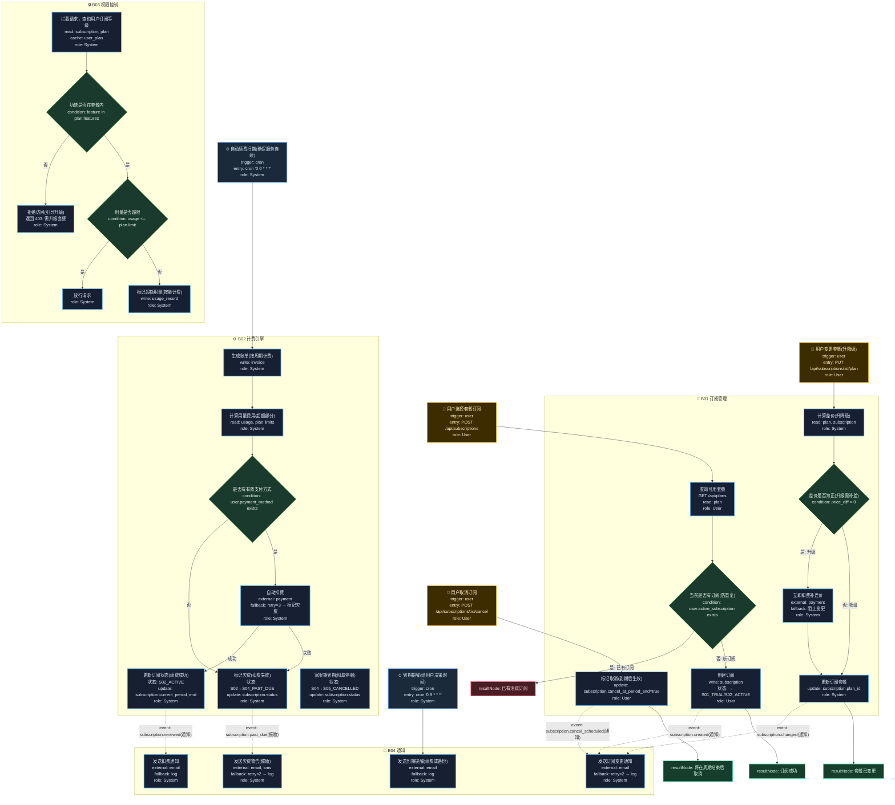

# T06: SaaS 订阅计费模板

## 适用场景

- SaaS 订阅制：免费试用 → 付费订阅 → 升降级 → 续费 → 到期
- 多套餐、用量计费、账单生成
- 订阅状态机、到期提醒、自动扣费

## 泳道设计（W3H）

| 泳道 | Who | What | Why | How |
|------|-----|------|-----|-----|
| B01 订阅管理 | User | 选套餐、升降级、取消 | 用户需要灵活管理订阅 | HTTP API |
| B02 计费引擎 | System | 账单计算、扣费、发票 | 确保收费准确按时 | 定时任务 + 支付 SDK |
| B03 权限控制 | System | 功能开关、用量限制 | 订阅等级决定可用功能 | 中间件 + 拦截器 |
| B04 通知 | System | 到期提醒、扣费通知 | 用户需及时了解订阅状态 | 异步通知 |

## 入口分析（W3H）

| 入口 | Who | What | Why | How |
|------|-----|------|-----|-----|
| 用户订阅 | User | 选择套餐并订阅 | 用户需要使用付费功能 | `POST /api/subscriptions` |
| 用户变更 | User | 升级/降级套餐 | 需求变化需调整套餐 | `PUT /api/subscriptions/:id/plan` |
| 用户取消 | User | 取消订阅 | 不再需要付费功能 | `POST /api/subscriptions/:id/cancel` |
| 自动续费 | Cron | 到期自动扣费 | 确保服务不中断 | `cron '0 0 * * *'` |
| 到期提醒 | Cron | 提前通知用户 | 给用户续费或备份数据的时间 | `cron '0 9 * * *'` |

## Mermaid 图



## 状态机

```
S01_TRIAL → S02_ACTIVE → S03_CANCEL_PENDING → S05_CANCELLED
                ↓                ↑
           S04_PAST_DUE ────────┘(扣费失败→宽限期→续费成功)
                ↓
           S05_CANCELLED(宽限期到期)
```

## 异常路径清单

| 触发点 | 错误码 | Why | 恢复方式 |
|--------|--------|-----|---------|
| B01-N02 | 409 | 已有活跃订阅 | 返回提示 |
| B01-N06 | 502 | 补差价扣费失败 | 阻止变更 |
| B02-N02 | 400 | 无有效支付方式 | 标记欠费 |
| B02-N03 | 502 | 自动扣费失败 | retry×3 → 标记欠费 |
| B03-N02 | 403 | 功能不在套餐内 | 返回引导升级 |
| B03-N03 | 403 | 用量超限 | 标记超额计费 |
| B04-N01 | 502 | 邮件发送失败 | retry×2 → log |
| B04-N04 | 502 | 欠费催缴发送失败 | retry×2 → log |

## 常见变异

| 变异点 | 默认方案 | 替代方案 |
|--------|---------|---------|
| 计费周期 | 月付 | 年付/季付/按量 |
| 试用 | 免费试用 N 天 | 无试用 / 需绑卡试用 |
| 降级生效 | 立即生效 | 当前周期结束后生效 |
| 取消策略 | 期末取消 | 立即取消 + 按比例退款 |
| 用量计费 | 无 | 超额按量收费（API 调用/存储） |
| 多席位 | 无 | 按席位计费 |
