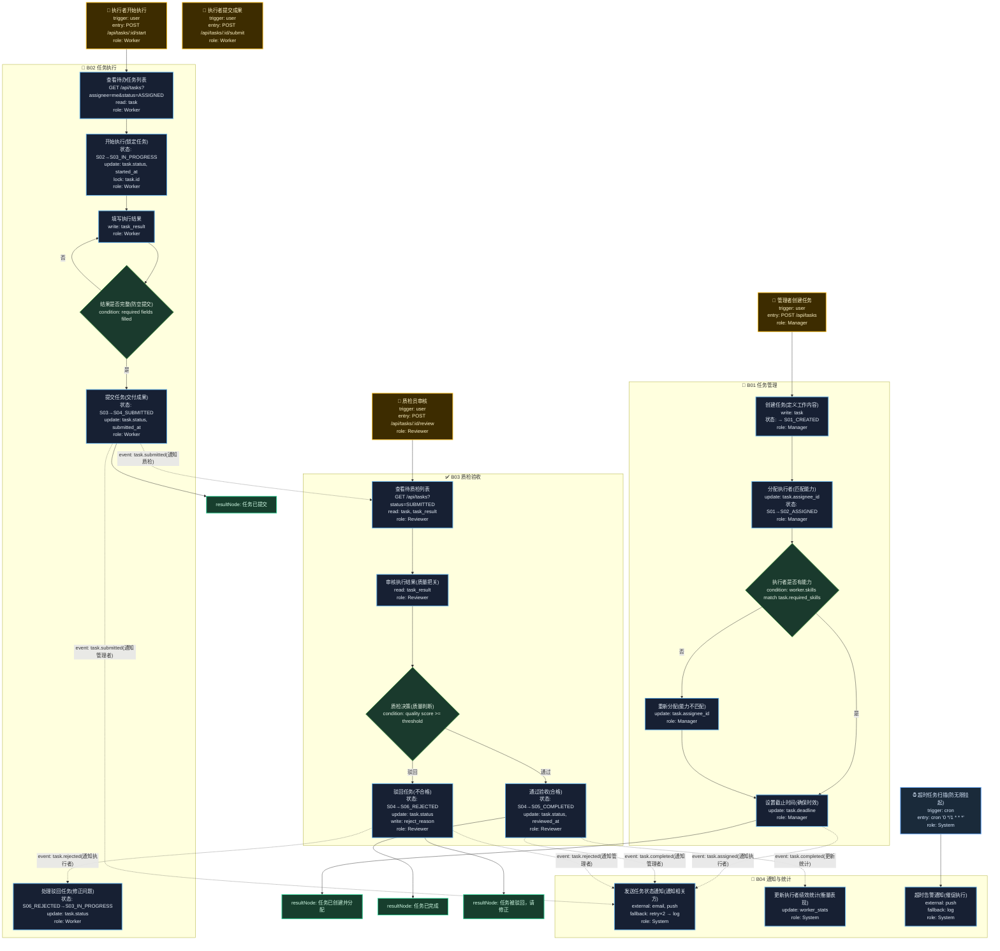

# T08: 任务分配与跟踪模板

## 适用场景

- 项目管理、工单系统、标注平台
- 任务创建 → 分配 → 执行 → 质检 → 完成
- 任务状态机、优先级、超时处理

## 泳道设计（W3H）

| 泳道 | Who | What | Why | How |
|------|-----|------|-----|-----|
| B01 任务管理 | Manager | 创建/分配/调整任务 | 管理者需要把工作分给合适的人 | HTTP API |
| B02 任务执行 | Worker | 领取/执行/提交任务 | 执行者需要高效完成任务 | HTTP API |
| B03 质检验收 | Reviewer | 审核任务质量 | 确保交付质量达标 | HTTP API |
| B04 通知与统计 | System | 状态通知、绩效统计 | 管理者需了解进度和质量 | 异步通知 + 报表 |

## 入口分析（W3H）

| 入口 | Who | What | Why | How |
|------|-----|------|-----|-----|
| 管理者创建 | Manager | 创建并分配任务 | 工作需要分配到人 | `POST /api/tasks` |
| 执行者执行 | Worker | 领取并执行任务 | 执行者需要完成分配的工作 | `POST /api/tasks/:id/start` |
| 执行者提交 | Worker | 提交完成的任务 | 交付工作成果 | `POST /api/tasks/:id/submit` |
| 质检审核 | Reviewer | 审核提交质量 | 确保质量达标 | `POST /api/tasks/:id/review` |
| 超时扫描 | Cron | 扫描超时任务 | 防止任务无限期挂起 | `cron '0 */1 * * *'` |

## Mermaid 图



## 状态机

```
S01_CREATED → S02_ASSIGNED → S03_IN_PROGRESS → S04_SUBMITTED → S05_COMPLETED
                                    ↑                  ↓
                                    └── S06_REJECTED ←─┘
```

## 异常路径清单

| 触发点 | 错误码 | Why | 恢复方式 |
|--------|--------|-----|---------|
| B01-N03 | 400 | 执行者技能不匹配 | 重新分配 |
| B02-N04 | 400 | 提交内容不完整 | 返回要求补充 |
| B03-N03 | 400 | 质检未通过 | 驳回附原因 |
| B04-N01 | 502 | 通知发送失败 | retry×2 → log |
| B04-N03 | 200 | 任务超时告警 | 通知催促执行 |

## 常见变异

| 变异点 | 默认方案 | 替代方案 |
|--------|---------|---------|
| 分配方式 | 指定执行者 | 抢占式（先到先得）/ 自动分配 |
| 质检 | 全量质检 | 抽检（按比例）/ 免检（信任度高） |
| 优先级 | 固定 | 动态优先级（FIFO + 紧急插队） |
| 多人协作 | 单人执行 | 多人执行（拆分子任务） |
| 批次管理 | 无 | 按批次创建/分配/质检 |
| 结算 | 无 | 按完成量和质量结算报酬 |
