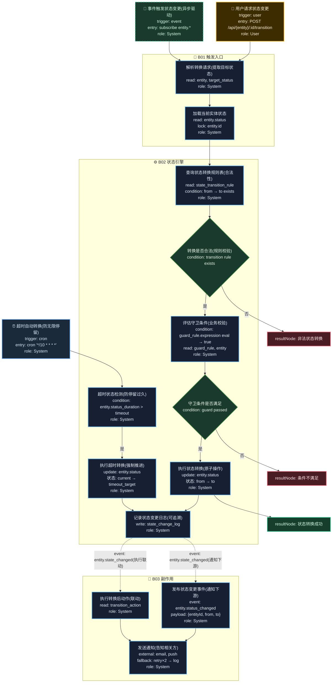

# T09: 状态机驱动模板

## 适用场景

- 任何状态驱动的业务：订单状态、设备生命周期、工单流转
- 复杂状态转换图、守卫条件、副作用
- 可复用的状态机引擎

## 泳道设计（W3H）

| 泳道 | Who | What | Why | How |
|------|-----|------|-----|-----|
| B01 触发入口 | User, System | 接收状态变更请求 | 外部需要触发状态变迁 | HTTP API / Event |
| B02 状态引擎 | System | 校验转换合法性、执行转换 | 状态变迁必须符合规则 | 状态机 + 规则表 |
| B03 副作用 | System | 通知、日志、联动 | 状态变更后需触发后续动作 | 事件驱动 |

## 入口分析（W3H）

| 入口 | Who | What | Why | How |
|------|-----|------|-----|-----|
| 用户触发转换 | User | 请求状态变更 | 用户操作驱动状态流转 | `POST /api/{entity}/:id/transition` |
| 系统触发转换 | System(Event) | 事件驱动状态变更 | 异步事件触发状态变迁 | Event subscriber |
| 定时触发转换 | Cron | 超时自动转换 | 防止状态无限期停留 | `cron` |

## Mermaid 图

## 异常路径清单

| 触发点 | 错误码 | Why | 恢复方式 |
|--------|--------|-----|---------|
| B02-N02 | 400 | 非法状态转换 | 返回错误提示 |
| B02-N04 | 400 | 守卫条件不满足 | 返回具体原因 |
| B01-N02 | 404 | 实体不存在 | 返回 404 |
| B01-N02 | 409 | 并发冲突（乐观锁） | 提示刷新重试 |
| B03-N03 | 502 | 通知发送失败 | retry×2 → log |
| B02-N07 | 200 | 超时未处理 | 强制推进状态 |

## 常见变异

| 变异点 | 默认方案 | 替代方案 |
|--------|---------|---------|
| 状态规则 | DB 规则表 | 代码内状态机（XState / Spring Statemachine） |
| 守卫条件 | 表达式求值 | 策略模式（每个转换一个校验类） |
| 并发控制 | 悲观锁 | 乐观锁（version 字段） |
| 历史追溯 | 变更日志表 | 事件溯源（Event Sourcing） |
| 多实体 | 单一状态机 | 分层状态机（父子状态） |
| 副作用 | 同步执行 | 异步队列（解耦） |
