# T10: 数据管道 ETL 模板

## 适用场景

- 数据同步、清洗、入库、报表
- 多数据源采集 → 转换 → 加载 → 质量校验
- 定时调度、失败重试、数据对账

## 泳道设计（W3H）

| 泳道 | Who | What | Why | How |
|------|-----|------|-----|-----|
| B01 数据采集 | System | 拉取/订阅源数据 | 原始数据是管道的起点 | API 拉取 / CDC / 日志采集 |
| B02 数据转换 | System | 清洗、映射、聚合 | 原始数据不能直接使用 | ETL 脚本 / Spark / Flink |
| B03 数据存储 | System | 写入目标存储 | 转换后数据需要持久化 | 数仓 / 数据湖 |
| B04 质量与调度 | System, Admin | 质量校验、调度编排 | 确保数据正确且按时产出 | DAG 调度 + 质量规则 |

## 入口分析（W3H）

| 入口 | Who | What | Why | How |
|------|-----|------|-----|-----|
| 定时调度 | Cron | 触发 ETL 任务 | 数据需要定期更新 | `cron '0 1 * * *'` |
| 事件触发 | Event | 数据变更即时同步 | 实时性要求高的场景 | subscribe data.changed |
| 手动触发 | Admin | 手动重跑/补数据 | 异常恢复或历史补录 | `POST /api/pipelines/:id/run` |

## Mermaid 图

```mermaid
flowchart TD
    ENTRY_CRON["⏰ 定时调度(按时产出)<br/>trigger: cron<br/>entry: cron '0 1 * * *'<br/>role: System"]
    ENTRY_EVENT["📡 数据变更事件(实时同步)<br/>trigger: event<br/>entry: subscribe data.changed<br/>role: System"]
    ENTRY_MANUAL["👑 管理员手动触发(补数据)<br/>trigger: admin<br/>entry: POST /api/pipelines/:id/run<br/>role: Admin"]

    subgraph B01["📥 B01 数据采集"]
        %% Why: 原始数据是管道的起点，必须完整及时
        direction TB
        B01-N01["创建管道执行实例(记录运行)<br/>write: pipeline_run<br/>状态: → S01_RUNNING<br/>role: System"]
        B01-N02["拉取源数据(多源采集)<br/>external: source_api, db, file<br/>fallback: retry×3 → 标记失败<br/>role: System"]
        B01-N03{"数据是否为空(防空跑)<br/>condition: fetched_records > 0"}
        B01-N04["记录采集元信息(可追溯)<br/>write: pipeline_run.source_meta<br/>role: System"]
    end

    subgraph B02["🔄 B02 数据转换"]
        %% Why: 原始数据不能直接使用，需要清洗和标准化
        direction TB
        B02-N01["执行清洗规则(去脏数据)<br/>condition: filter invalid records<br/>role: System"]
        B02-N02["字段映射与类型转换(标准化)<br/>role: System"]
        B02-N03["执行聚合计算(业务指标)<br/>role: System"]
        B02-N04{"转换后是否有有效数据<br/>condition: transformed_records > 0"}
        B02-N05["记录转换统计(监控)<br/>write: pipeline_run.transform_stats<br/>role: System"]
    end

    subgraph B03["💾 B03 数据存储"]
        %% Why: 转换后数据需要持久化到目标存储
        direction TB
        B03-N01{"目标表是否存在(防写入失败)<br/>condition: target_table exists"}
        B03-N02["写入目标存储(批量入库)<br/>write: target_table<br/>role: System"]
        B03-N03{"写入是否成功<br/>condition: write_count = transformed_count"}
        B03-N04["更新分区/索引(查询优化)<br/>update: partition, index<br/>role: System"]
        B03-N05["记录存储元信息<br/>write: pipeline_run.storage_meta<br/>role: System"]
    end

    subgraph B04["✅ B04 质量与调度"]
        %% Why: 确保数据正确且按时产出
        direction TB
        B04-N01["执行数据质量规则(正确性)<br/>condition: null_ratio < threshold & uniqueness ok<br/>role: System"]
        B04-N02{"质量校验是否通过<br/>condition: all quality rules passed"}
        B04-N03["标记管道成功(产出就绪)<br/>状态: S01→S02_SUCCESS<br/>update: pipeline_run.status<br/>role: System"]
        B04-N04["标记管道失败(需排查)<br/>状态: S01→S03_FAILED<br/>update: pipeline_run.status, error<br/>role: System"]
        B04-N05["发送执行报告(通知数据团队)<br/>external: email, webhook<br/>fallback: log<br/>role: System"]
    end

    ENTRY_CRON --> B01-N01
    ENTRY_EVENT --> B01-N01
    ENTRY_MANUAL --> B01-N01

    B01-N01 --> B01-N02
    B01-N02 --> B01-N03
    B01-N03 -->|否| B04-N04
    B01-N03 -->|是| B01-N04
    B01-N04 --> B02-N01

    B02-N01 --> B02-N02
    B02-N02 --> B02-N03
    B02-N03 --> B02-N04
    B02-N04 -->|否| B04-N04
    B02-N04 -->|是| B02-N05
    B02-N05 --> B03-N01

    B03-N01 -->|否| B04-N04
    B03-N01 -->|是| B03-N02
    B03-N02 --> B03-N03
    B03-N03 -->|否| B04-N04
    B03-N03 -->|是| B03-N04
    B03-N04 --> B03-N05
    B03-N05 --> B04-N01

    B04-N01 --> B04-N02
    B04-N02 -->|是| B04-N03
    B04-N02 -->|否| B04-N04
    B04-N03 --> B04-N05
    B04-N04 --> B04-N05

    RESULT_SUCCESS["resultNode: 管道执行成功，数据就绪"]
    RESULT_FAILED["resultNode: 管道执行失败，需排查"]

    B04-N03 --> RESULT_SUCCESS
    B04-N04 --> RESULT_FAILED

    classDef triggerCron fill:#1A2A3A,stroke:#60A5FA,color:#DBEAFE,stroke-width:2px
    classDef triggerEvent fill:#1A3A2D,stroke:#34D399,color:#D1FAE5,stroke-width:2px,stroke-dasharray: 5 5
    classDef triggerAdmin fill:#3B1028,stroke:#F472B6,color:#FCE7F3,stroke-width:2px
    classDef process fill:#172033,stroke:#5AA9E6,color:#E5EDF7,stroke-width:2px
    classDef decision fill:#1A3A2D,stroke:#2E7D32,color:#E8F5E9,stroke-width:2px
    classDef resultNode fill:#173E2D,stroke:#34D399,color:#D1FAE5,stroke-width:2px

    class ENTRY_CRON triggerCron
    class ENTRY_EVENT triggerEvent
    class ENTRY_MANUAL triggerAdmin
    class B01-N01,B01-N02,B01-N04,B02-N01,B02-N02,B02-N03,B02-N05,B03-N02,B03-N04,B03-N05,B04-N01,B04-N03,B04-N04,B04-N05 process
    class B01-N03,B02-N04,B03-N01,B03-N03,B04-N02 decision
    class RESULT_SUCCESS resultNode
    class RESULT_FAILED resultNode
```

## 异常路径清单

| 触发点 | 错误码 | Why | 恢复方式 |
|--------|--------|-----|---------|
| B01-N02 | 502 | 数据源不可用 | retry×3 → 标记失败 |
| B01-N03 | 200 | 源数据为空 | 标记管道失败 |
| B02-N04 | 200 | 清洗后无有效数据 | 标记管道失败 |
| B03-N01 | 500 | 目标表不存在 | 标记管道失败 |
| B03-N03 | 500 | 写入行数不匹配 | 标记管道失败 |
| B04-N02 | 200 | 质量校验未通过 | 标记管道失败 |
| B04-N05 | 502 | 报告通知发送失败 | log |

## 常见变异

| 变异点 | 默认方案 | 替代方案 |
|--------|---------|---------|
| 调度方式 | Cron | Airflow / DAG 调度器 |
| 转换引擎 | 脚本 | Spark / Flink / dbt |
| 存储目标 | 数据仓库 | 数据湖 / Elasticsearch |
| 增量策略 | 全量拉取 | CDC 增量 / 时间戳增量 |
| 实时性 | 批处理 | 流处理（Kafka + Flink） |
| 数据格式 | Parquet | ORC / Avro / JSON |
