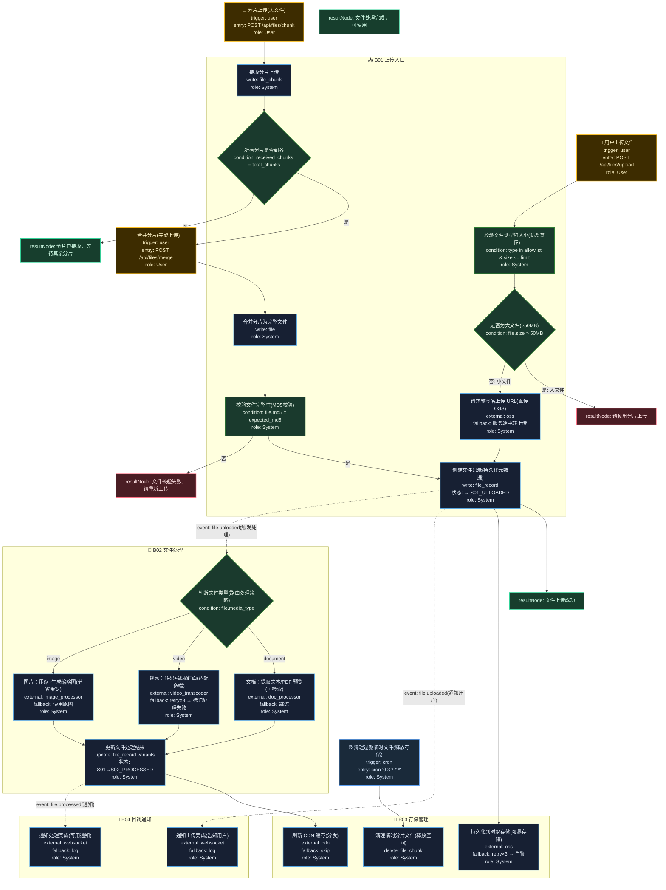

# T11: 文件上传与处理模板

## 适用场景

- 图片/视频/文档上传、转码、存储
- 大文件分片上传、断点续传
- 上传后自动处理（压缩、缩略图、OCR）

## 泳道设计（W3H）

| 泳道 | Who | What | Why | How |
|------|-----|------|-----|-----|
| B01 上传入口 | User | 文件上传、分片、校验 | 用户需要提交文件 | HTTP API + 直传 OSS |
| B02 文件处理 | System | 转码、压缩、缩略图 | 原始文件不适合直接使用 | 异步任务队列 |
| B03 存储管理 | System | 持久化、CDN 分发 | 文件需要可靠存储和快速访问 | 对象存储 + CDN |
| B04 回调通知 | System | 处理完成通知 | 用户需知道处理结果 | 异步事件 |

## 入口分析（W3H）

| 入口 | Who | What | Why | How |
|------|-----|------|-----|-----|
| 用户上传 | User | 提交文件 | 用户需要提交文件 | `POST /api/files/upload` |
| 分片上传 | User | 大文件分片提交 | 大文件需要分片传输 | `POST /api/files/chunk` |
| 完整合并 | User | 合并所有分片 | 分片上传后需要合并 | `POST /api/files/merge` |
| 定时清理 | Cron | 清理过期临时文件 | 防止临时文件占满存储 | `cron '0 3 * * *'` |

## Mermaid 图

## 异常路径清单

| 触发点 | 错误码 | Why | 恢复方式 |
|--------|--------|-----|---------|
| B01-N01 | 400 | 文件类型/大小不合法 | 返回错误提示 |
| B01-N02 | 400 | 大文件需分片上传 | 提示使用分片 |
| B01-N05 | 200 | 分片未到齐 | 等待其余分片 |
| B01-N07 | 400 | 文件 MD5 校验失败 | 要求重新上传 |
| B02-N02 | 502 | 图片处理失败 | 使用原图兜底 |
| B02-N03 | 502 | 视频转码失败 | retry×3 → 标记处理失败 |
| B03-N01 | 502 | OSS 写入失败 | retry×3 → 告警 |

## 常见变异

| 变异点 | 默认方案 | 替代方案 |
|--------|---------|---------|
| 上传方式 | 服务端接收 | 客户端直传 OSS（预签名 URL） |
| 分片策略 | 固定大小 | 动态分片（根据网络状况调整） |
| 断点续传 | 无 | 记录已上传分片，支持续传 |
| 图片处理 | 服务端处理 | CDN 实时裁剪（参数化 URL） |
| 视频转码 | 同步队列 | 分布式转码集群 |
| 权限控制 | 登录即可上传 | 上传令牌（限时 URL） |
