# T12: 用户注册登录模板

## 适用场景

- 邮箱/手机号注册、OAuth 第三方登录
- JWT/Session 管理、密码重置
- 登录安全：限流、验证码、异常检测

## 泳道设计（W3H）

| 泳道 | Who | What | Why | How |
|------|-----|------|-----|-----|
| B01 注册 | Anonymous | 收集信息、创建账户 | 新用户需要获取系统身份 | HTTP API |
| B02 登录 | Anonymous | 身份验证、签发凭证 | 用户需要证明身份获取访问权 | HTTP API + JWT/Session |
| B03 密码管理 | User | 重置密码、修改密码 | 用户可能忘记密码或需定期更换 | HTTP API + 邮件/短信 |
| B04 安全防护 | System | 限流、验证码、异常检测 | 防止暴力破解和恶意注册 | 中间件 + Redis |

## 入口分析（W3H）

| 入口 | Who | What | Why | How |
|------|-----|------|-----|-----|
| 用户注册 | Anonymous | 创建账户 | 新用户需要身份 | `POST /api/auth/register` |
| 用户登录 | Anonymous | 身份验证 | 获取访问凭证 | `POST /api/auth/login` |
| OAuth 登录 | Anonymous | 第三方授权登录 | 降低注册门槛 | `GET /api/auth/oauth/:provider` |
| 忘记密码 | User | 重置密码 | 用户忘记密码 | `POST /api/auth/forgot-password` |
| 刷新令牌 | User | 续期访问凭证 | 避免频繁重新登录 | `POST /api/auth/refresh` |

## Mermaid 图

```mermaid
flowchart TD
    ENTRY_REGISTER["👤 用户注册<br/>trigger: user<br/>entry: POST /api/auth/register<br/>role: Anonymous"]
    ENTRY_LOGIN["👤 用户登录<br/>trigger: user<br/>entry: POST /api/auth/login<br/>role: Anonymous"]
    ENTRY_OAUTH["👤 OAuth 第三方登录<br/>trigger: user<br/>entry: GET /api/auth/oauth/:provider<br/>role: Anonymous"]
    ENTRY_FORGOT["👤 忘记密码<br/>trigger: user<br/>entry: POST /api/auth/forgot-password<br/>role: User"]
    ENTRY_REFRESH["👤 刷新令牌(续期)<br/>trigger: user<br/>entry: POST /api/auth/refresh<br/>role: User"]

    subgraph B01["👤 B01 注册"]
        %% Why: 新用户需要安全地获取系统身份
        direction TB
        B01-N01["校验注册信息(防脏数据)<br/>condition: email/phone format valid & password strength ok<br/>role: System"]
        B01-N02{"账号是否已注册(防重复)<br/>condition: email/phone not exists"}
        B01-N03["创建用户账户<br/>write: user<br/>状态: → S01_UNVERIFIED<br/>role: System"]
        B01-N04["发送验证邮件/短信(确认身份)<br/>external: email/sms<br/>fallback: retry×3 → log<br/>role: System"]
        B01-N05["验证邮箱/手机号<br/>POST /api/auth/verify<br/>状态: S01→S02_ACTIVE<br/>update: user.status<br/>role: User"]
    end

    subgraph B02["👤 B02 登录"]
        %% Why: 用户需要证明身份获取访问权
        direction TB
        B02-N01["查找用户(身份识别)<br/>read: user<br/>role: System"]
        B02-N02{"用户是否存在<br/>condition: user exists"}
        B02-N03["校验密码(身份验证)<br/>condition: password match<br/>role: System"]
        B02-N04{"账户状态是否正常<br/>condition: user.status = ACTIVE"}
        B02-N05{"是否触发异常检测(防暴力破解)<br/>condition: login_fail_count < threshold"}
        B02-N06["签发 JWT/创建 Session(授权)<br/>write: session<br/>role: System"]
        B02-N07["记录登录日志(安全审计)<br/>write: login_log<br/>role: System"]
        B02-N08["OAuth 获取用户信息<br/>external: oauth_provider<br/>fallback: 返回授权失败<br/>role: System"]
        B02-N09{"OAuth 用户是否已绑定<br/>condition: oauth_user.linked_local_user exists"}
        B02-N10["绑定已有账号或创建新账号<br/>write: user_oauth<br/>role: System"]
    end

    subgraph B03["🔑 B03 密码管理"]
        %% Why: 用户可能忘记密码或需定期更换
        direction TB
        B03-N01["发送重置验证码(身份确认)<br/>external: email/sms<br/>fallback: retry×3 → log<br/>role: System"]
        B03-N02{"验证码是否正确<br/>condition: code match & not expired"}
        B03-N03["重置密码<br/>update: user.password_hash<br/>role: User"]
        B03-N04["修改密码(需验证旧密码)<br/>condition: old_password match<br/>update: user.password_hash<br/>role: User"]
    end

    subgraph B04["🔒 B04 安全防护"]
        %% Why: 防止暴力破解、恶意注册、撞库
        direction TB
        B04-N01["请求限流(防暴力)<br/>condition: request_count < rate_limit<br/>role: System"]
        B04-N02["验证码校验(防机器人)<br/>condition: captcha valid<br/>role: System"]
        B04-N03["异常登录检测(异地/新设备)<br/>condition: ip/device in trusted list<br/>role: System"]
        B04-N04["发送异常登录告警(通知用户)<br/>external: email/sms<br/>fallback: log<br/>role: System"]
    end

    ENTRY_REGISTER --> B01-N01
    B01-N01 --> B01-N02
    B01-N02 -->|否| ERR_EXISTS["resultNode: 账号已注册"]
    B01-N02 -->|是| B01-N03
    B01-N03 --> B01-N04
    B01-N04 --> RESULT_VERIFY["resultNode: 验证邮件已发送"]

    B01-N05 --> RESULT_ACTIVE["resultNode: 账号已激活"]

    ENTRY_LOGIN --> B02-N01
    B02-N01 --> B02-N02
    B02-N02 -->|否| ERR_USER["resultNode: 用户名或密码错误"]
    B02-N02 -->|是| B02-N03
    B02-N03 -->|否| B02-N05
    B02-N03 -->|是| B02-N04
    B02-N04 -->|否| ERR_DISABLED["resultNode: 账户未激活或已禁用"]
    B02-N04 -->|是| B02-N06
    B02-N05 -->|否| B04-N04
    B02-N05 -->|是| ERR_LOCKED["resultNode: 账户已锁定，请稍后重试"]
    B02-N06 --> B02-N07
    B02-N07 --> RESULT_LOGIN["resultNode: 登录成功，返回 Token"]

    ENTRY_OAUTH --> B02-N08
    B02-N08 --> B02-N09
    B02-N09 -->|否| B02-N10
    B02-N09 -->|是| B02-N06

    ENTRY_FORGOT --> B03-N01
    B03-N01 --> B03-N02
    B03-N02 -->|否| ERR_CODE["resultNode: 验证码错误或已过期"]
    B03-N02 -->|是| B03-N03
    B03-N03 --> RESULT_RESET["resultNode: 密码已重置"]

    ENTRY_REFRESH --> B02-N06

    classDef triggerUser fill:#3D2C00,stroke:#FBBF24,color:#FEF3C7,stroke-width:2px
    classDef process fill:#172033,stroke:#5AA9E6,color:#E5EDF7,stroke-width:2px
    classDef decision fill:#1A3A2D,stroke:#2E7D32,color:#E8F5E9,stroke-width:2px
    classDef error fill:#4A1D24,stroke:#FB7185,color:#FFE4E6,stroke-width:2px
    classDef resultNode fill:#173E2D,stroke:#34D399,color:#D1FAE5,stroke-width:2px

    class ENTRY_REGISTER,ENTRY_LOGIN,ENTRY_OAUTH,ENTRY_FORGOT,ENTRY_REFRESH triggerUser
    class B01-N01,B01-N03,B01-N04,B01-N05,B02-N01,B02-N03,B02-N06,B02-N07,B02-N08,B02-N10,B03-N01,B03-N03,B03-N04,B04-N01,B04-N02,B04-N03,B04-N04 process
    class B01-N02,B02-N02,B02-N03,B02-N04,B02-N05,B02-N09,B03-N02 decision
    class ERR_EXISTS,ERR_USER,ERR_DISABLED,ERR_LOCKED,ERR_CODE error
    class RESULT_VERIFY,RESULT_ACTIVE,RESULT_LOGIN,RESULT_RESET resultNode
```

## 异常路径清单

| 触发点 | 错误码 | Why | 恢复方式 |
|--------|--------|-----|---------|
| B01-N02 | 409 | 账号已注册 | 返回提示 |
| B01-N04 | 502 | 验证邮件发送失败 | retry×3 → log |
| B02-N02 | 401 | 用户不存在 | 返回模糊错误（防枚举） |
| B02-N03 | 401 | 密码错误 | 累计失败计数 |
| B02-N04 | 403 | 账户未激活/已禁用 | 返回具体状态 |
| B02-N05 | 423 | 登录失败次数超限 | 账户锁定 |
| B02-N08 | 502 | OAuth 提供方不可用 | 返回授权失败 |
| B03-N02 | 400 | 验证码错误/过期 | 返回提示 |
| B04-N03 | 200 | 异地/新设备登录 | 发送告警通知 |

## 常见变异

| 变异点 | 默认方案 | 替代方案 |
|--------|---------|---------|
| 认证方式 | JWT | Session + Cookie / OAuth Token |
| 密码存储 | bcrypt hash | argon2 / scrypt |
| 多因素认证 | 无 | TOTP / SMS / 邮箱二次验证 |
| 单点登录 | 无 | SSO（SAML / OIDC） |
| 社交登录 | 支持 | 不支持 / 仅企业微信 |
| 账户锁定 | 时间锁定 | 永久锁定（需管理员解锁） |
| 无密码登录 | 无 | 魔法链接 / 手机验证码直接登录 |
