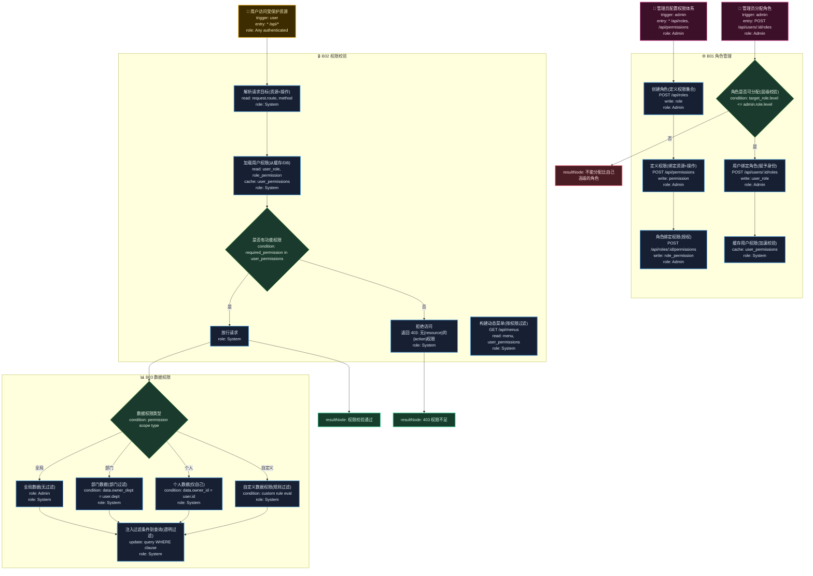

# T13: RBAC 权限模型模板

## 适用场景

- 角色、权限、菜单管理
- 数据权限（行级、列级）
- 权限校验、动态菜单

## 泳道设计（W3H）

| 泳道 | Who | What | Why | How |
|------|-----|------|-----|-----|
| B01 角色管理 | Admin | 角色 CRUD、权限分配 | 角色是权限的载体 | HTTP API |
| B02 权限校验 | System | 请求拦截、权限判断 | 确保用户只能操作授权范围内的资源 | 中间件 + 拦截器 |
| B03 数据权限 | System | 行级/列级过滤 | 不同用户只能看到自己权限范围内的数据 | 查询拦截 |

## 入口分析（W3H）

| 入口 | Who | What | Why | How |
|------|-----|------|-----|-----|
| 管理员配置 | Admin | 角色/权限 CRUD | 管理员需要定义权限体系 | `* /api/roles`, `* /api/permissions` |
| 用户请求 | User | 访问受保护资源 | 用户操作系统功能 | `* /api/*` |
| 分配角色 | Admin | 给用户分配角色 | 用户需要获得角色才有权限 | `POST /api/users/:id/roles` |

## Mermaid 图

## 异常路径清单

| 触发点 | 错误码 | Why | 恢复方式 |
|--------|--------|-----|---------|
| B01-N05 | 403 | 不能分配比自己高级的角色 | 返回权限不足 |
| B02-N03 | 403 | 无功能权限 | 返回具体缺失权限 |
| B03-N03 | 200 | 部门数据过滤 | 注入 WHERE 条件 |
| B03-N04 | 200 | 个人数据过滤 | 注入 owner_id 条件 |
| B01-N06 | 500 | 权限缓存失败 | 降级到 DB 查询 |

## 常见变异

| 变异点 | 默认方案 | 替代方案 |
|--------|---------|---------|
| 权限模型 | RBAC | ABAC（属性权限）/ ACL |
| 数据权限 | 行级过滤 | 列级过滤（字段可见性） |
| 角色层级 | 扁平 | 层级继承（子角色继承父角色） |
| 权限缓存 | Redis | JWT 内嵌权限 / 无缓存（实时查） |
| 多租户 | 无 | 租户隔离 + 租户级角色 |
| 动态菜单 | 服务端生成 | 前端路由守卫 |
