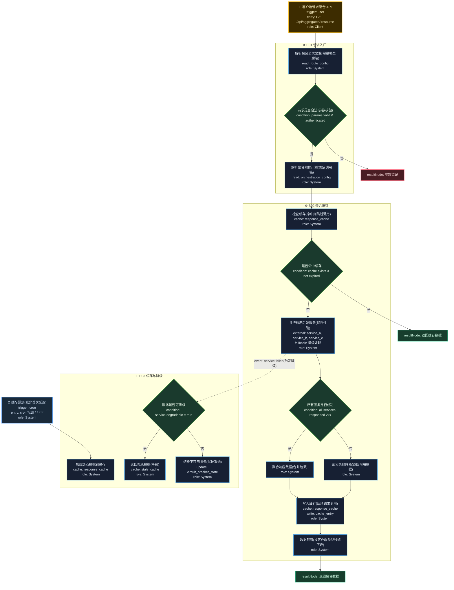

# T14: API 聚合/BFF 模板

## 适用场景

- 多后端服务聚合为统一 API
- BFF（Backend for Frontend）适配不同客户端
- 请求编排、缓存、降级

## 泳道设计（W3H）

| 泳道 | Who | What | Why | How |
|------|-----|------|-----|-----|
| B01 请求入口 | Client | 接收客户端请求 | 客户端需要统一入口 | HTTP API / GraphQL |
| B02 聚合编排 | System | 拆分/并行/聚合后端调用 | 减少客户端请求次数，屏蔽后端复杂度 | 并行 HTTP + 聚合 |
| B03 缓存与降级 | System | 缓存热点数据、降级非核心 | 提升响应速度，保证核心可用 | Redis + fallback |

## 入口分析（W3H）

| 入口 | Who | What | Why | How |
|------|-----|------|-----|-----|
| 客户端请求 | Client | 访问聚合 API | 客户端需要数据 | `GET /api/aggregated/*` |
| 缓存预热 | Cron | 预加载热点数据 | 减少首次请求延迟 | `cron '*/10 * * * *'` |

## Mermaid 图

## 异常路径清单

| 触发点 | 错误码 | Why | 恢复方式 |
|--------|--------|-----|---------|
| B01-N02 | 400 | 请求参数不合法 | 返回参数错误 |
| B01-N02 | 401 | 未认证 | 返回 401 |
| B02-N03 | 502 | 后端服务调用失败 | 降级处理 |
| B02-N04 | 206 | 部分服务失败 | 返回可用数据 |
| B03-N02 | 200 | 服务可降级 | 返回兜底数据 |
| B03-N04 | 503 | 熔断触发 | 返回降级响应 |

## 常见变异

| 变异点 | 默认方案 | 替代方案 |
|--------|---------|---------|
| 聚合方式 | REST API | GraphQL（客户端自定义查询） |
| 调用方式 | HTTP | gRPC（高性能） |
| 缓存策略 | TTL 过期 | stale-while-revalidate |
| 降级策略 | 返回兜底数据 | 返回核心数据 + 标记部分不可用 |
| 认证 | 统一 JWT | 请求头透传 + 各服务独立认证 |
| 协议适配 | 统一 JSON | 按客户端类型适配（Web/Mobile/IoT） |
