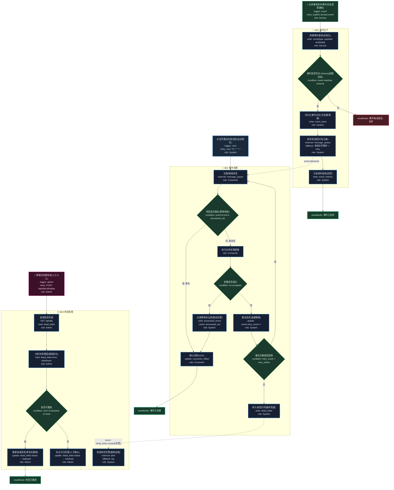

# T15: 事件驱动/消息队列模板

## 适用场景

- 异步解耦、事件溯源、CQRS
- 消息生产/消费、重试、死信队列
- 多消费者广播/竞争消费

## 泳道设计（W3H）

| 泳道 | Who | What | Why | How |
|------|-----|------|-----|-----|
| B01 事件生产 | Service | 发布领域事件 | 服务间需要异步通信 | Message Queue |
| B02 事件消费 | Service | 订阅并处理事件 | 消费者需要响应事件 | Message Consumer |
| B03 死信处理 | System | 重试失败消息、人工介入 | 消息不能丢失 | Dead Letter Queue |

## 入口分析（W3H）

| 入口 | Who | What | Why | How |
|------|-----|------|-----|-----|
| 业务事件 | Service | 发布领域事件 | 业务状态变更需通知下游 | event publish |
| 定时重试 | Cron | 重试失败消息 | 暂时性故障需自动恢复 | `cron '*/1 * * * *'` |
| 死信处理 | Admin | 人工处理死信 | 自动重试耗尽后需人工介入 | `POST /api/dlq/:id/replay` |

## Mermaid 图

## 异常路径清单

| 触发点 | 错误码 | Why | 恢复方式 |
|--------|--------|-----|---------|
| B01-N02 | 400 | 事件不符合 Schema | 丢弃 + 日志 |
| B01-N04 | 502 | 消息队列不可用 | 本地队列暂存 + retry |
| B02-N02 | 200 | 重复消息（幂等） | ACK 跳过 |
| B02-N04 | 500 | 消费处理异常 | 重试（退避） |
| B02-N08 | 200 | 重试次数耗尽 | 转入死信队列 |
| B03-N06 | 502 | 死信告警发送失败 | log |

## 常见变异

| 变异点 | 默认方案 | 替代方案 |
|--------|---------|---------|
| 消息队列 | Kafka / RabbitMQ | Redis Stream / SQS / Pulsar |
| 消费模式 | 竞争消费（单消费者处理） | 广播消费（所有消费者都收到） |
| 消息顺序 | 无序 | 有序（分区键 / FIFO 队列） |
| 幂等策略 | 消费端去重表 | 生产端幂等键 + 消费端去重 |
| 事件溯源 | 无 | Event Store + 投影重建 |
| CQRS | 无 | 读写分离 + 事件驱动同步 |
| 重试策略 | 固定间隔 | 指数退避 / 延迟队列 |
