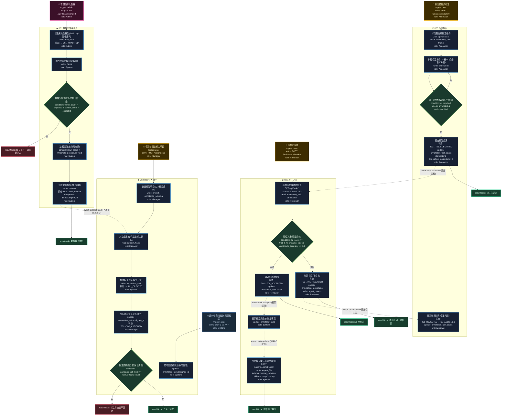

# T16: 自动驾驶数据标注平台模板

## 适用场景

- 自动驾驶数据标注：2D/3D 标注、语义分割、目标检测
- 数据采集 → 清洗 → 标注 → 质检 → 模型训练导出
- 标注任务分配、多级质检、标注员绩效

## 泳道设计（W3H）

| 泳道 | Who | What | Why | How |
|------|-----|------|-----|-----|
| B01 数据采集与导入 | System, Admin | 采集车数据导入、解包、清洗 | 原始传感器数据是标注的起点 | ROS bag 解包 + ETL |
| B02 标注任务管理 | Manager | 创建标注项目、分配任务 | 标注需按场景/难度分给合适的人 | HTTP API |
| B03 标注执行 | Annotator | 2D/3D 标注、属性标注 | 标注员需要高效完成标注 | HTTP API + 标注工具 |
| B04 质检与导出 | Reviewer, System | 多级质检、格式转换、导出 | 标注质量直接决定模型效果 | HTTP API + 自动化脚本 |

## 入口分析（W3H）

| 入口 | Who | What | Why | How |
|------|-----|------|-----|-----|
| 数据导入 | Admin | 导入采集数据 | 新采集数据需要进入标注流程 | `POST /api/datasets/import` |
| 创建标注项目 | Manager | 创建项目并分配 | 标注需要组织和管理 | `POST /api/projects` |
| 标注员标注 | Annotator | 执行标注任务 | 标注员完成标注工作 | `POST /api/tasks/:id/submit` |
| 质检员审核 | Reviewer | 审核标注质量 | 确保标注质量达标 | `POST /api/tasks/:id/review` |
| 定时质检超时 | Cron | 扫描超时任务 | 防止任务无限期挂起 | `cron '0 */1 * * *'` |

## Mermaid 图

## 异常路径清单

| 触发点 | 错误码 | Why | 恢复方式 |
|--------|--------|-----|---------|
| B01-N03 | 400 | 数据包损坏，帧数不匹配 | 重新导入 |
| B02-N05 | 400 | 标注员技能不匹配 | 重新分配 |
| B03-N03 | 400 | 标注不完整，存在漏标 | 返回继续标注 |
| B04-N02 | 200 | 质检未通过（IoU < 0.85） | 驳回修正 |
| B04-N05 | 502 | 导出格式转换失败 | retry×3 → log |

## 常见变异

| 变异点 | 默认方案 | 替代方案 |
|--------|---------|---------|
| 标注类型 | 2D 框 + 3D 点云 | 语义分割 / 关键点 / 多边形 |
| 质检方式 | 人工全量质检 | 自动质检（模型预检）+ 人工抽检 |
| 数据源 | ROS bag | 直连采集车流式上传 |
| 标注工具 | Web 端 | 客户端工具（性能更高） |
| 预标注 | 无 | 模型预标注 + 人工修正 |
| 导出格式 | COCO / KITTI | 自定义格式 / ONNX 标注 |
