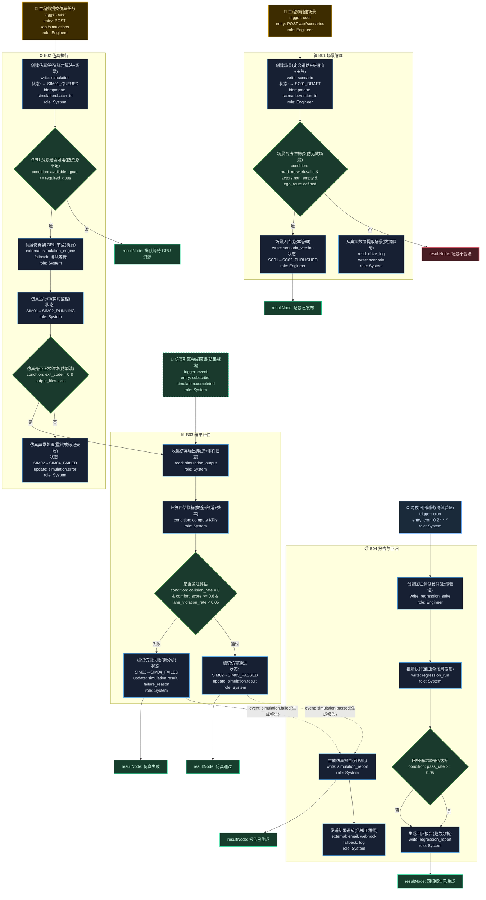

# T17: 自动驾驶仿真测试平台模板

## 适用场景

- 自动驾驶算法仿真：场景构建 → 仿真执行 → 结果评估
- 场景库管理、仿真任务调度、指标分析
- 回归测试、边缘场景验证

## 泳道设计（W3H）

| 泳道 | Who | What | Why | How |
|------|-----|------|-----|-----|
| B01 场景管理 | Engineer | 创建/编辑/管理测试场景 | 仿真的输入是场景，需要结构化管理 | HTTP API + 场景编辑器 |
| B02 仿真执行 | System | 调度仿真任务、运行仿真 | 算法需要在虚拟环境中验证 | 仿真引擎 + GPU 集群 |
| B03 结果评估 | System | 指标计算、通过/失败判定 | 仿真结果必须量化评估 | 自动化评估脚本 |
| B04 报告与回归 | System, Engineer | 生成报告、回归测试 | 评估结果需要可视化，算法迭代需要回归 | HTTP API + 报表 |

## 入口分析（W3H）

| 入口 | Who | What | Why | How |
|------|-----|------|-----|-----|
| 创建场景 | Engineer | 构建测试场景 | 需要定义测试用例 | `POST /api/scenarios` |
| 提交仿真 | Engineer | 提交算法跑仿真 | 验证算法表现 | `POST /api/simulations` |
| 仿真完成回调 | Simulation Engine | 仿真运行结束通知 | 仿真完成后触发评估 | Event subscribe |
| 定时回归 | Cron | 每夜回归测试 | 持续验证算法质量 | `cron '0 2 * * *'` |

## Mermaid 图

## 异常路径清单

| 触发点 | 错误码 | Why | 恢复方式 |
|--------|--------|-----|---------|
| B01-N02 | 400 | 场景不合法（缺少必要元素） | 返回编辑 |
| B02-N02 | 409 | GPU 资源不足 | 排队等待 |
| B02-N05 | 500 | 仿真引擎崩溃（exit_code ≠ 0） | 重试或标记失败 |
| B03-N03 | 200 | 评测未通过基线 | 标记需优化 |
| B04-N05 | 200 | 回归通过率 < 95% | 生成报告分析原因 |

## 常见变异

| 变异点 | 默认方案 | 替代方案 |
|--------|---------|---------|
| 仿真引擎 | 单机 GPU | 云端 GPU 集群 / 分布式仿真 |
| 场景格式 | OpenSCENARIO | CARLA / LGSVL 自定义格式 |
| 评估方式 | 规则评估 | 学习型评估（模型评分） |
| 回归策略 | 全量回归 | 增量回归（只跑变更影响的场景） |
| 数据驱动场景 | 手动提取 | 自动从真实数据挖掘边缘场景 |
| 并行度 | 单任务串行 | 多场景并行仿真 |
