# T18: 自动驾驶模型训练平台模板

## 适用场景

- 自动驾驶模型训练：数据准备 → 训练 → 评测 → 部署
- GPU 集群调度、训练实验管理、模型版本管理
- A/B 对比评测、模型灰度发布

## 泳道设计（W3H）

| 泳道 | Who | What | Why | How |
|------|-----|------|-----|-----|
| B01 实验管理 | Engineer | 创建训练实验、配置超参 | 模型训练需要可追溯的实验管理 | HTTP API |
| B02 训练执行 | System | GPU 调度、训练运行、checkpoint | 训练需要可靠执行和断点续训 | GPU 集群 + 训练框架 |
| B03 模型评测 | System | 自动评测、指标计算、对比 | 模型效果必须量化对比 | 自动化评测脚本 |
| B04 模型部署 | Engineer, System | 模型打包、灰度发布、监控 | 模型需要安全上线到车端 | OTA / 部署管线 |

## 入口分析（W3H）

| 入口 | Who | What | Why | How |
|------|-----|------|-----|-----|
| 创建实验 | Engineer | 创建训练实验 | 开始一轮模型训练 | `POST /api/experiments` |
| 训练完成回调 | System(Event) | 训练完成通知 | 触发自动评测 | subscribe training.completed |
| 评测完成回调 | System(Event) | 评测完成通知 | 触发部署决策 | subscribe evaluation.completed |
| 定时清理 | Cron | 清理过期 checkpoint | 释放 GPU 存储 | `cron '0 3 * * 0'` |

## Mermaid 图

```mermaid
flowchart TD
    ENTRY_EXPERIMENT["👤 工程师创建训练实验<br/>trigger: user<br/>entry: POST /api/experiments<br/>role: Engineer"]
    ENTRY_TRAIN_CB["📡 训练完成回调(触发评测)<br/>trigger: event<br/>entry: subscribe training.completed<br/>role: System"]
    ENTRY_EVAL_CB["📡 评测完成回调(触发部署决策)<br/>trigger: event<br/>entry: subscribe evaluation.completed<br/>role: System"]
    ENTRY_CLEANUP["⏰ 清理过期 checkpoint(释放存储)<br/>trigger: cron<br/>entry: cron '0 3 * * 0'<br/>role: System"]

    subgraph B01["🧪 B01 实验管理"]
        %% Why: 模型训练需要可追溯的实验管理，每轮实验都可复现
        direction TB
        B01-N01["创建实验(定义模型架构+超参+数据集)<br/>write: experiment<br/>状态: → E01_CREATED<br/>idempotent: experiment.config_hash<br/>role: Engineer"]
        B01-N02{"数据集是否就绪(防空跑)<br/>condition: dataset.status = READY & sample_count >= min_samples"}
        B01-N03{"GPU 资源是否可用(防排队过久)<br/>condition: available_gpus >= experiment.gpu_requirement"}
        B01-N04["锁定实验资源(防并发冲突)<br/>lock: experiment.id<br/>role: System"]
    end

    subgraph B02["⚙️ B02 训练执行"]
        %% Why: 训练需要可靠执行，支持断点续训
        direction TB
        B02-N01["启动训练任务(分发到 GPU 节点)<br/>external: training_framework<br/>状态: E01→E02_TRAINING<br/>fallback: 释放资源 + 重试×2<br/>role: System"]
        B02-N02["记录训练指标(实时监控)<br/>write: training_metric<br/>role: System"]
        B02-N03{"训练是否正常结束(防崩溃/发散)<br/>condition: exit_code = 0 & loss_converged = true & no NaN"}
        B02-N04["保存最终模型 checkpoint(持久化)<br/>write: model_checkpoint<br/>role: System"]
        B02-N05["训练失败处理(记录原因)<br/>状态: E02→E05_FAILED<br/>update: experiment.error<br/>role: System"]
        B02-N06["断点续训(从最近 checkpoint 恢复)<br/>read: model_checkpoint<br/>role: System"]
    end

    subgraph B03["📊 B03 模型评测"]
        %% Why: 模型效果必须量化对比，不能凭感觉上线
        direction TB
        B03-N01["加载模型到评测环境<br/>read: model_checkpoint<br/>role: System"]
        B03-N02["运行评测数据集(闭环评测)<br/>external: evaluation_engine<br/>fallback: retry×3 → 标记评测失败<br/>role: System"]
        B03-N03{"评测是否通过基线(对比)<br/>condition: mAP >= baseline.mAP & false_positive_rate <= baseline.fpr & latency <= 50ms"}
        B03-N04["标记评测通过(优于基线)<br/>状态: E02→E03_EVAL_PASSED<br/>update: experiment.result<br/>role: System"]
        B03-N05["标记评测未通过(需优化)<br/>状态: E02→E04_EVAL_FAILED<br/>update: experiment.result<br/>role: System"]
        B03-N06["生成评测报告(可视化对比)<br/>write: evaluation_report<br/>role: System"]
    end

    subgraph B04["🚀 B04 模型部署"]
        %% Why: 模型需要安全上线到车端，灰度降低风险
        direction TB
        B04-N01["打包模型(转换部署格式)<br/>external: model_converter<br/>fallback: retry×2 → log<br/>role: System"]
        B04-N02{"模型是否通过安全检查(防上线风险)<br/>condition: safety_test.passed & size <= deployment_limit"}
        B04-N03["创建灰度发布(逐步放量)<br/>write: deployment<br/>状态: → D01_CANARY<br/>role: Engineer"]
        B04-N04["监控灰度指标(异常检测)<br/>read: deployment_metrics<br/>role: System"]
        B04-N05{"灰度指标是否正常(放行判定)<br/>condition: error_rate < 0.01 & latency_p99 < 100ms"}
        B04-N06["全量发布(正式上线)<br/>状态: D01→D02_FULL<br/>update: deployment.status<br/>role: System"]
        B04-N07["回滚模型(异常时回退)<br/>状态: D01→D03_ROLLED_BACK<br/>update: deployment.status<br/>role: System"]
    end

    ENTRY_EXPERIMENT --> B01-N01
    B01-N01 --> B01-N02
    B01-N02 -->|否| ERR_DATA["resultNode: 数据集未就绪"]
    B01-N02 -->|是| B01-N03
    B01-N03 -->|否| RESULT_QUEUED["resultNode: 排队等待 GPU"]
    B01-N03 -->|是| B01-N04
    B01-N04 --> B02-N01

    B02-N01 --> B02-N02
    B02-N02 --> B02-N03
    B02-N03 -->|否| B02-N05
    B02-N03 -.->|"否: 崩溃非发散"| B02-N06
    B02-N03 -->|是| B02-N04

    ENTRY_TRAIN_CB --> B03-N01
    B02-N04 -.->|"event: training.completed(触发评测)"| B03-N01
    B03-N01 --> B03-N02
    B03-N02 --> B03-N03
    B03-N03 -->|通过| B03-N04
    B03-N03 -->|未通过| B03-N05
    B03-N04 --> B03-N06
    B03-N05 --> B03-N06

    ENTRY_EVAL_CB --> B04-N01
    B03-N06 -.->|"event: evaluation.completed(部署决策)"| B04-N01
    B04-N01 --> B04-N02
    B04-N02 -->|否| ERR_UNSAFE["resultNode: 安全检查未通过"]
    B04-N02 -->|是| B04-N03
    B04-N03 --> B04-N04
    B04-N04 --> B04-N05
    B04-N05 -->|是| B04-N06
    B04-N05 -->|否| B04-N07

    ENTRY_CLEANUP --> B02-N04

    RESULT_CREATED["resultNode: 实验已创建"]
    RESULT_PASSED["resultNode: 评测通过"]
    RESULT_FAILED["resultNode: 评测未通过"]
    RESULT_DEPLOYED["resultNode: 模型已部署"]
    RESULT_ROLLEDBACK["resultNode: 模型已回滚"]

    classDef triggerUser fill:#3D2C00,stroke:#FBBF24,color:#FEF3C7,stroke-width:2px
    classDef triggerCron fill:#1A2A3A,stroke:#60A5FA,color:#DBEAFE,stroke-width:2px
    classDef triggerEvent fill:#1A3A2D,stroke:#34D399,color:#D1FAE5,stroke-width:2px,stroke-dasharray: 5 5
    classDef process fill:#172033,stroke:#5AA9E6,color:#E5EDF7,stroke-width:2px
    classDef decision fill:#1A3A2D,stroke:#2E7D32,color:#E8F5E9,stroke-width:2px
    classDef error fill:#4A1D24,stroke:#FB7185,color:#FFE4E6,stroke-width:2px
    classDef resultNode fill:#173E2D,stroke:#34D399,color:#D1FAE5,stroke-width:2px

    class ENTRY_EXPERIMENT triggerUser
    class ENTRY_CLEANUP triggerCron
    class ENTRY_TRAIN_CB,ENTRY_EVAL_CB triggerEvent
    class B01-N01,B01-N04,B02-N01,B02-N02,B02-N04,B02-N05,B02-N06,B03-N01,B03-N02,B03-N04,B03-N05,B03-N06,B04-N01,B04-N03,B04-N04,B04-N06,B04-N07 process
    class B01-N02,B01-N03,B02-N03,B03-N03,B04-N02,B04-N05 decision
    class ERR_DATA,ERR_UNSAFE error
    class RESULT_QUEUED,RESULT_CREATED,RESULT_PASSED,RESULT_FAILED,RESULT_DEPLOYED,RESULT_ROLLEDBACK resultNode
```

## 异常路径清单

| 触发点 | 错误码 | Why | 恢复方式 |
|--------|--------|-----|---------|
| B01-N02 | 400 | 数据集未就绪（样本不足） | 返回准备数据 |
| B01-N03 | 409 | GPU 资源不可用 | 排队等待 |
| B02-N03 | 500 | 训练崩溃/loss 发散 | 记录原因 + 可断点续训 |
| B03-N03 | 200 | 评测未通过基线 | 标记需优化 |
| B04-N02 | 403 | 安全检查未通过 | 阻止部署 |
| B04-N05 | 200 | 灰度指标异常 | 自动回滚 |

## 常见变异

| 变异点 | 默认方案 | 替代方案 |
|--------|---------|---------|
| 训练框架 | PyTorch | TensorFlow / PaddlePaddle |
| 调度方式 | 自建调度 | Kubernetes + Volcano |
| 评测方式 | 离线评测 | 在线 A/B 评测（仿真环境） |
| 部署方式 | OTA 推送 | 边缘端热更新 |
| 模型格式 | ONNX | TensorRT / OpenVINO |
| 实验跟踪 | 自建 | MLflow / Weights & Biases |
