# T19: 自动驾驶车队管理平台模板

## 适用场景

- 自动驾驶车队运营：车辆注册、状态监控、远程调度
- 固件/算法 OTA 升级、车辆健康诊断
- 运营数据采集与分析

## 泳道设计（W3H）

| 泳道 | Who | What | Why | How |
|------|-----|------|-----|-----|
| B01 车辆管理 | Admin | 车辆注册、状态管理、编组 | 车辆是运营的核心资产 | HTTP API + MQTT |
| B02 远程监控 | System | 实时状态、告警、诊断 | 车辆状态必须实时可知 | MQTT + 时序数据库 |
| B03 OTA 升级 | Admin, System | 固件/算法推送、灰度、回滚 | 车端软件需要安全高效更新 | OTA 管道 + 灰度策略 |
| B04 运营分析 | System | 行驶统计、故障分析、效率 | 运营数据驱动决策 | 数据管道 + BI |

## 入口分析（W3H）

| 入口 | Who | What | Why | How |
|------|-----|------|-----|-----|
| 车辆注册 | Admin | 新车辆入网 | 新车需要加入车队 | `POST /api/vehicles` |
| 车辆心跳 | Vehicle | 上报实时状态 | 车辆状态必须持续监控 | `MQTT telemetry` |
| OTA 推送 | Admin | 推送升级包 | 车端软件需要更新 | `POST /api/ota/deployments` |
| 升级回调 | Vehicle | 升级结果上报 | 确认升级是否成功 | `MQTT ota.result` |
| 定时诊断 | Cron | 定时健康扫描 | 主动发现潜在故障 | `cron '0 */6 * * *'` |

## Mermaid 图

```mermaid
flowchart TD
    ENTRY_REGISTER["👑 管理员注册新车辆<br/>trigger: admin<br/>entry: POST /api/vehicles<br/>role: Admin"]
    ENTRY_TELEMETRY["📡 车辆心跳上报(实时状态)<br/>trigger: event<br/>entry: MQTT vehicle/telemetry<br/>role: Vehicle"]
    ENTRY_OTA["👑 管理员推送 OTA 升级<br/>trigger: admin<br/>entry: POST /api/ota/deployments<br/>role: Admin"]
    ENTRY_OTA_CB["📡 车辆升级结果回调(确认结果)<br/>trigger: event<br/>entry: MQTT ota/result<br/>role: Vehicle"]
    ENTRY_DIAG["⏰ 定时健康诊断(主动巡检)<br/>trigger: cron<br/>entry: cron '0 */6 * * *'<br/>role: System"]

    subgraph B01["🚗 B01 车辆管理"]
        %% Why: 车辆是运营的核心资产，必须精确管理每台车的状态
        direction TB
        B01-N01["注册车辆信息(VIN/类型/传感器配置)<br/>write: vehicle<br/>状态: → V01_REGISTERED<br/>idempotent: vehicle.vin<br/>role: Admin"]
        B01-N02{"车辆信息是否完整(防缺信息)<br/>condition: vin valid & sensor_config non-empty & vehicle_type defined"}
        B01-N03["分配车辆编组(按运营区域)<br/>update: vehicle.fleet_id<br/>状态: V01→V02_ACTIVE<br/>role: Admin"]
        B01-N04["车辆退役/报废(生命周期终止)<br/>状态: V02→V03_RETIRED<br/>update: vehicle.status<br/>role: Admin"]
    end

    subgraph B02["📡 B02 远程监控"]
        %% Why: 车辆状态必须实时可知，异常需要秒级告警
        direction TB
        B02-N01["接收车辆遥测数据(位置/速度/传感器状态)<br/>write: telemetry<br/>cache: vehicle_state<br/>role: Vehicle"]
        B02-N02{"数据是否超时(判断连接状态)<br/>condition: last_heartbeat_age < 30s"}
        B02-N03["标记车辆离线(连接中断)<br/>状态: V02→V02_OFFLINE<br/>update: vehicle.status<br/>role: System"]
        B02-N04{"传感器是否异常(硬件健康)<br/>condition: all sensor_health = OK"}
        B02-N05["触发告警(通知运维)<br/>external: alert<br/>fallback: retry×2 → log<br/>role: System"]
        B02-N06["记录告警日志(可追溯)<br/>write: alert_log<br/>role: System"]
    end

    subgraph B03["📦 B03 OTA 升级"]
        %% Why: 车端软件需要安全高效更新，灰度降低风险
        direction TB
        B03-N01["创建升级包(固件/算法)<br/>write: ota_package<br/>role: Admin"]
        B03-N02{"升级包校验(防损坏/兼容)<br/>condition: package_hash valid & target_version > current_version & compatible_hardware"}
        B03-N03["选择目标车辆(灰度策略)<br/>read: vehicle, deployment_policy<br/>role: System"]
        B03-N04["推送升级指令到车端<br/>external: mqtt<br/>状态: → OTA01_PUSHED<br/>fallback: retry×3 → 标记推送失败<br/>role: System"]
        B03-N05{"升级是否成功(结果判定)<br/>condition: result = SUCCESS & new_version = target_version"}
        B03-N06["标记升级成功<br/>状态: OTA01→OTA02_SUCCESS<br/>update: vehicle.software_version<br/>role: System"]
        B03-N07["升级失败回滚(恢复旧版本)<br/>状态: OTA01→OTA03_FAILED<br/>update: vehicle.software_version = previous<br/>role: System"]
    end

    subgraph B04["📊 B04 运营分析"]
        %% Why: 运营数据驱动决策，故障趋势需提前发现
        direction TB
        B04-N01["聚合遥测数据(按车/区域/时段)<br/>write: daily_stats<br/>role: System"]
        B04-N02["执行健康诊断脚本(主动巡检)<br/>condition: check sensor_calibration & battery_health & storage_usage<br/>role: System"]
        B04-N03{"是否发现异常(预防性维护)<br/>condition: any diagnostic_flag = WARNING"}
        B04-N04["生成维保工单(提前处理)<br/>write: maintenance_order<br/>role: System"]
        B04-N05["生成运营日报(可视化)<br/>write: daily_report<br/>role: System"]
    end

    ENTRY_REGISTER --> B01-N01
    B01-N01 --> B01-N02
    B01-N02 -->|否| ERR_INFO["resultNode: 车辆信息不完整"]
    B01-N02 -->|是| B01-N03

    ENTRY_TELEMETRY --> B02-N01
    B02-N01 --> B02-N02
    B02-N02 -->|是| B02-N04
    B02-N02 -->|否| B02-N03
    B02-N04 -->|否| B02-N05
    B02-N05 --> B02-N06

    ENTRY_OTA --> B03-N01
    B03-N01 --> B03-N02
    B03-N02 -->|否| ERR_PKG["resultNode: 升级包校验失败"]
    B03-N02 -->|是| B03-N03
    B03-N03 --> B03-N04

    ENTRY_OTA_CB --> B03-N05
    B03-N05 -->|是| B03-N06
    B03-N05 -->|否| B03-N07

    ENTRY_DIAG --> B04-N02
    B04-N02 --> B04-N03
    B04-N03 -->|是| B04-N04
    B04-N03 -->|否| B04-N05

    B02-N01 -.->|"event: telemetry.received(聚合统计)"| B04-N01

    RESULT_REGISTERED["resultNode: 车辆已注册"]
    RESULT_OFFLINE["resultNode: 车辆离线告警"]
    RESULT_ALERT["resultNode: 传感器告警"]
    RESULT_PUSHED["resultNode: 升级已推送"]
    RESULT_UPGRADED["resultNode: 升级成功"]
    RESULT_ROLLBACK["resultNode: 升级失败已回滚"]
    RESULT_REPORT["resultNode: 运营日报已生成"]
    RESULT_MAINTENANCE["resultNode: 维保工单已创建"]

    B01-N03 --> RESULT_REGISTERED
    B02-N03 --> RESULT_OFFLINE
    B02-N05 --> RESULT_ALERT
    B03-N04 --> RESULT_PUSHED
    B03-N06 --> RESULT_UPGRADED
    B03-N07 --> RESULT_ROLLBACK
    B04-N04 --> RESULT_MAINTENANCE
    B04-N05 --> RESULT_REPORT

    classDef triggerAdmin fill:#3B1028,stroke:#F472B6,color:#FCE7F3,stroke-width:2px
    classDef triggerCron fill:#1A2A3A,stroke:#60A5FA,color:#DBEAFE,stroke-width:2px
    classDef triggerEvent fill:#1A3A2D,stroke:#34D399,color:#D1FAE5,stroke-width:2px,stroke-dasharray: 5 5
    classDef process fill:#172033,stroke:#5AA9E6,color:#E5EDF7,stroke-width:2px
    classDef decision fill:#1A3A2D,stroke:#2E7D32,color:#E8F5E9,stroke-width:2px
    classDef error fill:#4A1D24,stroke:#FB7185,color:#FFE4E6,stroke-width:2px
    classDef resultNode fill:#173E2D,stroke:#34D399,color:#D1FAE5,stroke-width:2px

    class ENTRY_REGISTER,ENTRY_OTA triggerAdmin
    class ENTRY_DIAG triggerCron
    class ENTRY_TELEMETRY,ENTRY_OTA_CB triggerEvent
    class B01-N01,B01-N03,B01-N04,B02-N01,B02-N03,B02-N05,B02-N06,B03-N01,B03-N03,B03-N04,B03-N06,B03-N07,B04-N01,B04-N02,B04-N04,B04-N05 process
    class B01-N02,B02-N02,B02-N04,B03-N02,B03-N05,B04-N03 decision
    class ERR_INFO,ERR_PKG error
    class RESULT_REGISTERED,RESULT_OFFLINE,RESULT_ALERT,RESULT_PUSHED,RESULT_UPGRADED,RESULT_ROLLBACK,RESULT_REPORT,RESULT_MAINTENANCE resultNode
```

## 异常路径清单

| 触发点 | 错误码 | Why | 恢复方式 |
|--------|--------|-----|---------|
| B01-N02 | 400 | 车辆信息不完整 | 补全信息 |
| B02-N02 | 200 | 车辆心跳超时（连接中断） | 标记离线 |
| B02-N04 | 200 | 传感器异常 | 触发告警 |
| B03-N02 | 400 | 升级包校验失败（损坏/不兼容） | 拒绝推送 |
| B03-N05 | 200 | 车端升级失败 | 自动回滚旧版本 |
| B04-N03 | 200 | 诊断发现异常 | 生成维保工单 |

## 常见变异

| 变异点 | 默认方案 | 替代方案 |
|--------|---------|---------|
| 通信协议 | MQTT | HTTP 长轮询 / WebSocket / gRPC |
| OTA 策略 | 灰度推送 | 全量推送 / A/B 分组 |
| 监控方式 | 被动接收心跳 | 主动轮询 + 被动上报 |
| 编组方式 | 按运营区域 | 按车型 / 按任务类型 |
| 诊断方式 | 定时巡检 | 连续在线诊断（流式分析） |
| 车端计算 | 无 | 边缘计算 + 云端协同 |
