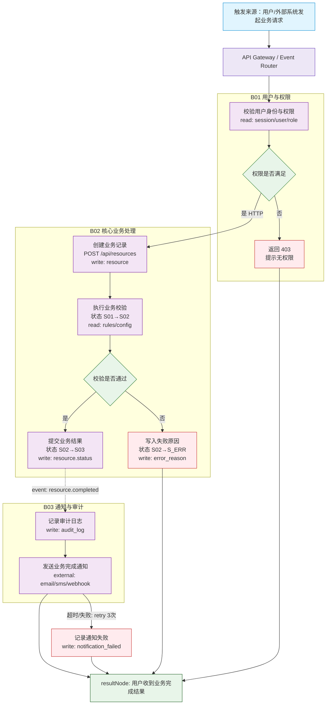

# project.flow.mermaid 模板

文件：`.shadow/L1-business/project.flow.mermaid`

> Shadow Flow 只维护一张项目级总图。BXX 是总图里的泳道/领域编号，不再对应独立业务线 flow 文件。

**约束：**
- 必须通过 Mermaid 渲染校验脚本（优先 `skills/shadow-l1-flow/scripts/mmdc-check.sh`，兼容 `skills/mermaid-check/scripts/mmdc_check.sh`）
- 项目只允许一个 L1 Flow 总图：`.shadow/L1-business/project.flow.mermaid`
- BXX subgraph 是总图里的领域/泳道分组，不是独立文件
- 每个节点命名包含具体动作或判断，禁止使用 `B01-N01[处理]`、`B01-N02{判断}` 等模糊命名
- 每个关键步骤必须有对应的异常处理分支，禁止只有 happy path
- 总图必须包含端到端主链路、异常链路、跨域协作和 resultNode
- 总图必须展示关键操作点、业务点、流程点、数据流转、接口请求流、外部依赖和错误处理点
- 用户交互节点必须标注 API 请求或数据读写；外部服务节点必须有失败/超时/重试路径
- 跨泳道同步调用必须在边标签标注 `HTTP` / `RPC` / `query` 等性质
- 跨泳道异步协作必须用虚线事件边，并使用 `event: domain.action` 命名
- 禁止为 B01/B02/B03 等业务线创建单独 `flow.mermaid`、`project.flow.mermaid` 或 `*.flow.mermaid`

### 品味约束

引用 `shadow-taste/references/taste-criteria.md`。
- 每个决策节点有否定/异常分支（无否定分支 = 否认意外存在）
- 外部依赖节点有超时/重试/降级路径
- 泳道 ≤ 10 节点 / 节点命名"动词+宾语"
- 关键节点标注 read/write/external
