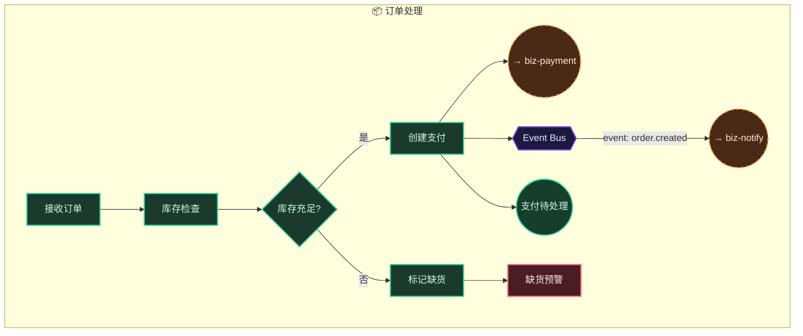
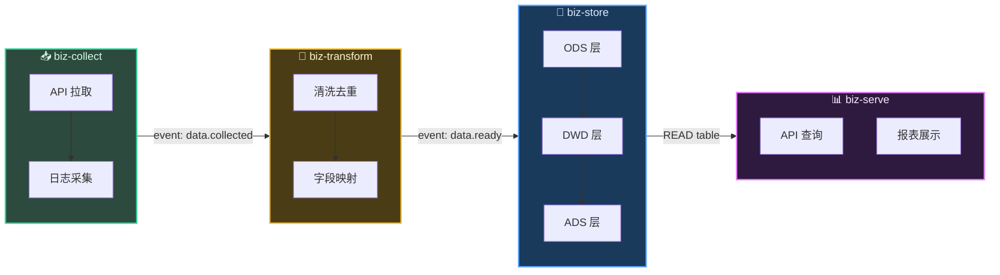
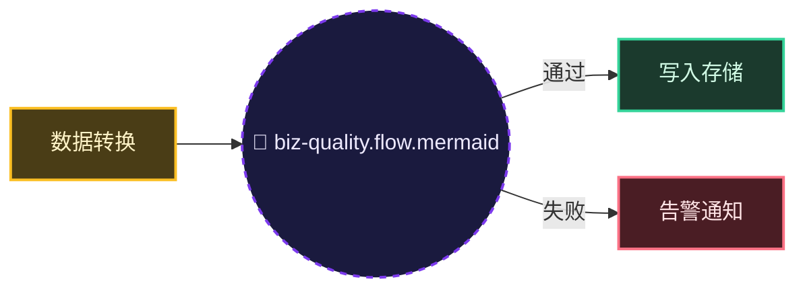
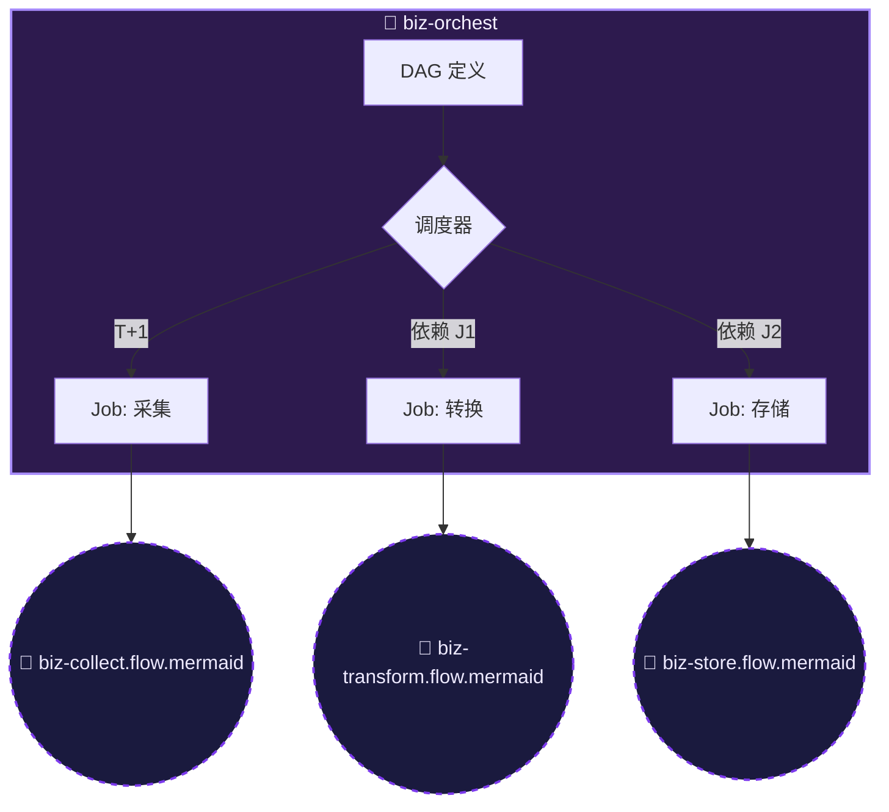
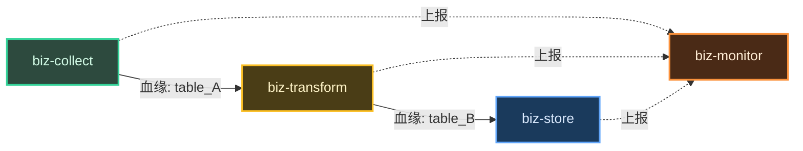
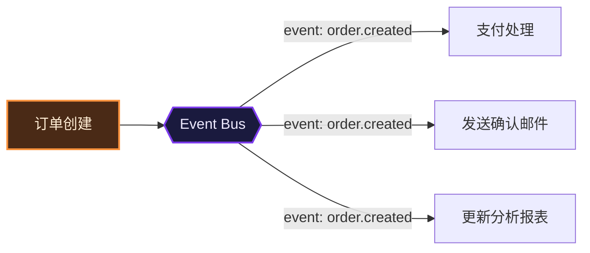

# 跨业务线连接与交叉场景指南

> 本指南定义业务线间的连接协议和典型交叉场景处理方式。
> 参考 [多业务线 L1 设计规范](multi-bizline.md)。

## 目录

- [3. 跨线连接协议](#3-跨线连接协议)
  - [3.1 核心原则](#31-核心原则)
  - [3.2 接口节点类型](#32-接口节点类型)
  - [3.3 连接标签规范](#33-连接标签规范)
  - [3.4 跨线连接示例（总图中）](#34-跨线连接示例总图中)
  - [3.5 跨线连接检查清单](#35-跨线连接检查清单)
- [5. 业务交叉场景处理](#5-业务交叉场景处理)
  - [5.1 通用场景分类](#51-通用场景分类)
  - [5.2 数据流程典型交叉场景](#52-数据流程典型交叉场景)
  - [5.3 事件扇出示例](#53-事件扇出示例)
  - [5.4 跨线连接在 spec.md 中的体现](#54-跨线连接在-specmd-中的体现)

## 3. 跨线连接协议

### 3.1 核心原则

> **业务线之间禁止直接连接内部节点。** 所有跨线通信必须通过标准化的接口节点中转。

### 3.2 接口节点类型

| 类型 | 适用场景 | Mermaid 节点形状 | 连接标签 |
|------|---------|----------------|---------|
| API Gateway | 同步 HTTP/gRPC 调用 | `GATEWAY[["API Gateway"]]` | `HTTP /method` |
| Event Bus | 异步事件驱动 | `EVT{{"Event Bus"}}` | `event: name` |
| Shared Service | 共享基础设施 | `SHARED[("Shared: Redis/DB")]` | `READ/WRITE key` |
| Webhook | 外部系统回调 | `HOOK[/"Webhook"/]` | `POST /callback` |

### 3.3 连接标签规范

```
同步调用：  源 -->|HTTP POST /api/v1/orders| 目标
异步事件：  源 -->|event: order.created| EVT
事件消费：  EVT -->|订阅 order.created| 目标
数据访问：  源 -->|READ user:123| SHARED
```

### 3.4 跨线连接示例（总图中）



### 3.5 跨线连接检查清单

生成跨线连接后，逐项检查：

| # | 检查项 | 通过标准 |
|---|--------|---------|
| 1 | 接口节点存在 | 每条跨线连接都经过 API Gateway / Event Bus / Shared Service |
| 2 | 连接标签完整 | 每条跨线边都有 `|HTTP /path|` 或 `|event: name|` 标签 |
| 3 | 方向明确 | 箭头方向与调用方向一致（请求方 → 接口 → 消费方） |
| 4 | 无循环依赖 | 业务线之间不存在 A→B→A 的循环调用 |
| 5 | 事件命名 | 事件名格式 `domain.action`（如 `order.created`） |
| 6 | 出/入标识 | 总图中用 `outbound` 样式标注流向他线的节点 |

## 5. 业务交叉场景处理

### 5.1 通用场景分类

| 场景 | 特征 | 处理方式 |
|------|------|---------|
| **单向调用** | A 调用 B，B 不调用 A | A 的 subgraph 中放 outbound 节点 → Event Bus → B |
| **双向交互** | A 和 B 互相调用 | 主流程中双向标注，各子流程各放 outbound |
| **事件广播** | A 发布事件，B/C/D 订阅 | A → Event Bus，Event Bus → B/C/D（扇出） |
| **聚合服务** | A+B+C 的数据聚合到 D | A/B/C 各自 → Event Bus，D 从 Event Bus 聚合 |
| **共享依赖** | A/B/C 都访问同一 DB | 各自 → Shared Service 节点（不直接连 DB） |

### 5.2 数据流程典型交叉场景

#### 场景 A：数据管道标准链路

```
biz-collect → biz-transform → biz-store → biz-serve
```



#### 场景 B：数据质量校验嵌入管道

```
biz-transform → biz-quality → (通过) biz-store
                           → (失败) biz-monitor
```



#### 场景 C：DAG 编排驱动多管道

```
biz-orchest ──调度──▶ biz-collect
                   ──调度──▶ biz-transform
                   ──调度──▶ biz-store
```



#### 场景 D：数据血缘追踪（跨多业务线）

```
biz-collect ──血缘──▶ biz-transform ──血缘──▶ biz-store
     │                     │                     │
     └───────── biz-monitor（统一追踪）────────────┘
```



#### 场景 E：CDC 实时同步

```
源 DB ──CDC──▶ biz-collect ──kafka──▶ biz-transform ──upsert──▶ biz-store
```


### 5.3 事件扇出示例



### 5.4 跨线连接在 spec.md 中的体现

当存在跨线连接时，spec.md 必须增加 `## 跨业务线依赖` 章节：

```markdown
## 跨业务线依赖

| 依赖方向 | 事件/接口 | 协议 | 超时 | 降级策略 |
|---------|----------|------|------|---------|
| biz-order → biz-payment | HTTP POST /payments | HTTP/JSON | 5s | 标记待支付，异步重试 |
| biz-order → biz-notify | event: order.created | Event | 最终一致 | 补偿任务重发 |
| biz-payment → biz-order | event: payment.completed | Event | 最终一致 | 对账任务补偿 |
```
