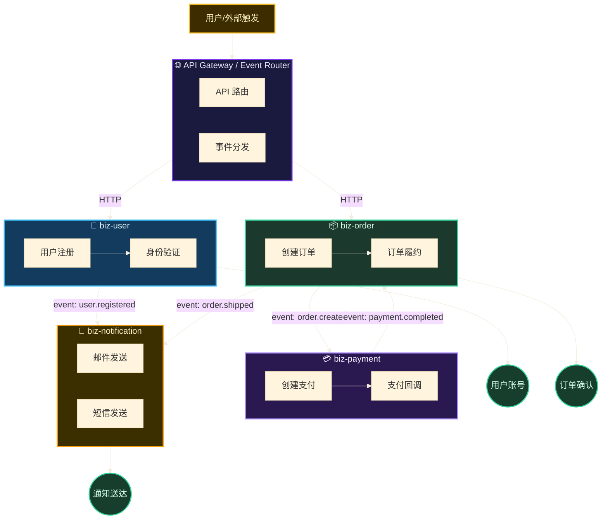

# 多业务线流程总图与工作流指南

> 本指南定义项目级流程总图的模板、多业务线工作流和 Gate 检查扩展。
> 参考 [多业务线 L1 设计规范](multi-bizline.md)。

## 目录

- [2. 项目级流程总图体系](#2-项目级流程总图体系)
  - [2.1 单图结构](#21-单图结构)
  - [2.2 总图职责](#22-总图职责)
  - [2.3 总图（project.flow.mermaid）模板](#23-总图projectflowmermaid模板)
- [6. L1 多业务线工作流](#6-l1-多业务线工作流)
  - [6.1 新增业务的接入判断](#61-新增业务的接入判断)
  - [6.2 修改现有业务的影响面分析](#62-修改现有业务的影响面分析)
- [7. Gate 检查扩展](#7-gate-检查扩展)

## 2. 项目级流程总图体系

### 2.1 单图结构

```
.shadow/L1-business/project.flow.mermaid   ← 唯一项目级总图，包含所有业务域/泳道
```

### 2.2 总图职责

| 文件 | 职责 | 包含内容 |
|------|------|---------|
| `.shadow/L1-business/project.flow.mermaid` | 展示全项目端到端业务流、业务域协作、关键异常路径 | BXX 泳道 subgraph、BXX-NYY 节点、同步调用边、异步事件边、resultNode |

禁止再创建 `biz-{id}.flow.mermaid`、`biz-{id}-{module}.flow.mermaid` 等业务线独立流程图。复杂内部步骤进入 `spec.md` 规则、异常路径和状态迁移。

### 2.3 总图（project.flow.mermaid）模板



## 6. L1 多业务线工作流

### 6.1 新增业务的接入判断

```
[收到新业务需求]
  ↓
[扫描 `.shadow/L1-business/project.flow.mermaid` 总图]
  ↓
{是否存在匹配的业务线？}
  ├─ 是 → 在总图对应 biz-{id} subgraph 中扩展节点和边
  │        → 如有新跨线连接 → 在总图增加带标签的跨泳道边
  └─ 否 → 在总图创建新的 biz-{new-id} subgraph
           → 添加入口、出口、异常路径和跨泳道连接
           → 更新 mermaid.md 配色表（如需要新配色）
```

### 6.2 修改现有业务的影响面分析

当修改某个业务线时：

```
1. 确定变更的业务域/泳道 biz-{id}
2. 读取 `.shadow/L1-business/project.flow.mermaid` 总图，查找所有连接到 biz-{id} 的边
3. 列出受影响的业务线（上游调用方 + 下游消费方）
4. 在 research.md 变更记录中声明影响面
5. 在同一张总图中更新受影响节点和边
6. 更新跨业务线依赖表（spec.md 中）
```

## 7. Gate 检查扩展

多业务线场景下，Gate 检查增加以下项：

| # | 检查项 | 说明 |
|---|--------|------|
| M1 | 总图包含所有业务线 subgraph | `.shadow/L1-business/project.flow.mermaid` 中有所有 biz-{id} 的 subgraph |
| M2 | 不存在业务线独立流程图 | 禁止 `biz-{id}.project.flow.mermaid` |
| M3 | 跨线连接经过接口节点 | 无边直接连接两个业务线 subgraph 的内部节点 |
| M4 | 连接标签完整 | 每条跨线边都有标签 |
| M5 | 事件命名规范 | 使用 `domain.action` 格式 |
| M6 | 无循环依赖 | 业务线间无 A→B→A 调用链 |
| M7 | 配色唯一性 | 每个业务线使用独立的 classDef 配色 |
| M8 | spec.md 有跨线依赖表 | 当存在跨线连接时必须有此表 |
| M9 | 节点均可追溯 | 所有正式业务动作都有 BXX-NYY 编号 |
| M10 | 总图可读 | 通过泳道、事件边和异常分支保持结构清晰 |
| M11 | 跨线引用双向声明 | 输出方声明 `A→B` 时，B 的 spec 接入点章节必须有反向声明；缺失 → FAIL |
| M12 | 子节点编号连续性 | 每个父节点的子节点编号 .01, .02, .03...必须连续无跳号；跳号 → FAIL |
| M13 | 子节点总数 ≤ 8 | 每个父节点的子节点总数不超过 8；超过 → 建议拆分为兄弟节点 |
