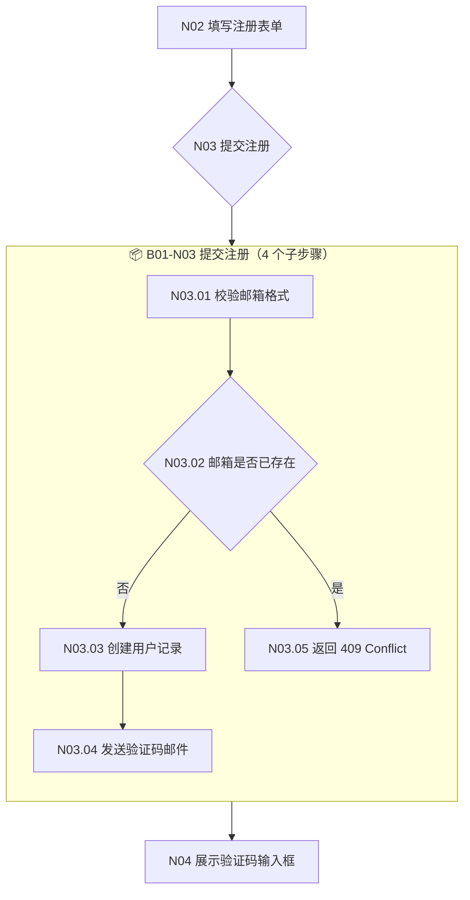
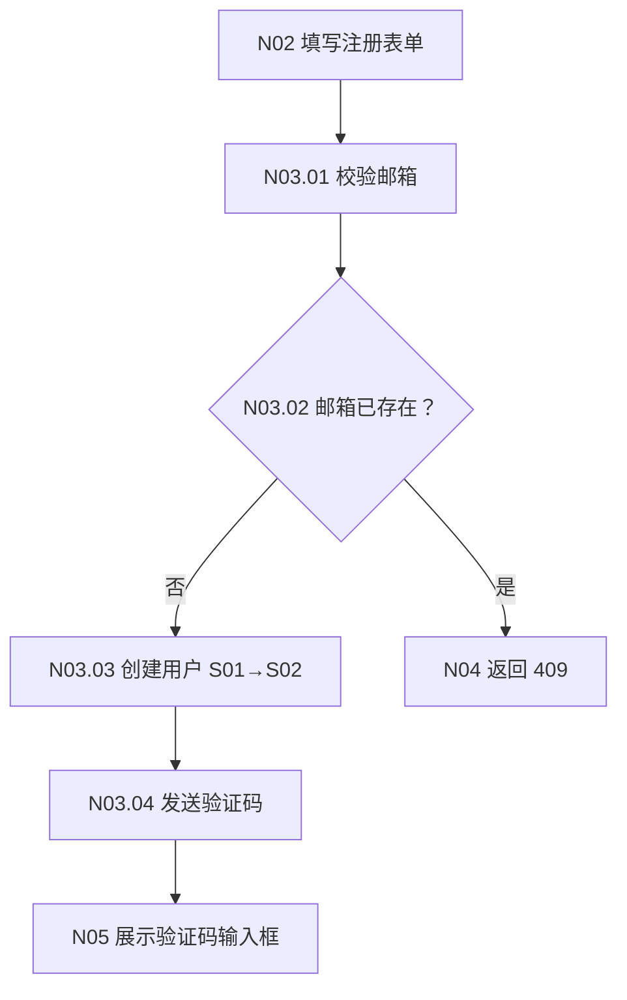

# 多业务线命名与编号规范

> 本指南定义业务线的编号体系（BXX-NYY）、标识系统和视觉规范。
> 参考 [多业务线 L1 设计规范](multi-bizline.md)。

## 目录

- [0. 业务线编号体系（BXX-NYY 路由）](#0-业务线编号体系bxx-nyy-路由)
- [1. 业务线标识系统](#1-业务线标识系统)
- [4. 总图泳道视觉规范](#4-总图泳道视觉规范)

## 0. 业务线编号体系（BXX-NYY 路由）

### 0.1 核心原则

> **BXX（业务线编号） + NYY（节点编号） = 业务操作全局唯一坐标**
>
> 从代码出发：`@implements: {{SLUG}}-B01-N03` → 定位到 business line B01 的节点 N03 →
> 从节点出发：看 B01 的 project.flow.mermaid 感知该业务全局 → 从 project.flow.mermaid 主流程感知整个项目全局

### 0.2 编号规则

| 层级 | 标识 | 格式 | 作用域 | 示例 |
|------|------|------|--------|------|
| **业务线编号** | `BXX` | `B01`, `B02`...（两位数，01-99） | 项目全局唯一 | `B01` = 用户管理 |
| **流程节点编号** | `NYY` | `N01`, `N02`...（两位数，01-99） | 业务线内唯一 | `N03` = 提交注册表单 |
| **组合路由 ID** | `BXX-NYY` | `B01-N03` | 全局唯一 | `B01-N03` = 用户管理的注册提交节点 |
| **规则 ID** | `RYY` | `{{SLUG}}-R01` | 业务线内唯一 | 规则锚定于节点，一个节点可对应多条规则 |

### 0.3 节点粒度铁律

> **一个 Mermaid 节点 = 一个不可再拆的业务动作。**
> 如果节点内部还有子流程（多个步骤/分支/循环），必须拆分成子节点。
>
> 节点粒度直接决定代码实现质量和可追溯精度。

| 节点特征 | 处理 | 示例 |
|---------|------|------|
| 单一动作 | 保留为一个节点 | `N03[POST /api/register → 创建用户记录]` |
| 含条件分支 | 拆分为判断节点 + 结果节点 | `N03{邮箱是否已注册} → N04[注册成功] / N05[返回错误]` |
| 含异步等待 | 拆分为发送 + 等待 + 回调节点 | `N06[发送验证码] → N07[等待验证] → N08[验证回调]` |
| 含外部调用 | 标注外部依赖，失败时拆分降级节点 | `N09[调用 CRM] → N10[CRM 超时降级]` |
| 含人工操作 | 拆分出人工节点 | `N11[提交审批] → N12[管理员审批] → N13[审批结果]` |

**节点命名格式**：`NYY[动作]` 或 `NYY{判断条件}`，动作描述包含 HTTP 路径/函数名/业务动作。

### 0.4 INDEX.md 中的业务线编号

```markdown
# L1 业务索引

> 业务线子目录使用 `BXX-<slug>` 格式（如 `B01-user-management/`），文件系统可直接检索。

| B# | 业务目录 | 业务名称 | 主业务 | 状态 | 节点数 | 规则数 | 最后更新 |
|:--:|---------|---------|:-----:|:----:|:-----:|:-----:|----------|
| B01 | B01-user-management | 用户管理 | ⭐ | ✅ | 15 | 12 | 2026-05-12 |
| B02 | B02-payment | 支付系统 | | ✅ | 8 | 6 | 2026-05-12 |
| B03 | B03-notification | 通知服务 | | 🔄 | 5 | 4 | 2026-05-12 |
```

### 0.5 @implements 中的路由引用

```python
# 规则级（指向 spec 规则）
# @implements: user-management-R01, user-management-R02

# 节点级（指向 flow 节点，必须精确定位）
# @implements: user-management-B01-N03

# 函数级（同时引用规则和节点）
# @implements: user-management-R01 (B01-N03)
```

> **强制**：文件头用规则级 `@implements`，关键函数必须用节点级精确定位。节点坐标是全链路追溯的唯一锚点。

### 0.6 节点层级体系 — 跨文件引用与子节点聚合

> **核心思想**：每个 BXX-NYY 节点是全局可寻址的"原子操作"。节点可以跨文件/跨文件夹互相引用作为输入，也可以拥有子节点形成层级聚合。

#### 0.6.1 节点子层级编号

父节点可以展开为子节点，通过 `.ZZ` 后缀编号：

| 层级 | 格式 | 示例 | 说明 |
|------|------|------|------|
| **父节点** | `BXX-NYY` | `B01-N03` | 提交注册表单（聚合节点） |
| **一级子节点** | `BXX-NYY.ZZ` | `B01-N03.01` | 校验邮箱格式 |
|  |  | `B01-N03.02` | 检查邮箱是否已存在 |
|  |  | `B01-N03.03` | 创建用户记录 |
|  |  | `B01-N03.04` | 发送验证码邮件 |
| **二级子节点** | `BXX-NYY.ZZ.WW` | `B01-N03.02.01` | 查询数据库 |
|  |  | `B01-N03.02.02` | 比对结果 |
| **三级子节点** | `BXX-NYY.ZZ.WW.VV` | `B01-N03.02.01.01` | 构建 SQL |

**铁律**：
- 子节点编号最多 3 级（`.01` → `.01.01` → `.01.01.01`），超过则说明父节点粒度过粗，应重新拆分
- 父节点本身仍然是 project.flow.mermaid 中的正式节点，子节点是展开细节
- 子节点总数建议 ≤ 8 个，超过则父节点应拆为多个兄弟节点
- 子节点编号必须连续（如 N03 的子节点应为 .01, .02, .03...，禁止跳号如 .01, .02, .04）。缺号 → L1 Gate FAIL
- **Mermaid ID 与坐标映射**：project.flow.mermaid 中节点 ID 用下划线（如 `N03_01`、`N03_01_02`），因为 Mermaid 语法不支持点号；spec/wire/代码 等其他文件用点号坐标（如 `B01-N03.01`、`B01-N03.01.02`）。转换规则：`_` ↔ `.`，读取 flow 生成其他文件时必须替换

#### 0.6.2 跨文件/跨文件夹节点引用

任何节点都可以通过 BXX-NYY 坐标引用其他文件中的节点作为输入：

```
[B01-N03 提交注册] 的输出 → 作为 [B02-N01 发送欢迎邮件] 的输入
[B01-N07 支付成功] 的输出 → 作为 [B03-N02 更新库存] 的输入
```

**引用方式**：

| 场景 | 写法 | 说明 |
|------|------|------|
| **同文件引用** | `→ B01-N05` | 同一 project.flow.mermaid 内的边 |
| **跨业务线引用** | `→ B02-N01` | 不同 biz-{id} 的节点 |
| **跨文件引用** | `→ B01-N03.02` | 引用子节点，精确定位 |
| **wire 产物引用** | `data-node="B01-N03.02"` | UI 元素精确到子节点 |
| **代码引用** | `@implements: slug-R01 (B01-N03.02)` | 代码精确到子节点 |

#### 0.6.3 节点输入/输出声明

每个节点在 spec.md 中必须声明输入和输出：

```markdown
### B01-N03 提交注册表单

| 属性 | 值 |
|------|------|
| 输入 | `B01-N02` 的邮箱/密码数据 |
| 输出 | 用户记录（S01→S02） |
| 子节点 | N03.01 校验邮箱 → N03.02 查重 → N03.03 创建记录 |
| 异常 | N03.02 查重失败 → B01-N04 返回冲突 |
```

#### 0.6.4 Mermaid 中的子节点表达

**方式一：subgraph 展开**（推荐用于关键节点）



**方式二：内联标注**（推荐用于简单子节点）



#### 0.6.5 wire 产物中的子节点映射

UI 元素必须精确到子节点级别：

```html
<div class="card" data-node="B01-N03.01">
  <strong>邮箱校验区 [N03.01]</strong>
  <div class="input" data-node="B01-N03.01.01">邮箱输入框 [实时格式校验]</div>
  <div class="error" data-node="B01-N03.01.02">格式错误提示 [红色]</div>
</div>

<div class="card" data-node="B01-N03.03">
  <strong>提交按钮 [N03.03]</strong>
  <div class="btn" data-node="B01-N03.03.01">提交按钮 [N03.01+N03.02 通过后启用]</div>
  <div class="loading" data-node="B01-N03.03.02">Loading 动画 [提交中]</div>
</div>
```

#### 0.6.6 跨业务线节点聚合示例

```
B01 用户管理              B02 通知服务              B03 订单服务
┌──────────────┐         ┌──────────────┐         ┌──────────────┐
│ B01-N03 提交  │──输出──▶│ B02-N01 发邮件 │         │              │
│  ├─ N03.01   │         │  ├─ N01.01   │         │              │
│  ├─ N03.02   │         │  ├─ N01.02   │         │              │
│  └─ N03.03   │         │  └─ N01.03   │         │              │
└──────────────┘         └──────────────┘         └──────────────┘
                               │                         ▲
                               └──输出──────────────────▶│
                                         B03-N02 创建订单
```

**规则**：
- 跨线引用必须通过明确定义的接口节点（API/Event）
- 输出方节点必须在 spec.md 的 `## 跨业务线依赖` 章节声明
- 输入方节点必须在 spec.md 的 `## 接入点` 章节声明来源
- **双向声明强制**：当 A 的 spec 声明 `A-N03 → B-N01` 时，B 的 spec 必须在 `## 接入点` 章节反向声明"来自 A-N03"。L1 Gate 检查时验证双向声明一致性，缺失反向声明 → Gate FAIL

## 1. 业务线标识系统

### 1.1 业务线 ID 命名

| 规则 | 格式 | 示例 |
|------|------|------|
| 格式 | `biz-{领域名词}`（kebab-case，2-3 个单词） | `biz-user`, `biz-payment`, `biz-order` |
| 长度 | 不超过 3 级层级 | `biz-user-auth`（3 级），`biz-payment-alipay`（3 级） |
| 禁止 | 动词、形容词、内部代号 | ~~`biz-process`~~, ~~`biz-fast`~~ |

### 1.2 数据流程业务线

如果你的工作偏数据流程管理，以下业务线覆盖数据管道全生命周期：

```
┌─────────────┐    ┌─────────────┐    ┌─────────────┐    ┌─────────────┐
│ biz-collect │───▶│  biz-transform│───▶│  biz-store  │───▶│  biz-serve  │
│   数据采集    │    │  数据转换     │    │  数据存储    │    │  数据服务    │
└─────────────┘    └─────────────┘    └─────────────┘    └─────────────┘
        │                  │                  │                  │
        ▼                  ▼                  ▼                  ▼
┌─────────────┐    ┌─────────────┐    ┌─────────────┐    ┌─────────────┐
│  biz-orchest │    │  biz-quality │    │ biz-monitor │    │  biz-export │
│  管道编排     │    │  数据质量     │    │  监控告警    │    │  数据分发    │
└─────────────┘    └─────────────┘    └─────────────┘    └─────────────┘
```

| 业务线 ID | 职责 | 典型能力 |
|-----------|------|----------|
| `biz-collect` | 数据采集/接入 | API 拉取、CDC、日志采集、文件上传 |
| `biz-transform` | 数据转换/清洗 | ETL、字段映射、数据标准化、聚合计算 |
| `biz-store` | 数据存储/建模 | 数仓分层、表结构、分区策略、索引 |
| `biz-serve` | 数据服务/查询 | API 查询、报表展示、数据导出、Dashboard |
| `biz-orchest` | 管道编排/调度 | DAG 定义、任务依赖、定时调度、重试策略 |
| `biz-quality` | 数据质量校验 | Schema 校验、完整性检查、异常值检测、对账 |
| `biz-monitor` | 监控告警 | 延迟告警、失败重试、血缘追踪、SLA 监控 |
| `biz-export` | 数据分发/同步 | 数据推送、消息队列、跨系统同步、文件导出 |

### 1.3 业务线分类原则

```
[核心业务]     直接产生业务价值的流程（订单、支付、注册）
  ↓
[支撑业务]     为核心业务提供能力（通知、日志、鉴权）
  ↓
[基础设施]     跨业务线共享（DB、缓存、消息队列）
```

**分类决策树：**

```
用户/调用方能否直接感知此功能？
  ├─ 是 → 核心业务（biz-order, biz-user）
  └─ 否 → 是否为核心业务不可或缺？
          ├─ 是 → 支撑业务（biz-notification, biz-audit）
          └─ 否 → 基础设施（不分配 biz-id，归入 infra 区）
```

## 4. 总图泳道视觉规范

### 4.1 业务线配色表

| 业务线类型 | 背景色 | 边框色 | 文字色 | 场景 |
|-----------|--------|--------|--------|------|
| 👤 用户/身份 | `#123B5D` | `#38BDF8` | `#E0F2FE` | 注册、登录、权限 |
| 💳 支付/财务 | `#2A1850` | `#A78BFA` | `#F4F0FF` | 支付、退款、账单 |
| 📦 订单/物流 | `#1B3A2D` | `#34D399` | `#D1FAE5` | 订单、发货、库存 |
| 🔔 通知/消息 | `#3B2F00` | `#F59E0B` | `#FEF3C7` | 邮件、短信、推送 |
| 🔍 搜索/推荐 | `#3B1028` | `#F472B6` | `#FCE7F3` | 搜索、推荐、排行 |
| ⚙️ 管理/配置 | `#1F2937` | `#6B7280` | `#F3F4F6` | 后台管理、设置 |
| 📊 数据/分析 | `#1A2744` | `#60A5FA` | `#DBEAFE` | 报表、统计、埋点 |
| 🌐 网关/路由 | `#1A1A3E` | `#7C3AED` | `#EDE9FE` | API Gateway、事件路由 |
| ⚠️ 告警/异常 | `#4A1D24` | `#FB7185` | `#FFE4E6` | 错误处理、熔断 |
| 🔗 跨线出口 | `#4A2A16` | `#FB923C` | `#FFEDD5` | 流向他线的节点 |

### 4.2 新增业务线配色规则

当现有配色不够用时，遵循：

```
1. 色相环上间隔 ≥ 60°（避免相邻色混淆）
2. 饱和度 40-70%（太鲜艳刺眼，太暗淡不显眼）
3. 明度 15-35%（暗色背景适配）
4. 边框色比背景色亮 2-3 级
5. 文字色用对应边框色的最浅色阶
```

### 4.3 Subgraph 标题格式

```
subgraph BIZ_ID["图标 业务线名称"]
```

- 使用 emoji 图标增强视觉识别
- 标题不加节点形状标记（`[]`、`()`）
- ID 全部大写，名称用中文
