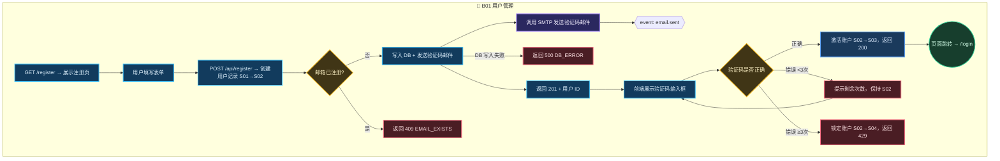
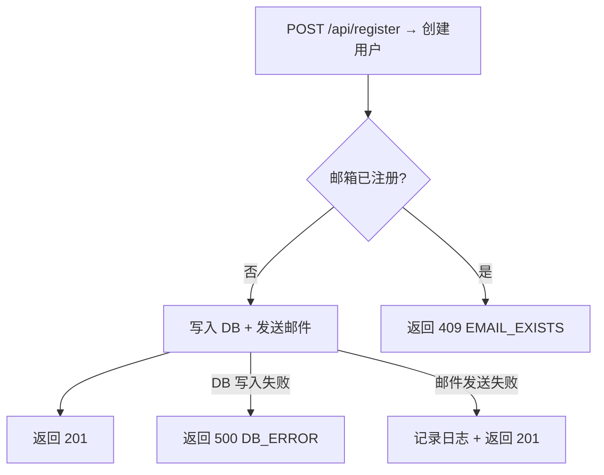
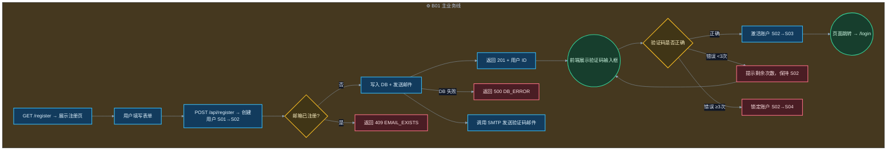
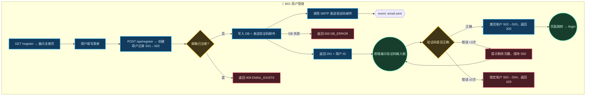

# R Flow Rebuilder — 完整流程图反推规则

## 核心原则

反推生成的 project.flow.mermaid 必须达到正向 L1 设计的质量标准：
- **BXX-NYY 编号体系**：每个节点都有坐标编号，可追溯
- **6 类节点齐全**：阶段节点、分支节点、异常节点、状态机节点、后台执行行为、前端观察
- **异常分支完整**：每个关键节点都有异常/错误处理分支，禁止只有 happy path
- **状态转换标注**：识别状态机，标注 S→S 转换
- **多业务线 subgraph**：按模块边界拆分业务线，跨线经过接口节点
- **L1 配色规范**：使用 L1 模板定义的 classDef 配色

## 6 类节点体系

> **参考 L1 mermaid 模板**（`../../layers/l1/templates/mermaid.md`），所有配色必须与其一致。

| 节点类型 | 含义 | Mermaid 形状 | classDef | 配色 | 代码识别信号 |
|---------|------|-------------|---------|------|-------------|
| **阶段节点** | 流程中的主要处理步骤 | `[...]` | `phaseNode` | fill:#123B5D, stroke:#38BDF8, color:#E0F2FE | 函数调用链中的动作、API 调用、数据处理 |
| **分支节点** | 条件判断/路由选择 | `{...}` | `branchNode` | fill:#403516, stroke:#FBBF24, color:#FEF3C7 | if/else, switch/case, guard clause, 三元运算 |
| **异常节点** | 错误捕获/异常处理/失败返回 | `[...]` | `errorNode` | fill:#4A1D24, stroke:#FB7185, color:#FFE4E6 | try/catch, except, .catch(), throw, return 4xx/5xx |
| **状态机节点** | 状态转换/生命周期变化 | `[...]` | `stateNode` | fill:#1A3A5C, stroke:#60A5FA, color:#DBEAFE | status=, setState, enum 赋值, 状态守卫 |
| **后台执行行为** | 用户不可见的异步/后台操作 | `[...]` | `backendNode` | fill:#2A285F, stroke:#A78BFA, color:#F4F0FF | send_email, queue_job, cron, worker, async/await, 消息发布 |
| **前端观察** | 用户可见的 UI 反馈/页面跳转 | `((...))` | `frontendNode` | fill:#173E2D, stroke:#34D399, color:#D1FAE5 | render, redirect, toast, modal, loading, 页面跳转, 状态标签 |

### 节点形状约定

| 类型 | 形状 | 说明 |
|------|------|------|
| 阶段/异常/状态机/后台 | `[圆角矩形]` | 处理动作 |
| 分支 | `{菱形}` | 决策点 |
| 前端观察（交付物） | `((双层圆))` | 用户可感知的结果 |
| 事件发布 | `{{菱形}}` | 异步事件触发 |
| 跨线出口 | `((→ biz-xxx))` | 流向其他业务线 |

### 完整示例



## 反推流程

### Phase 1: 入口点发现

```
扫描项目根目录
  ├── Web 后端：识别 router/app 文件 → 提取路由定义（HTTP method + path）
  ├── Web 前端：识别 page/route 组件 → 提取页面路径
  ├── CLI 工具：识别 main 入口 → 提取子命令
  ├── Skill/Plugin：识别 SKILL.md 或 index 导出 → 提取触发条件和工具定义
  └── SDK/Library：识别 public API 导出 → 提取函数签名
```

**产出**：入口点清单 `{文件, 触发方式(HTTP/CLI/事件), method/path/name}`

### Phase 2: 调用链逆向追踪

```
对每个入口点：
  1. 解析入口函数体
  2. 追踪所有 function call / method invocation
  3. 在每个分支点（if/else/switch/try-catch/guard）创建决策节点
  4. 在每个副作用点（DB写入/外部调用/IO/状态变更）创建动作节点
  5. 在每个终止点（return/throw/render/response）创建终端节点
  6. 递归追踪到叶子节点（≤3层深度，超出标记为子流程引用）
```

**代码模式 → 节点映射表**：

| 代码模式 | 节点类型 | Mermaid 形状 | classDef | 示例 |
|---------|---------|-------------|---------|------|
| 路由处理 `@app.post("/x")` | 阶段节点 | `[...]` | phaseNode | `N03[POST /api/register → 创建用户]` |
| 函数调用 `createUser()` | 阶段节点 | `[...]` | phaseNode | `N03[调用 createUser → 构建用户对象]` |
| 条件判断 `if/switch/guard` | 分支节点 | `{...}` | branchNode | `N04{邮箱已注册?}` |
| 异常捕获 `try/catch/except` | 异常节点 | `[...]` | errorNode | `N08[捕获: DB连接失败 → 返回 500]` |
| 返回错误 `return 4xx/5xx` | 异常节点 | `[...]` | errorNode | `N06[返回 409 EMAIL_EXISTS]` |
| 数据库操作 `save/query/update` | 阶段节点 | `[...]` | phaseNode | `N05[写入 DB: INSERT users]` |
| 状态赋值 `status = PENDING` | 状态机节点 | `[...]` | stateNode | `N08[状态 S02→S03 已激活]` |
| 邮件/通知 `send_email()` | 后台执行 | `[...]` | backendNode | `N09[调用 SMTP 发送验证码邮件]` |
| 异步事件 `emit/publish/queue` | 后台执行 | `{{...}}` | backendNode | `N10{{event: user.created}}` |
| 页面跳转 `redirect('/login')` | 前端观察 | `((...))` | frontendNode | `N16((页面跳转 → /login))` |
| UI 渲染 `render/modal/toast` | 前端观察 | `((...))` | frontendNode | `N11((展示验证码输入框))` |
| 返回成功 `return 200/201` | 前端观察 | `((...))` | frontendNode | `N07((返回 201 + 用户 ID))` |

### Phase 3: 异常分支发现

**必须为每个关键节点查找异常路径**：

```
对每个动作节点 N：
  ├── 查找 try-catch 块 → 每个 catch 分支创建异常节点
  ├── 查找 if-else 块 → else 分支创建失败/拒绝节点
  ├── 查找 early return / throw → 创建错误返回节点
  ├── 查找 .catch() / .on('error') → 创建异步错误节点
  ├── 查找 guard clause / precondition → 创建前置校验失败节点
  └── 查找 timeout / retry 逻辑 → 创建超时/重试节点

规则：
  - 有 try-catch → 至少 2 条分支（正常 + 异常）
  - 有 if-else → 2 条分支
  - 有数据库操作 → 必须有失败处理分支
  - 有外部调用 → 必须有超时/失败处理分支
  - 禁止只画 happy path
```

**示例**：



### Phase 4: 状态机还原

```
识别状态模式：
  ├── 枚举/常量定义：enum Status { ACTIVE, PENDING, LOCKED }
  ├── 状态字段：status/state/phase 字段赋值
  ├── 状态转换函数：activate/lock/verify/deactivate
  └── 状态守卫：if (user.status !== 'PENDING') throw ...

产出状态表：
  | 状态 ID | 状态名称 | 进入节点 | 退出节点 | 非法转换处理 |
  |---------|---------|---------|---------|-------------|
  | S01 | 未注册 | N01 | N03 | — |
  | S02 | 待验证 | N03 | N05 | 重复注册 → 409 |
  | S03 | 已激活 | N05 | — | — |
  | S04 | 已锁定 | N08 | N09(超时解锁) | 锁定中提交 → 429 |
```

在 project.flow.mermaid 中，状态转换标注在节点描述中：
```
N03[POST /api/register → 创建用户 S01→S02]
```

### Phase 5: 业务线拆分与 subgraph 生成

```
Phase 2 产出的所有节点 → 按模块/目录归类：
  ├── 同一目录/模块下的节点 → 归入同一业务线 subgraph
  ├── 跨模块调用 → 标记为跨线连接
  └── 共享工具函数 → 归入 Shared Service

业务线编号（BXX）分配规则：
  ├── B01: 主业务线（入口点最多的模块）
  ├── B02-B09: 次要业务线（按节点数降序排列）
  └── B99: 共享基础设施

subgraph 内节点编号（NYY）：
  ├── 每条业务线从 N01 开始递增
  ├── N01: 该业务线的入口/触发节点
  └── N99: 该业务线的交付物/终端节点
```

### Phase 6: Mermaid 生成

#### 6.1 主流程图 (`project.flow.mermaid`)



#### 6.2 项目级流程总图 (`.shadow/L1-business/project.flow.mermaid`)

逆向重建时只生成一张项目级流程总图。业务线/模块以 subgraph 泳道呈现，不拆 `biz-{name}.project.flow.mermaid`：



### Phase 7: 置信度标注

每个节点和边标注置信度：

```mermaid
  N03[POST /api/register → 创建用户 S01→S02] %% [CONF: HIGH]
  N05[写入 DB + 发送验证码邮件] %% [CONF: HIGH]
  N09[记录日志，返回 201] %% [CONF: MEDIUM] ← 邮件失败处理推断
```

| 置信度 | 判定依据 |
|--------|---------|
| HIGH | 代码中有明确的实现（函数体/路由处理器） |
| MEDIUM | 从代码结构推断（错误处理模式、条件分支） |
| LOW | 按行业惯例推测（无直接代码证据） |

## 跨线连接识别

```
IF 模块 A 调用/依赖 模块 B
  AND 模块 A ≠ 模块 B（不同目录/不同业务线）
THEN:
  ├── HTTP 直接调用 → API Gateway 中转
  │   标注: GATEWAY[["HTTP /method/path"]]
  ├── 消息队列/事件发布 → Event Bus 中转
  │   标注: EVT{{"event: domain.action"}}
  ├── 数据库共享读写 → Shared Service 中转
  │   标注: SHARED[("key: description")]
  └── import/require 直接依赖 → 内部模块引用
      标注: 直接边 + 标签 "import: module"

跨线连接铁律：
  - 禁止两个业务线 subgraph 内部节点直接连接
  - 所有跨线通信必须经过接口节点
  - 连接边必须有标签
```

## 特殊项目类型适配

### Skill/Plugin 仓库

```
入口点 = SKILL.md description 中的触发条件
动作节点 = 工具定义（tool() / command()）
决策节点 = 条件路由（if/switch on user intent）
交付物 = 工具返回值 / 文件产出

示例：
  N01[触发: "create skill"] --> N02[读取 SKILL.md]
  N02 --> N03{SKILL.md 是否存在?}
  N03 -->|否| N04[创建 SKILL.md 模板]
  N03 -->|是| N05[解析现有 SKILL.md]
  N04 --> N06[生成目录结构]
  N05 --> N07[编辑指定 section]
```

### CLI 工具

```
入口点 = 子命令定义（argparse / commander / yargs）
动作节点 = 命令处理函数
决策节点 = 参数校验 / 条件分支
交付物 = 命令输出 / 文件变更
```

### 数据管道

```
入口点 = 数据源（API/文件/消息队列）
动作节点 = 数据处理步骤（transform/filter/aggregate）
决策节点 = 数据质量检查 / 路由规则
交付物 = 数据输出（写入目标/发布事件）
状态 = 数据处理阶段（ingesting/processing/completed/failed）
```

## 质量检查清单

反推生成的 project.flow.mermaid 必须通过以下检查：

| # | 检查项 | 通过标准 | 审计结论 |
|---|--------|---------|---------|
| F1 | BXX-NYY 编号 | 每个节点都有唯一编号，业务线内从 N01 递增 | PASS/WARN(编号不连续) |
| F2 | 触发节点 | 每条业务线/子流程的 N01 标注了触发来源 | PASS/WARN(未标注) |
| F3 | 交付物节点 | 最后一个节点用 `((...))` 形状 + frontendNode class | PASS/BLOCK(缺失) |
| F4 | 6类节点齐全 | 阶段/分支/异常/状态机/后台/前端 都有对应节点 | PASS/WARN(某类缺失) |
| F5 | 异常分支 | 每个关键动作节点（DB/IO/外部调用）有异常处理分支 | PASS/WARN(部分缺)/BLOCK(全部缺) |
| F6 | 状态标注 | 有状态转换的节点标注了 `SXX→SYY` | PASS/WARN(部分未标) |
| F7 | subgraph 拆分 | 多模块项目按业务线拆分为独立 subgraph | PASS/WARN(未拆分) |
| F8 | 跨线连接 | 跨模块调用经过接口节点中转 | PASS/WARN(标签缺失) |
| F9 | 配色 | 使用 6 类 classDef 配色方案，非默认颜色 | PASS/BLOCK(未使用) |
| F10 | 置信度 | 每个节点/路径标注了 `[CONF: ...]` | PASS/WARN(部分未标) |
| F11 | 节点描述 | 使用具体动作描述，禁止 `处理`、`判断` 等模糊命名 | PASS/BLOCK(模糊命名) |
| F12 | 节点数控制 | 单个流程 ≤15 节点，超出拆子流程引用 | PASS/WARN(节点过多) |
