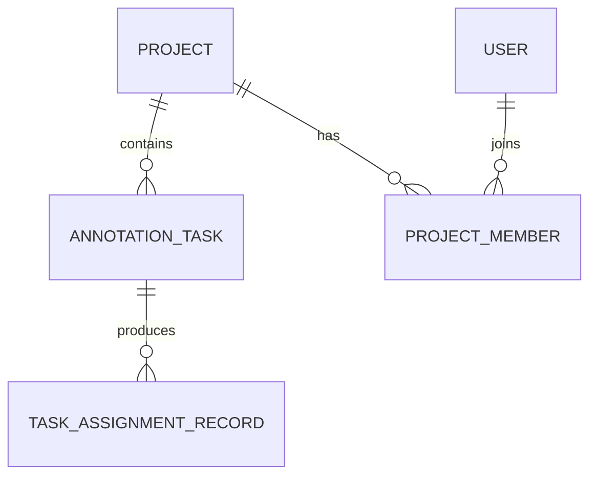

# xdd-architecture — 结构锚

## 我锚定什么 / 上游 / 下游

**我锚定的是「系统怎么实现」** —— 把 spec 的业务规则映射到层/模块/API/事件/数据。API 端点清单是前后端契约，事件契约是服务间契约。这些是 plan 写 task、code 写实现的直接依据。

| | |
|---|---|
| **上游** | `xdd-brainstorm`(design.md) + `xdd-spec`(RXX 规则) |
| **我产出** | `{bxx-slug}/architecture.md` + `flow.mermaid` + `docker-compose*.yml`；全局 `aggregate-landscape.md` + `event-contract.md` |
| **下游消费者** | `xdd-plan`（端点/聚合/事件 → task）、`xdd-resilience`（ODD 失败模型是韧性种子）、`xdd-verify`（端点清单做 architecture↔code 审计） |
| **回溯锚** | 每个端点标 `@flow BXX-NYY` + `@rules RXX`，每个技术选型标 `@intent` |

### 上游锚冲突：提出变更，不直接改写

`intent.md` 和 `design.md` 属于 understand 阶段的项目级锚；architecture 阶段只能读取，**不得直接修改**。当架构分析发现上游锚与已知系统约束、规则或可验证性交叉冲突时：

1. 写入 `.xdd/design/architecture/upstream-change-requests.md`，逐项记录：受影响的上游段落、可复现证据、影响的 RXX/架构决策、至少一个备选方案、推荐方案，以及是否需要用户确认。
2. 仅规则、验收场景或业务语义不完整：调用 `xdd_rollback(targetStage="spec", reason=...)`。
3. 项目意图、成功标准、非目标、范围或项目级技术约束不成立：调用 `xdd_rollback(targetStage="understand", reason=...)`；由 understand 阶段修改 `intent.md`/`design.md` 并重新通过后续阶段。

不要为了让架构方案成立而静默缩小目标、删除成功标准或把“待确认”伪装成确定决策。

## ADD 思维链

```
功能需求(RXX) → 质量属性场景 → 选架构模式 → 战术 → 架构草图
                     ↑              ↑
              约束 + 技术栈    references/architecture-patterns.md
```

**「选架构模式」这一步不是走形式** —— 查 `references/architecture-patterns.md` 的决策矩阵,按质量属性场景选模式,把选择写进技术栈决策并标 `@intent`。**禁止默认套 4 层分层**:4 层分层只是模式之一,不是默认答案。多模式组合是常态(如「分层单体 + 事件总线做异步」)。

## 三面手

| 面 | 任务 | 产出 |
|---|------|------|
| 设计 | 质量属性/安全/性能/限界上下文/技术栈/分层/规则传导/API/事件/文件清单/Docker | architecture.md + aggregate-landscape.md + event-contract.md + flow.mermaid |
| 实现 | **Tech PoC**：高风险组件写最小可运行代码验证能跑 | `poc/{component}.md` |
| 跟踪 | **架构审计**：execute 完成后反向验证代码符合设计 | `arch-audit-report.md` |

## 怎么做

### 0. Feature → 架构映射链（先理解再动手）

**架构文档不是 Feature 的复述，是回答：谁来负责、怎么实现、怎么保持正确、异常怎么收敛。**

Feature 回答：什么条件下，发生什么行为，产生什么业务结果。
架构回答：哪些模块协作，怎么保存状态，怎么保证权限/一致性/并发/失败恢复，从而实现这些业务结果。

映射链（Gherkin 是最后一步的反面 -- 架构是从 Feature 反推的第一步）：

```
Feature/Rule/Scenario
  ↓ 提取业务能力与约束
业务规则 (BR-XX)
  ↓ 推导
领域模型与状态机
  ↓ 落地
应用服务与模块职责
  ↓ 定义
接口、数据、事件和事务
  ↓ 保障
并发、安全、失败恢复、可观测性
  ↓ 追踪
Feature-架构-测试追踪矩阵 → 开发任务
```

**不要直接从 Scenario 生成代码结构**（TaskController/TaskService/TaskRepository 只是技术分层，不是架构设计）。先提取 Feature 的架构含义：

| Feature 信息 | 架构含义 |
|-------------|---------|
| "项目管理员"操作 | 需要角色 + 项目范围权限校验 |
| "待分配"状态 | 任务存在状态机，操作只允许特定状态 |
| "当前项目成员" | 需要项目成员关系模型 |
| "7个进行中任务" | 需要查询当前工作负载 |
| "最多10个" | 存在项目级分配策略 |
| "状态变为进行中" | 需要事务内完成状态转换 |
| "负责人变为小王" | 任务需要负责人字段 |
| "记录分配人和时间" | 需要审计记录 |
| "发送通知" | 需要领域事件或异步消息 |
| "同时分配只能成功一次" | 需要并发控制 |
| "通知失败不影响主业务" | 需要事务与异步副作用解耦 |

#### 0a. 输入检查（写架构前必须具备）

仅有 Feature 文件通常不够。至少需要以下输入，缺的标"待确认"：

| 输入 | 来源 | 缺了会怎样 |
|------|------|-----------|
| Feature 文件 | spec 阶段 RXX | 架构无业务依据 |
| 领域词汇表 | understand 阶段 glossary.md | 术语在产品/开发/测试间含义不一致 |
| **当前系统约束** | design.md 或手动补充 | AI 生成与实际系统不相容的设计 |
| 非功能要求 | design.md 或手动补充 | 写出"高性能高可用"等无法验证的目标 |

**当前系统约束**必须明确（不能假设）：
- 单体还是微服务？任务和成员是否同一数据库？
- 是否已有消息队列？是否已有统一权限服务？
- 是否允许增加数据库表？是否需要兼容旧客户端？
- 当前数据量和访问量是多少？

**没有这些信息，AI 很容易生成与实际系统不相容的设计。**

#### 0b. 三类信息必须分开（不许混在一起）

架构文档中所有信息必须明确标注属于哪一类：

```markdown
## 已知事实（来自 Feature/PRD/现有代码/正式业务规则）
- 只有项目管理员可以手动分配任务
- 任务只能从待分配状态进入进行中状态

## 架构决策（技术团队根据约束作出的设计选择）
- 任务并发分配使用数据库条件更新和 version 字段控制
- 通知通过 Outbox 事件异步发送

## 待确认问题（需求没答案但会影响实现）
- 标注员达上限后，管理员是否允许强制分配？
- 通知连续失败后是否需要在管理端展示告警？
```

**不得把待确认问题直接写成确定规则。** 不得把架构决策伪装成已知事实。不得把假设伪装成业务规则。

#### 0c. 背景与非目标

**背景只说明当前存在的真实问题**，不写"随着业务不断发展"：

```
✅ 当前任务主要由调度系统自动分配。项目出现紧急任务或人员调整时，
   项目管理员无法直接指定负责人，只能修改成员状态或等待调度周期。
   这导致任务重新分配过程不可控，也无法追踪是谁进行了调整。

❌ 随着业务不断发展，系统对任务管理能力提出了更高要求。
```

**非目标（明确不做什么，控制范围，不是可有可无）**：
- 本次不支持批量分配
- 本次不支持修改已完成任务的负责人
- 本次不修改自动调度算法
- 本次不实现跨项目任务转移

### 1. 质量属性场景（ADD）

3-5 个关键场景，每个写：刺激源 → 刺激 → 环境 → 响应 → 响应度量。

| 属性 | 典型问题 |
|------|---------|
| 性能 | 95% 请求在多少 ms 内？ |
| 可用性 | 能否接受宕机？SLA？ |
| 安全性 | 谁可访问？防什么攻击？ |
| 可修改性 | 规则变更要改多少代码？ |

### 2. 安全设计（SDD）

1. **威胁建模**：STRIDE（Spoofing/Tampering/Repudiation/Info Disclosure/DoS/EoP）
2. **认证授权**：JWT/Session/OAuth2 + RBAC/ABAC + 数据隔离
   - **操作者身份必须来自认证上下文（authentication.getName()），不能信客户端传入的 operatorId**
   - 有全局菜单权限不等于能操作所有项目的数据 -- 必须结合 projectId 做项目级校验
3. **数据保护**：TLS 1.2+ 传输加密、存储加密、密钥管理、日志脱敏
4. **安全基线**：API 认证、输入校验、输出编码、限流、CORS、依赖扫描

### 3. 性能设计（PDD）

1. **性能基准**：P50/P99 响应、首屏、并发数、DB 查询时间
2. **瓶颈分析**：批量操作、大文件、并发写入
3. **缓存策略**：浏览器/CDN/应用/DB 四层 + 失效策略
4. **并发模型**：异步 + 连接池 + 事件总线 + 任务队列

### 4. 限界上下文

从 design.md 传导：每个上下文的职责 + 上下文关系（上下游 / 防腐层 / 共享内核）。

### 5. 技术栈 + 分层

每安排一个选型记原因(背景→选项→选了→为什么),标 `@intent`。

**结构由所选架构模式决定**,不是固定 4 层。先查 `references/architecture-patterns.md` 的决策矩阵按质量属性场景选模式,再定结构:
- 选了**分层模式** → `Presentation(UI+API) → Application → Domain → Infrastructure`(这是分层模式的标准结构,不是所有项目的默认)
- 选了**管道-过滤器** → Filter 链 + Pipe 数据契约
- 选了**事件总线/CQRS/事件溯源** → 读/写模型分离 + 事件存储 + 投影
- 选了**六边形** → 领域核心 + 端口(接口)+ 适配器(技术实现)
- 多模式组合常见,如实写出各模式的边界

### 6. 业务规则 (BR-XX) + 规则传导矩阵

#### 6a. 提取业务规则（BR-XX）

从 spec 的 RXX 和 Scenario 提炼业务不变量，写成 BR-XX。**BR 是架构设计的输入，不应只存在于代码实现中。**

```markdown
## 业务规则
BR-01：只有当前项目的项目管理员可以手动分配任务。
BR-02：只有处于 UNASSIGNED 状态的任务可以被分配。
BR-03：目标用户必须是任务所属项目中已启用的标注员。
BR-04：目标标注员进行中的任务数必须小于项目任务上限。
BR-05：分配成功后，任务负责人和任务状态必须原子更新。
BR-06：同一个任务的并发分配最多允许一个请求成功。
BR-07：通知发送失败不回滚任务分配结果。
BR-08：每次成功分配都必须生成不可修改的审计记录。
```

每条 BR 必须能追溯到 RXX 规则和 Scenario（AC-XX）。

#### 6b. 规则传导矩阵

一条条过 spec 的 RXX 规则，确定每条在哪个层/模块实现 + 对应文件类型。用户交互类规则必须同时映射到前端组件。

```markdown
| RXX | BR | 后端层 | 文件 | 前端组件 | 实现 |
|-----|-----|--------|------|---------|------|
| R01 登录返回 JWT | BR-01 | Application | app/services/auth.py | pages/login.vue | - [ ] |
```

### 7. API 端点清单（前后端契约）—— 100% 完整

**不得省略端点**。这是前后端契约 + execute 覆盖率比照基准。每个端点定义：触发的流程节点（BXX-NYY）、覆盖规则（RXX）、请求结构、响应结构、错误码、权限。

汇总表（一行一个端点）：

```markdown
## API 端点清单
| 端点 | 方法 | BXX | RXX | 认证 | 限流 | 实现 |
|------|------|-----|-----|------|------|------|
| `/api/v1/auth/login` | POST | B01 | R01 | - | 100/min | - [ ] |
| `/api/v1/urls` | POST | B02 | R05 | JWT | 200/min | - [ ] |
```

**「实现」列语义**（§6 规则传导矩阵 / §7 端点清单通用）：
- `- [x]` = 后端文件有 `@implements RXX`（端点清单另需路由真注册）；`- [ ]` = 未实现
- 运行时状态，不参与设计内容评审冻结；可由 `xdd-verify/scripts/sync-contract-checkboxes` 半自动翻转

加端点详细契约（每个含 `@flow` / `@rules` / `@auth` / `@request` / `@response` / `@errors`）。

**错误码必须稳定**，不能让客户端依赖自然语言错误信息判断业务结果。错误码来自业务规则（BR-XX），不是随意为每个 Scenario 发明一套。错误码一旦发布不可变更语义（只能废弃+新建）。

### 8. 事件契约（EDD，全局独立产出）

`.xdd/design/architecture/event-contract.md`：
- 事件清单汇总表（事件 ID、名、来源聚合、传递方式、订阅方、流程节点）
- 每个事件详细契约（载荷 + 约束 + 重试策略 + 传递方式）

### 9. 领域模型 + 聚合全景（全局独立产出）

**聚合设计是 DDD 战术核心**。划分前必读 `references/ddd.md § 聚合划分决策法`（4 步法 + 「聚合尽量小」+ 跨聚合只引 ID）。核心原则:聚合根保护业务不变量;聚合尽量小;跨聚合只用 ID 引用 + 领域事件最终一致。

`.xdd/design/architecture/aggregate-landscape.md`：

**领域模型**（每聚合写出核心实体 + 字段 + 关系，不是贫血模型）：

```markdown
### 核心实体
AnnotationTask
- id, projectId, status, assigneeId, version, assignedAt, updatedAt

ProjectMember
- projectId, userId, role, status

TaskAssignmentRecord（审计记录，不可修改）
- id, taskId, previousAssigneeId, newAssigneeId, operatorId, assignedAt, reason
```

**ER 关系**（Mermaid erDiagram）：


**聚合边界**（明确什么在事务内、什么不在）：
- Task 是分配操作的聚合根，状态转换 + 负责人更新 + 审计记录在同一事务
- TaskAssignmentRecord 不能绕过 UseCase 单独创建
- ProjectMember 不属于 Task 聚合，分配时通过只读查询

还需含：
- 聚合清单（按业务线）：聚合根、实体/值对象、一致性边界、发布事件、**子域类型**、**不变量**
- 聚合间关系（ID 引用 + 事件驱动，不持有对象引用）
- 一致性边界：强一致（单聚合事务）vs 最终一致（跨聚合事件）
- 跨上下文映射（context-map）：ACL/OHS/遵奉者等关系，详见 `references/ddd.md § 上下文映射`

### 10. 运维视图（ODD）

回答 5 问：系统怎么启动/关闭/恢复？状态怎么流转？异常怎么自愈？并发/资源/幂等/一致性怎么保证？运维怎么排障？

必含 6 块（并入 architecture.md）：
1. **启动序列**（初始化顺序、后台循环、readiness 何时开放）
2. **关闭序列**（SIGTERM→503→摘流→完成 in-flight→flush→exit）
3. **状态机**（Mermaid `stateDiagram-v2` + 状态含义 + 推进方 + 推进条件 + 终态 + 非法防御）
4. **核心时序图**（Mermaid `sequenceDiagram` 覆盖主链路）
5. **失败模型与恢复**（外部依赖挂/进程重启/重复回调/任务丢失/资源泄漏）
6. **排障锚点**（状态字段/runtime_ref/trace_id/日志位置/自动 vs 人工恢复）

**禁止抽象空话**："高性能高可用" ❌ → "P95 ≤ 500ms，SIGTERM 后 readiness 返回 503" ✅。

**本节 5 问是写"具体怎么做"。动手之前先过一遍 §21 reconcile 审查（slide 三问）——期望状态显式吗、谁检测偏差、失败怎么收敛。**

### 11. 流程图（flow，吸收自 xdd-flow）

`.xdd/design/architecture/{bxx-slug}/flow.mermaid` —— 通过组件分解体现非功能性设计：

1. **体现组件职责与边界**：前端/网关/服务/MQ/存储/AI 引擎分层
2. **暴露核心数据流向**：箭头标协议（HTTP/gRPC）或核心 Payload
3. **凸显非功能战术**：高并发（限流）、异步（转码/AI）、高可用（缓存/副本）用专门节点体现
4. **与 spec 字段对齐**：路由分支/数据状态与 `rules.md` 名词一致

**节点编号 NYY（流程节点序号）**：flow.mermaid 的节点用人读组件名（`Client`/`Handler`，可读优先）。**NYY 编号**（`B01-N01`）用于端点契约的 `@flow BXX-NYY` 追溯标注——给端点触发的流程步骤编序，序号在该业务线内全局唯一、递增。NYY 只活在端点 `@flow` 标注里（机器追溯），不强制写进 flow.mermaid 节点显示名。

**分两层画（多业务线时）**：flow.mermaid 明确分 **base 层**（通用/支撑上下文下沉的基础建设，foundation）+ **业务层**（核心子域），依赖箭头只从业务指向基础（单向，见 §13）。让"哪些是基础建设、依赖方向"可视化。

### 12. Docker Compose 部署

生产 + 测试环境都 Docker Compose 封装：
- `docker-compose.yml`（healthcheck、持久卷、restart、独立 network）
- `docker-compose.test.yml`（test profile、独立 DB、无持久卷）
- 每服务必有 healthcheck，`depends_on` 用 `condition: service_healthy`
- 敏感信息走 `.env`

### 13. 模块化设计（通用能力下沉为基础建设）

架构不只是"按业务线切上下文"，还要**把通用能力抽成基础模块（base/foundation），业务模块复用它**，别让每条业务线各造一遍认证/存储/通知/审计。模块粒度 = **DDD 限界上下文级**。

**怎么划分 + 怎么复用 → 查 `references/modular-design.md`（实操手册）**，这里给入口：

**划分 5 步**（每能力过一遍）：
1. 列能力候选（从 design.md + RXX）
2. 问 3 判定：是项目差异化竞争力？→ 业务模块；行业有现成方案？→ 基础模块(用现成)；多业务线都要？→ 基础模块(下沉)
3. 定边界：一模块一类能力，高内聚（改内部不牵动别人）
4. 定接口契约：基础只暴露接口(端口)，业务依赖接口不依赖实现
5. 落 module-landscape.md

**复用 3 机制**（按场景选）：
- 业务"用"基础能力（拿用户/存文件）→ **直接调用**接口
- 解耦基础实现（测试/换方案）→ **依赖注入**接口
- 基础要"感知"业务事件（审计/通知触发）→ **事件订阅**（业务发事件，基础订阅，基础不 import 业务）

**铁律**：业务→基础**单向**。基础 import 业务 = 反向依赖 = 架构腐烂起点。基础要感知业务只能走事件订阅。

**产出**：`.xdd/design/architecture/module-landscape.md`（全局，与 `aggregate-landscape.md` / `event-contract.md` 并列）——
- 基础上下文清单（base/foundation：职责 + 对外接口/端口 + 实现方案 + 子域类型）
- 业务上下文清单（core：核心子域 + 依赖哪些基础模块）
- 依赖矩阵（业务上下文 × 基础上下文，✓=依赖；**反向依赖必须为空**）

### 14. 模块职责表

**不要只列类名清单**（TaskController/TaskService/TaskManager/TaskUtils/TaskDAO 没有职责边界不算架构）。每个模块写清负责什么 + 不负责什么：

```markdown
| 模块 | 职责 | 不负责 |
|------|------|--------|
| TaskAssignmentController | 接收请求、解析身份、返回结果 | 不含业务规则 |
| AssignTaskUseCase | 编排分配流程和事务 | 不直接发通知 |
| TaskAssignmentPolicy | 判断任务是否允许分配 | 不访问 UI |
| AssigneeEligibilityService | 校验成员、状态和工作负载 | 不修改任务 |
| TaskRepository | 加载和保存任务聚合 | 不决定业务规则 |
| AssignmentRecordRepository | 保存审计记录 | 不发送消息 |
| OutboxRepository | 保存领域事件 | 不执行通知 |
| NotificationConsumer | 消费事件并发送通知 | 不回滚任务分配 |
```

### 15. 事务边界

**明确什么在事务内、什么在事务外**（不能出现"负责人已更新但状态仍是待分配"的中间结果）：

```markdown
同一本地事务内：
1. 条件更新任务负责人和状态
2. 创建任务分配审计记录
3. 创建 TaskAssigned Outbox 事件

事务外（最终一致）：
1. 发送站内通知
2. 发送邮件/短信
3. 刷新工作负载统计缓存

通知失败策略：任务分配不回滚；消息进入重试队列；达最大重试进死信队列；产生告警；管理员可人工重放。
```

### 16. 数据设计

**明确表/字段/索引/约束/生命周期**（不是只画 ER 图）：

```sql
-- 支持负责人查询、状态查询、并发版本控制、项目范围查询
CREATE INDEX idx_task_project_status ON annotation_task(project_id, status);
CREATE INDEX idx_task_assignee_status ON annotation_task(assignee_id, status);
-- 第二个索引用于统计标注员当前进行中任务数
```

**数据生命周期**：
- 审计记录（TaskAssignmentRecord）：**创建后不可更新，只允许追加**。发现记录错误时创建新的纠正记录，不覆盖旧记录
- Outbox 事件：发布成功后标记 published，保留 N 天后归档
- 任务数据：根据业务保留策略，不随意物理删除

**唯一约束**（如果有）：
- 同一任务同一时间只能有一个进行中分配 -> 通过状态条件更新保证（不是唯一索引）

### 17. 可观测性

**Feature 中的"系统应记录"不能只理解为数据库审计。** 至少定义：

```markdown
日志：taskId, projectId, operatorId, assigneeId, oldStatus, newStatus, requestId, traceId, result, errorCode, duration
指标：task_assignment_requests_total, task_assignment_success_total, task_assignment_failure_total{reason}, task_assignment_conflict_total, task_assignment_duration_seconds
告警：分配失败率异常升高、并发冲突率升高、Outbox 积压超阈值、通知死信超阈值

**告警阈值必须结合生产数据调整，不能由 AI 随意确定后直接作为最终标准。** 未有生产数据时标"待确认"，先设保守值，上线后根据实际调整。
```

### 18. 架构决策记录（ADR）

对存在明显选项的关键决策写 ADR（不是所有决策都要写，只写有取舍的）：

```markdown
### ADR-001：使用乐观锁处理任务并发分配
背景：同一任务可能被多个管理员同时分配。
选择：通过 version 字段 + 状态条件更新实现乐观并发控制。
原因：并发冲突概率低；不需要长事务锁；实现简单。
放弃方案：分布式锁（额外依赖）、悲观锁（高并发 DB 等待）、纯应用层检查（竞争窗口）。
后果：客户端冲突时需刷新任务状态后重新操作。
```

### 19. Feature 追踪矩阵

**最关键的最终产物之一** -- 映射 Scenario → 业务规则 → 用例 → 模块 → 数据变化 → 测试级别：

```markdown
| Feature 场景 | 业务规则 | 应用用例 | 核心模块 | 数据变化 | 测试级别 |
|-------------|---------|---------|---------|---------|---------|
| AC-01 正常分配 | BR-01~05 | AssignTaskUseCase | Task,Member,Outbox | Task,Record,Outbox | API+集成 |
| AC-02 普通用户分配 | BR-01 | AssignTaskUseCase | Authorization | 无 | API |
| AC-03 非项目成员 | BR-03 | AssignTaskUseCase | Eligibility | 无 | 集成 |
| AC-04 达到上限 | BR-04 | AssignTaskUseCase | CapacityPolicy | 无 | 领域+集成 |
| AC-05 非法状态 | BR-02 | Task.assignTo() | Task聚合 | 无 | 领域 |
| AC-06 并发分配 | BR-06 | AssignTaskUseCase | Repository | 仅一个请求更新 | 并发集成 |
```

**检查**：每个 Feature 场景有架构支持？每个架构模块有需求来源？每个 BR 有测试覆盖？有没有没有需求依据的过度设计？

### 20. 开发任务拆分 + 测试策略 + 推荐目录结构

#### 20a. 推荐目录结构（DDD 分层）

```
{module}/
├── api/              # 接口层：Controller、Request、ExceptionHandler
├── application/      # 应用层：Command、Result、UseCase（编排，不含业务规则）
├── domain/           # 领域层：实体、值对象、聚合根、领域事件、策略
├── port/             # 端口：Repository 接口（领域定义，基础设施实现）
└── infrastructure/   # 基础设施：持久化、Outbox、通知消费者
```

**领域规则住在 domain/，不住 Controller。** Controller 只做请求解析+身份传递+响应转换。

#### 20b. 开发任务拆分（从架构推导，不凭空拆）

```markdown
DEV-01：增加任务 version 和 assignedAt 字段
DEV-02：实现 Task.assignTo() 领域方法（状态转换 + 产生事件）
DEV-03：实现项目管理员权限校验（AssignmentPolicy.verifyOperator）
DEV-04：实现目标标注员资格校验（AssignmentPolicy.verifyAssignee）
DEV-05：实现当前进行中任务数量查询（TaskLoadRepository）
DEV-06：实现项目任务容量策略
DEV-07：实现条件更新和并发冲突识别（Repository）
DEV-08：实现任务分配审计记录（append-only）
DEV-09：实现 TaskAssigned Outbox 事件
DEV-10：实现通知消费者、重试和死信处理
DEV-11：实现分配接口和业务错误码
DEV-12：增加日志、指标和告警
DEV-13：实现 AC-01 至 AC-XX 自动化测试
```

每个开发任务必须能追溯到 Feature 或架构决策。

#### 20c. 四层测试架构

| 层级 | 验证什么 | 怎么测 | 对应 BR |
|------|---------|--------|---------|
| **领域测试** | 单条业务规则 | 直接调领域方法，不依赖 DB | BR-02(状态)、BR-03(资格)、BR-04(容量) |
| **应用服务测试** | 完整业务结果 | 调 UseCase，验证 Task+审计+Outbox 都写入 | BR-01~07(全链路) |
| **Repository 集成测试** | 数据库并发+事务 | 真实 DB，两人同时条件更新，验证只成功一次 | BR-06(并发)、BR-09(失败回滚) |
| **Feature 验收测试** | 完整业务链路 | **通过公开 API 调用系统**，不绕过应用层直接改 DB | 全部 AC-XX |

**Feature 测试通过公开 API 调用系统，而不是绕过应用层直接修改数据库。**

#### 20d. 推荐开发顺序（17 步）

```
1. 审查 Feature 是否包含真实业务规则
2. 为 Rule 和 Scenario 分配编号（AC-XX）
3. 提取业务规则(BR-XX)和状态转换
4. 建立 Feature-规则追踪表
5. 设计领域模型
6. 设计事务、并发和事件策略
7. 写领域测试（先写测试）
8. 实现领域代码
9. 写应用服务测试
10. 实现应用服务
11. 写 Repository 集成测试
12. 实现数据库条件更新
13. 实现审计和 Outbox
14. 实现 API
15. 实现 Feature 自动化测试
16. 建立日志、指标和告警
17. 更新 traceability-matrix.md（填入代码位置和测试列）
```

**先写测试再实现**（步骤 7 在 8 之前，9 在 10 之前，11 在 12 之前）。

## 21 · reconcile 审查（slide 三问）

任何架构方案写完后过一遍这三问——能直接挡掉一批"听起来合理但没有 reconcile 路径"的方案。来源：slide《学习架构思想：声明式 / 控制循环 / 稳定抽象 / 自愈 / 职责解耦》。

**注**：reconcile 是系统设计的通用范式（不限于任何特定实现），xdd reconcile 审查直接运用其精神——与任何具体编排平台无依赖关系。

### Q1 · desiredState 显式可见吗？

期望状态不能藏在模型脑子里，必须写到 architecture.md 里并可观测。

| 检查 | 落到哪一节 |
|---|---|
| 每个状态机/事件流/聚合不变量/失败模式都有"什么是达成"的语句 | §10 ODD、§8 EDD、§9 聚合、§11 flow |
| desiredState 表述风格统一（用一致术语，避免"差不多"） | 全文 |

### Q2 · 谁自动检测实际 vs 期望？

检测点不能依赖"人眼对比"。每个 desiredState 必须有可执行的 gate / observer / healthcheck。

| 检查 | 落到哪一节 |
|---|---|
| 每个 desiredState 至少配 1 个 gate / observer / healthcheck | §10 ODD、§11 flow、§12 docker-compose healthcheck |
| 检测点输入可获取、输出可比较（不是"差不多应该是这样"） | §10 ODD、§8 EDD |

### Q3 · 失败能不能重试并收敛？

失败路径不是"出错就挂"。必须区分瞬态与永久故障，分别有 retry 和 deadline。

| 检查 | 落到哪一节 |
|---|---|
| 瞬态故障：retry + 指数退避 + max retries | §10 ODD、§8 EDD |
| 永久失败：deadline / convergeTimeBudget（不是无限 retry 也不是立即终止） | §10 ODD |

## 业务线 colocation（v8.0.0 保留）

`architecture/{bxx-slug}/` 一站式放整个业务线的架构产物，不跨目录跳查：

```
.xdd/design/architecture/
├── aggregate-landscape.md       # 全局聚合全景
├── event-contract.md            # 全局事件契约
├── module-landscape.md          # 全局模块全景（base 基础建设 + 业务上下文 + 依赖矩阵，见 §13）
└── {bxx-slug}/
    ├── architecture.md          # 含 §运维视图
    ├── flow.mermaid             # 流程图
    ├── docker-compose.yml
    ├── docker-compose.test.yml
    └── resilience/              # xdd-resilience 产出（见该 skill）
```

## 产出（architecture.md 一份文档含）

Feature→架构映射链 + 质量属性场景 + 安全设计(SDD) + 性能设计(PDD) + 限界上下文 + 技术栈决策 + 分层架构 + **业务规则(BR-XX)** + 规则传导矩阵 + API 端点清单 + **模块职责表** + **事务边界** + 文件清单（后端+前端）+ 质量要点 + 运维视图(ODD含**失败模式表+并发控制+幂等**) + **可观测性** + **ADR** + **Feature追踪矩阵(traceability-matrix.md，活文档)** + **开发任务拆分+四层测试+17步流程+目录结构** + **数据设计** + Docker Compose 架构。

**全局独立产出**（非 colocation，跨业务线）：`aggregate-landscape.md`（聚合全景）+ `event-contract.md`（事件契约）+ `module-landscape.md`（模块全景：base 基础建设 + 业务上下文 + 依赖矩阵，见 §13）。

## 自检

```
□ 质量属性场景 3-5 个，每个有响应度量？
□ 架构模式选择有 @intent（背景→选项→选了→为什么），非默认套分层？（查 references/architecture-patterns.md 决策矩阵）
□ SDD 四步齐（威胁建模/认证授权/数据保护/基线）？
□ PDD 四步齐（基准/瓶颈/缓存/并发）？
□ 每条 RXX 规则在传导矩阵有映射？
□ 每条 RXX 至少一个 API 端点入口？
□ API 端点清单完整，每个标 @flow + @rules？
□ 事件契约独立产出，不隐式散射？
□ 聚合全景跟 spec _landscape.md 业务线清单一致？
□ 聚合划分遵循「聚合尽量小 + 跨聚合只引 ID」？（查 references/ddd.md § 聚合划分决策法）
□ 每个聚合根有明确的业务不变量？没有贫血模型（只有 getter/setter）？
□ context-map 画了跨上下文关系（ACL/OHS/遵奉者等）？
□ 运维视图 6 块齐，状态机/时序图能渲染？
□ docker-compose.yml + .test.yml 都有，每服务有 healthcheck？
□ flow.mermaid 能渲染（用 xdd-mermaid-check 验）？
□ 组件名/状态名跟 spec rules.md 一致，未知标"待确认"？
□ 识别了基础建设上下文（通用/支撑子域下沉为 base），业务上下文没各造一遍认证/存储/通知？
□ 依赖方向单向（业务→基础），无反向依赖？flow.mermaid 画了 base 层？module-landscape.md 依赖矩阵反向为空？
□ 复用机制选对（直接调用/依赖注入/事件订阅，按场景，查 references/modular-design.md 常见错误清单）？
□ §21 reconcile · Q1 desiredState 显式可见？
□ §21 reconcile · Q1 ·子项·每个状态机/事件流/聚合不变量/失败模式都有"什么是达成"语句？
□ §21 reconcile · Q1 ·子项·§3 §10 §13 的 desiredState 表述风格统一（用一致术语）？
□ §21 reconcile · Q2 谁自动检测实际 vs 期望？
□ §21 reconcile · Q2 ·子项·每个 desiredState 至少配 1 个 gate/observer/healthcheck？
□ §21 reconcile · Q2 ·子项·检测点输入可获取、输出可比较，不是"差不多"？
□ §21 reconcile · Q3 失败能重试并收敛？
□ §21 reconcile · Q3 ·子项·瞬态故障有 retry + backoff + max retries？
□ §21 reconcile · Q3 ·子项·永久失败有 deadline/convergeTimeBudget（不是无限 retry 也不是立即终止）？
□ Feature→架构映射链：从 Feature 提取了架构含义（不是直接生成 Controller/Service/Repository）？
□ 业务规则 BR-XX 提取了，每条能追溯到 RXX 和 AC-XX？
□ 领域模型写了核心实体+字段+关系（不是贫血模型只有 getter/setter）？
□ 状态机跟 spec 的 Scenario Outline 一致（哪些状态允许/禁止操作）？
□ 模块职责表写了"不负责"列（不是类名清单）？
□ 事务边界明确（什么在事务内、什么在事务外、通知失败不回滚主业务）？
□ 并发控制策略写了具体方案+SQL+理由（不是"系统需要防止并发问题"）？
□ 失败模式表结构化（失败点→主业务结果→系统处理，不是散文）？
□ 幂等策略写了（如果有重复请求风险）？
□ 可观测性定义了日志/指标/告警（不是只写"系统应记录"）？
□ ADR 写了关键决策的背景/选择/原因/放弃方案/后果？
□ Feature追踪矩阵完整（场景→BR→用例→模块→数据→测试级别，每个场景有架构支持，每个模块有需求来源）？
□ 开发任务从架构推导（不是凭空拆），测试策略按追踪矩阵的测试级别？
□ API 错误码来自业务规则（不是随意为每个 Scenario 发明一套）？
□ 权限写了数据范围（有全局菜单权限不等于能操作所有项目的数据）？
□ 性能写了具体取舍（"第一阶段用DB索引查询，P95超50ms再评估Redis"不是"高性能高扩展"）？
```

### 最终验收标准（14 条全过才可进入开发）

```
□ 1.  每个 Feature Scenario 都能映射到具体架构设计？
□ 2.  每条业务规则(BR-XX)都有明确责任模块？
□ 3.  每个状态变化都有合法来源和目标状态？
□ 4.  成功操作涉及的数据变化已经列明？
□ 5.  失败操作不能发生的数据变化已经列明？
□ 6.  事务边界已经明确（什么在事务内/外）？
□ 7.  并发冲突有数据库级处理方式（不是应用层先查后改）？
□ 8.  外部服务失败后的主业务结果已经明确？
□ 9.  关键架构选择(ADR)包含原因和被放弃方案？
□ 10. 所有未经确认的内容都被列为待确认项（不伪装成确定规则）？
□ 11. 开发人员可以据此拆分任务？
□ 12. 测试人员可以据此设计测试数据和断言？
□ 13. 运维人员可以据此配置日志、指标和告警？
□ 14. 文档中不存在无法验证的空泛质量描述？
□ design/ 产物不引用 iter-N（design 是持久锚，跨 iter 保留）？
```

**架构文档的价值不在于篇幅，而在于它是否消除了实现中的关键歧义。**
