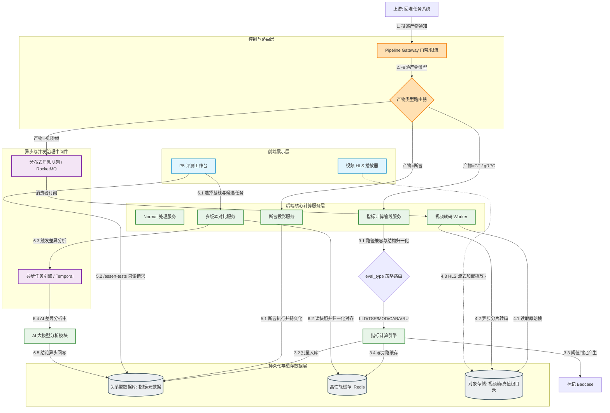

# xdd-flow
Depict the system architecture using a unified flow diagram that integrates architectural views, behavioral views, and business line exploration. Ensure the granularity is sufficiently detailed yet non-redundant, with fine-grained nodes. Regularly update the diagram to maintain consistency with the actual system architecture design. The diagram should be saved in `./.xdd/project.flow.mermaid`.

通过组件分解（Decomposition）来体现系统非功能性设计（高性能、高可用、可扩展性），拒绝纯业务画图

## 核心要求
1. **体现组件职责与边界**：必须清晰区分前端（Frontend）、网关（Gateway）、微服务（Services）、消息队列（MQ）、数据存储（DB/Cache/OSS）以及 AI/算法引擎。
2. **暴露核心数据流向**：箭头线上必须标注数据传输协议（HTTP/gRPC/RPC）或核心数据 Payload（如：JSON 报文、HLS 切片、指标快照）。
3. **凸显非功能性战术**：凡是涉及"高并发（并发治理/限流）"、"异步处理（转码/AI分析）"、"高可用（缓存/只读副本）"，必须在图中用专门的节点（如 Redis, Kafka, Celery Worker）体现。
4. **与 BDD 字段对齐**：图中的核心路由分支（如按 `eval_type` 路由）和数据状态，必须与 `.xdd/bdd` 中的名词完全一致。

## template

## 门禁
- check mermaid can render to svg
