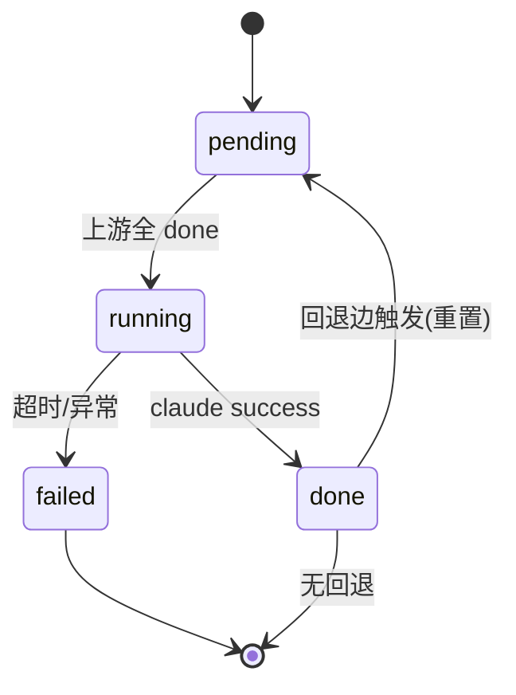
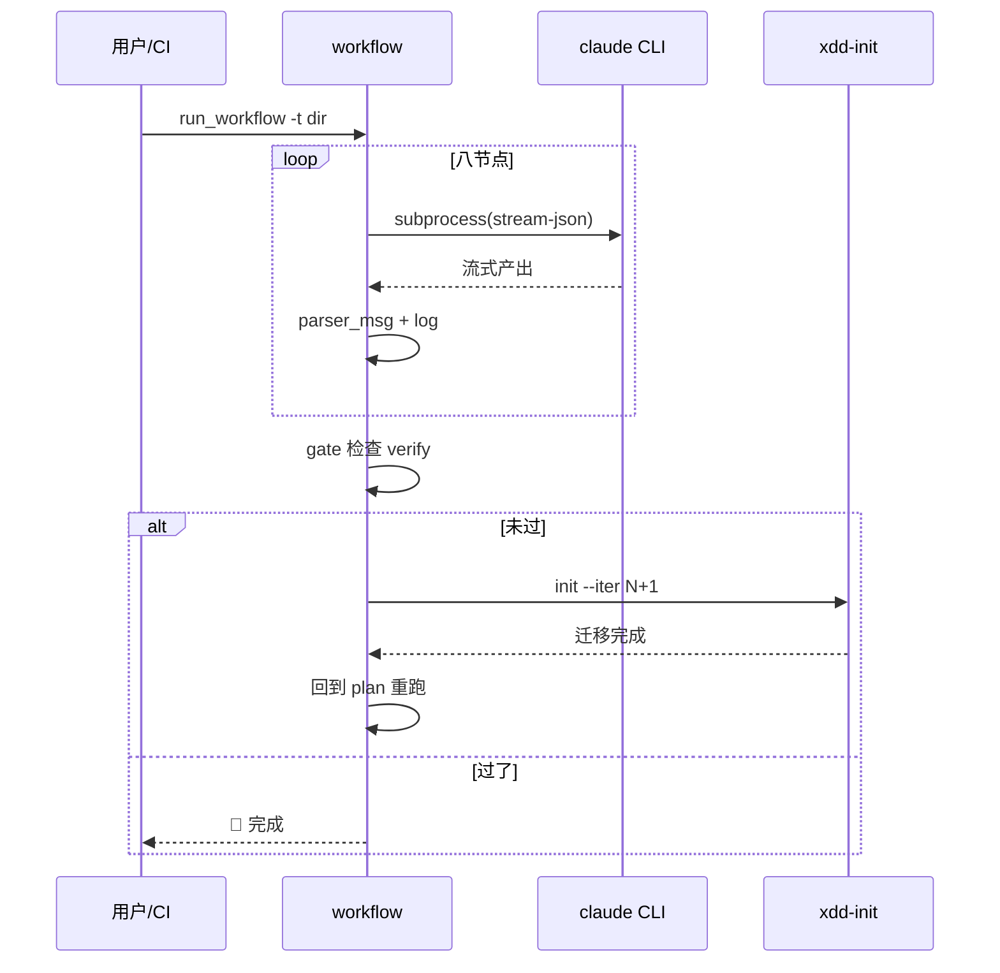

# B01-cli 架构 — 命令行调度器

> 适配说明:workflow 是纯 Python 包(CLI 工具),无 DB/无服务/无 docker。
> 架构文档按 skill 6 块写,但运维视图(ODD)适配为"进程/subprocess 模型",不产 docker-compose。

## 质量属性场景(ADD)

| 场景 | 质量属性 | 应对 |
|---|---|---|
| CI 无人值守跑八节点 | 可靠性 | claude 失败重试;验收未过 iter 迁移重跑 |
| 单节点跑数分钟 | 可用性 | subprocess + select 心跳(10s);3000s 超时 kill |
| 节点产出路径要准 | 正确性 | build_nodes 数据驱动对照 skill 真实产出 |
| 模型 key 轮换 | 可维护性 | models.yaml 外置,不入库 |

## 安全设计(SDD)

- `--permission-mode bypassPermissions`:自动跑不等人,确保**只在可信环境**跑(单机/CI 受控)。
- models.yaml 含 API key,**不入库**(.gitignore)。
- prompt 经临时文件传 stdin,不进命令行历史。
- 不接受远程输入(task_dir 是本地路径)。

## 性能设计(PDD)

- 节点串行执行(不并行):避免 claude CLI 并发争抢 + 产物依赖顺序。
- stream-json 逐行解析,buftype=1 行缓冲,日志实时刷。
- 单进程,无连接池/缓存需求(Python 包,非服务)。

## 限界上下文

B01-cli = 命令行调度上下文。与 B02-web 的边界:**共享基础模块(nodes/gate/claude_runner),不共享业务逻辑**(B01 的验收循环 ≠ B02 的图引擎)。

## 技术栈决策

| 决策 | 选定 | @intent |
|---|---|---|
| 语言 | Python 3 | 与 skill scripts 一致,subprocess 调 CLI 天然 |
| CLI 框架 | argparse(标准库) | 无外部依赖 |
| 配置 | YAML(pyyaml) | models.yaml 可读 |
| AI 调用 | subprocess + claude CLI | 不绑 SDK,平台中立 |
| 日志 | logging 标准库 | 文件 + stdout |

## 分层架构

```
┌─────────────────────────────────────┐
│  run_workflow.py(CLI 入口,argparse)│  ← B01 业务层
├─────────────────────────────────────┤
│  验收循环(workflow 函数)            │  ← B01 业务:iter 迁移编排
├─────────────────────────────────────┤
│  nodes / gate / iter_utils          │  ← 基础层(共享)
│  claude_runner / models             │
├─────────────────────────────────────┤
│  claude CLI(外部进程)              │  ← 外部依赖
└─────────────────────────────────────┘
```
依赖单向向下。业务层 import 基础层,基础层不 import 业务层。

## 规则传导矩阵(RXX → 落在哪)

| RXX | 落在模块 | 验证方式 |
|---|---|---|
| B01-R01 产出路径忠实 skill | nodes.py `build_nodes` | 对照 8 skill 真实产出 |
| B01-R02 prompt 注入上下文 | nodes.py `node_prompt` | 检查 prompt 含上游/BXX/iter |
| B01-R03 gate 认双符号 | gate.py `gate_check` | 单测 □ 和 - [ ] |
| B01-R04 验收走 iter 迁移 | run_workflow.py `workflow` | mock verify 未过,检查调 init |
| B01-R05 迁移后重跑 | run_workflow.py `workflow` | 同上,检查 iter 前进 |
| B01-R06 iter 读 current | iter_utils.py `current_iter` | 单测解析 iter-N |

## 端点清单(适配:CLI 命令而非 HTTP)

| 命令 | 作用 | @flow |
|---|---|---|
| `python -m workflow.run_workflow -t <dir> -m <model>` | 跑八节点 | B01-N01 |
| `-f` | force 忽略已有产出 | B01-N02 |
| `--iter N` | 指定 iter(默认读 current) | B01-N03 |

## 运维视图(ODD,适配进程模型)

### 1. 启动序列
`python -m workflow.run_workflow` → 解析 args → 读 models.yaml → 读 current-iteration → 顺序跑节点。

### 2. 关闭序列
SIGINT/SIGTERM → 当前 subprocess 收到 → wait(5s) → 强 kill → exit。无 in-flight 需 flush(stream-json 已实时落 log)。

### 3. 状态机(节点级)



推进方:workflow 主循环。推进条件:next 上游全 done。终态:done(无回退) / failed。非法防御:running 不可直接回 pending(必须经 done)。

### 4. 核心时序(验收循环)



### 5. 失败模型与恢复

| 失败 | 检测 | 恢复 |
|---|---|---|
| claude 超时(3000s) | select 心跳计时 | kill subprocess,记失败 |
| claude 返回非 success | returncode/result subtype | 记 warn,节点标失败 |
| current-iteration 缺失 | 文件不存在 | 回退 iter 1 + 警告(R06) |
| iter 迁移失败 | init.sh 非 0 退出 | 停止,报告 |
| 达到最大 iter | iter 计数 ≥ 上限 | 停止,报告"疑似无法收敛" |

### 6. 排障锚点

- 日志:`<task_dir>/log/workflow.log`(主)+ `log/claude/<ts>_<agent>_<uuid>.log`(每节点)。
- 状态:`<task_dir>/.xdd/current-iteration`(当前 iter)。
- runtime_ref:verify-report.md 的自检清单(gate 判据)。

## 不产 docker-compose 的理由

workflow 是 Python 包(CLI + Web server),不是长跑服务:
- CLI 是一次性进程(跑完八节点就退)。
- Web server 是开发/本地工具(`python -m workflow.web.server`),不是生产部署。
- 无 DB/无外部服务依赖(只依赖 claude CLI 在 PATH)。
→ docker 化是过度设计,违背 intent.md 非目标。verify 阶段据此适配(不跑 healthcheck/混沌,见 verify SKILL 适配说明)。
