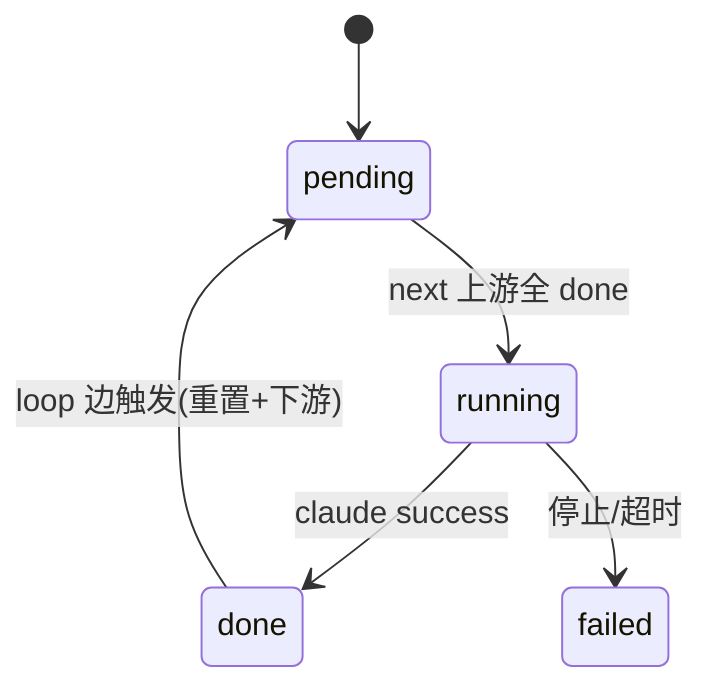
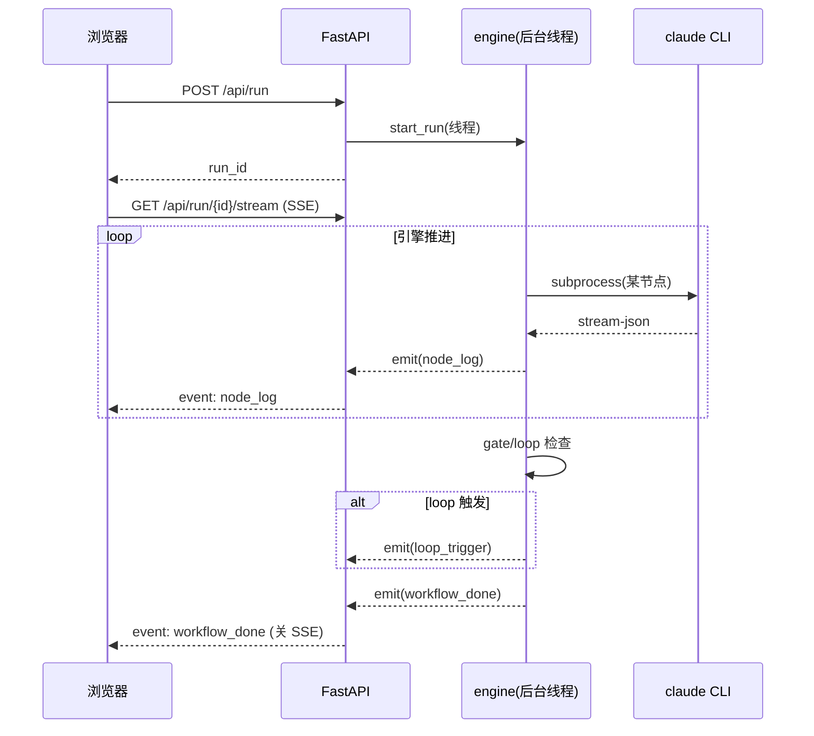

# B02-web 架构 — 可视化编排前端

> 适配说明:纯 Python(FastAPI)+ 纯静态前端(Drawflow),无 DB/无服务集群。
> Web server 是本地开发工具,不是生产部署。

## 质量属性场景(ADD)

| 场景 | 质量属性 | 应对 |
|---|---|---|
| 节点跑几分钟,浏览器要实时看 | 可用性 | SSE 推流,事件队列单调追加 |
| 用户拉任意回退边 | 灵活性 | 图模型(nodes+edges),引擎支持 loop 边 |
| 多个 run 并发 | 并发 | 每 run 独立 RunHandle + 后台线程 |
| 回退边死循环 | 可靠性 | 引擎步数上限(200)拦 |
| 前端零构建 | 可维护性 | 纯静态 + Drawflow vendor,无 npm |

## 安全设计(SDD)

- 本地工具,默认 `--host 0.0.0.0` 但建议绑 127.0.0.1(无认证)。
- `--permission-mode bypassPermissions` 经 claude 跑,确保可信环境。
- graph.json 落 `<task_dir>/.xdd/`,不执行用户输入的 skill 内容(只传给 claude)。
- task_dir 校验存在性,防路径遍历(基础校验)。

## 性能设计(PDD)

- SSE 用 `StreamingResponse` + asyncio.sleep(0.15) 轮询 events,不阻塞事件循环。
- events 列表 append 原子,idx 单调,SSE 客户端按序消费。
- Drawflow 画布渲染由浏览器承担,server 只推事件。

## 限界上下文

B02-web = 可视化编排上下文。与 B01-cli 边界:**import 共享基础(nodes/gate/claude_runner),业务逻辑独立**(图引擎 ≠ 验收循环)。

## 技术栈决策

| 决策 | 选定 | @intent |
|---|---|---|
| 后端框架 | FastAPI | SSE + async 原生支持 |
| ASGI server | uvicorn | FastAPI 标配 |
| 前端画布 | Drawflow(~46KB) | vanilla,无构建,零重型依赖 |
| 实时通信 | SSE(EventSource) | 浏览器原生,单向推流够用 |
| 持久化 | JSON 文件(graph.json) | 无需 DB |

## 分层架构

```
浏览器(Drawflow 画布)  ──HTTP/SSE──▶  FastAPI server
     │                                    │
     │ EventSource                         ├─ graph_io(graph.json 读写)
     ▼                                    ├─ engine(图执行:拓扑+回退)
  节点状态徽章                              │    └─ import 基础:nodes/gate/claude_runner
  日志面板                                  └─ RunHandle(事件队列 + 后台线程)
                                                └─ subprocess → claude CLI
```

## 规则传导矩阵(RXX → 落在哪)

| RXX | 落在模块 | 验证方式 |
|---|---|---|
| B02-R01 图模型+7字段 | graph_io.py | 校验 graph.json 结构 |
| B02-R02 边分 next/loop | graph_io.py `validate_graph` | next 环检测 + loop condition |
| B02-R03 图引擎 | engine.py `run_graph` | mock 测拓扑+回退语义 |
| B02-R04 SSE 推流 | server.py `api_run_stream` | 起 server 订阅验事件 |
| B02-R05 复用 B01 | engine.py import | import 检查 |
| B02-R06 默认图 | graph_io.py `default_graph` | 加载检查八节点 |

## 端点清单(HTTP API)

| 方法 | 路径 | @flow | @B02-RXX |
|---|---|---|---|
| GET | `/` | 画布页 | — |
| GET | `/api/models` | 模型列表 | — |
| POST | `/api/models/reload` | 热刷 | — |
| GET | `/api/graph?task_dir=` | 读图 | R01/R06 |
| POST | `/api/graph` | 存图 | R01 |
| POST | `/api/graph/validate` | 校验 | R02 |
| POST | `/api/run` | 启动 | R03/R04 |
| GET | `/api/run/{id}/stream` | SSE | R04 |
| POST | `/api/run/{id}/stop` | 停止 | R03 |
| GET | `/api/runs` | run 列表 | — |

## 运维视图(ODD,适配线程/subprocess 模型)

### 1. 启动序列
`python -m workflow.web.server` → uvicorn 起 → mount /static → 等请求。
`POST /api/run` → 建 RunHandle → 起后台线程跑 `run_graph`。

### 2. 关闭序列
SIGINT → uvicorn 优雅停 → 后台线程 daemon=True 自动随主进程退 → 当前 subprocess 被 kill。

### 3. 状态机(节点级,与 B01 一致)



run 级:`running → (finished=true)`,finished 后 SSE 推 workflow_done 并关闭。

### 4. 核心时序(图执行 + SSE)



### 5. 失败模型与恢复

| 失败 | 检测 | 恢复 |
|---|---|---|
| claude 超时 | select 心跳 3000s | kill,节点 failed |
| SSE 客户端断开 | EventSource onerror | 自动重连(若 run 未 finished) |
| 回退边死循环 | 步数 ≥ 200 | 停止,报告 |
| 并发 run 资源争抢 | 每 run 独立线程/subprocess | 隔离,不互相阻塞 |
| claude 无 key(env 空) | MODEL_ENVS 检查 | 警告但继续(用默认) |
| 用户点停止 | stop_event.set | 下次心跳 kill subprocess |

### 6. 排障锚点

- 事件历史:`GET /api/run/{id}/stream` 重放(从 events[0] 推)。
- run 状态:`GET /api/runs`(finished/alive/error/event_count)。
- 后台线程名:`run-{run_id}`(便于 ps/jstack 定位)。
- claude debug:`<task_dir>/log/claude/<ts>_<agent>_<uuid>.log`。

## 不产 docker-compose 的理由

同 B01:本地开发工具,无 DB/无服务集群,Web server 直接 `python -m` 起。docker 化违背 intent 非目标。
